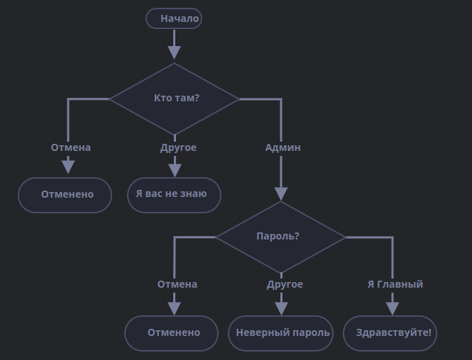

# **1.2.3 Основные операторы**

> [Index](./0%20Index.md)

## **Термины: «унарный», «бинарный», «операнд»**

Операнд – то, к чему применяется оператор. Например, в умножении `5 * 2` есть два операнда: левый операнд равен `5`, а правый операнд равен `2`. Иногда их называют **«аргументами»** вместо **«операндов»**.

Унарным называется оператор, который применяется к **одному операнду**. Например, оператор унарный минус `"-"` меняет знак числа на противоположный:

```js
let x = 1;

x = -x;
alert(x); // -1, применили унарный минус
```

Бинарным называется оператор, который применяется к **двум операндам**. Тот же минус существует и в бинарной форме:

```js
let x = 1,
  y = 3;
alert(y - x); // 2, бинарный минус вычитает значения
```

Формально, в последних примерах мы говорим о двух разных операторах, использующих один символ: **оператор отрицания** (унарный оператор, который обращает знак) и **оператор вычитания** (бинарный оператор, который вычитает одно число из другого).

## **Арифметические операторы:**

- Сложение: `+`
- Вычитание: `-`
- Умножение: `*`
- Деление: `/`
- Остаток от деления: `%`
- Возведение в степень: `**`

**Пример кода:**

```javascript
let a = 10;
let b = 3;

console.log(a + b); // 13
console.log(a - b); // 7
console.log(a * b); // 30
console.log(a / b); // 3.333...
console.log(a % b); // 1
console.log(a ** b); // 1000 (10 в степени 3)
```

### **Взятие остатка `%`**

Оператор взятия остатка `%,` несмотря на обозначение, никакого отношения к процентам не имеет.

Результат `a % b` – это остаток от целочисленного деления `a` на `b`.

Например:

```js
alert(5 % 2); // 1, остаток от деления 5 на 2
alert(8 % 3); // 2, остаток от деления 8 на 3
alert(8 % 4); // 0, остаток от деления 8 на 4
```

### **Возведение в степень**

Оператор возведения в степень `a ** b` возводит `a` в степень `b`.

Например:

```js
alert(2 ** 2); // 2² = 4
alert(2 ** 3); // 2³ = 8
alert(2 ** 4); // 2⁴ = 16
```

Математически, оператор работает и для нецелых чисел. Например, квадратный корень является возведением в степень ½:

```js
alert(4 ** (1 / 2)); // 2 (степень 1/2 эквивалентна взятию квадратного корня)
```

### **Сложение строк при помощи бинарного `+`**

Давайте рассмотрим специальные возможности операторов JavaScript, которые выходят за рамки школьной арифметики.

Обычно при помощи плюса `'+'` складывают числа.

Но если бинарный оператор `'+'` применить к строкам, то он их объединяет в одну:

```js
let s = 'моя' + 'строка';
alert(s); // моястрока
```

> [!WARNING]
>
> Обратите внимание, если хотя бы один операнд является строкой, то второй будет также преобразован в строку.

Например:

```js
alert('1' + 2); // "12"
alert(2 + '1'); // "21"
```

Как видите, не важно, первый или второй операнд является строкой.

Вот пример посложнее:

```js
alert(2 + 2 + '1'); // будет "41", а не "221"
```

Здесь операторы работают один за другим. Первый `+` складывает два числа и возвращает `4`, затем следующий `+` объединяет результат со строкой, производя действие `4 + '1' = '41'`.

> [!IMPORTANT]
>
> **Сложение и преобразование строк** — это особенность бинарного плюса `+`. Другие арифметические операторы работают только с числами и всегда преобразуют операнды в числа.

Например, вычитание и деление:

```js
alert(6 - '2'); // 4, '2' приводится к числу
alert('6' / '2'); // 3, оба операнда приводятся к числам
```

### **Приведение к числу, унарный `+`**

Плюс `+` существует в двух формах: **бинарной**, которую мы использовали выше, и **унарной**.

**Унарный**, то есть применённый к одному значению, плюс `+` ничего не делает с числами. Но если операнд не число, унарный плюс преобразует его в число.

Например:

```js
// Не влияет на числа
let x = 1;
alert(+x); // 1

let y = -2;
alert(+y); // -2

// Преобразует не числа в числа
alert(+true); // 1
alert(+''); // 0
```

На самом деле это то же самое, что и `Number(...)`, только короче.

Необходимость преобразовывать строки в числа возникает очень часто. Например, обычно значения полей HTML-формы — это строки. А что, если их нужно, к примеру, сложить?

Бинарный плюс сложит их как строки:

```js
let apples = '2';
let oranges = '3';

alert(apples + oranges); // "23", так как бинарный плюс объединяет строки
```

Поэтому используем унарный плюс, чтобы преобразовать к числу:

```js
let apples = '2';
let oranges = '3';

// оба операнда предварительно преобразованы в числа
alert(+apples + +oranges); // 5

// более длинный вариант
// alert( Number(apples) + Number(oranges) ); // 5
```

С точки зрения математики, такое изобилие плюсов выглядит странным. Но с точки зрения программиста тут нет ничего особенного: сначала выполнятся унарные плюсы, которые приведут строки к числам, а затем бинарный `'+'` их сложит.

Почему унарные плюсы выполнились до бинарного сложения? Как мы сейчас увидим, дело в их приоритете.

### **Приоритет операторов**

В том случае, если в выражении есть несколько операторов – порядок их выполнения определяется приоритетом, или, другими словами, существует определённый порядок выполнения операторов.

Из школы мы знаем, что умножение в выражении `1 + 2 * 2` выполнится раньше сложения. Это как раз и есть **«приоритет»**. Говорят, что умножение имеет более высокий приоритет, чем сложение.

**Скобки** важнее, чем **приоритет**, так что, если мы не удовлетворены порядком по умолчанию, мы можем использовать их, чтобы изменить приоритет. Например, написать `(1 + 2) * 2`.

В JavaScript много операторов. Каждый оператор имеет соответствующий номер приоритета. Тот, у кого это число **больше**, – выполнится **раньше**. Если приоритет одинаковый, то порядок выполнения – **слева направо**.

Отрывок из таблицы приоритетов (**нет необходимости всё запоминать**, обратите внимание, что приоритет унарных операторов выше, чем соответствующих бинарных):

| Приоритет | Название             | Обозначение |
| --------- | -------------------- | ----------- |
| 15        | унарный плюс         | `+`         |
| 15        | унарный минус        | `-`         |
| 14        | возведение в степень | `**`        |
| 13        | умножение            | `*`         |
| 13        | деление              | `/`         |
| 12        | сложение             | `+`         |
| 12        | вычитание            | `-`         |
| ---       | ---                  | ---         |
| 2         | присваивание         | `=`         |

Так как `«унарный плюс»` имеет приоритет `15`, который выше, чем `12` у `«сложения»` (бинарный плюс), то в выражении `"+apples + +oranges"` сначала выполнятся унарные плюсы, а затем сложение.

### **Присваивание**

Давайте отметим, что в таблице приоритетов также есть оператор присваивания `=`. У него один из самых низких приоритетов: `2`.

Именно поэтому, когда переменной что-либо присваивают, например, `x = 2 * 2 + 1`, то сначала выполнится арифметика, а уже затем произойдёт присваивание `=` с сохранением результата в `x`.

```js
let x = 2 * 2 + 1;

alert(x); // 5
```

Присваивание `=` возвращает значение
Тот факт, что `=` является оператором, а не **«магической»** конструкцией языка, имеет интересные последствия.

Большинство операторов в JavaScript возвращают значение. Для некоторых это очевидно, например сложение `+` или умножение `*`. Но и оператор присваивания не является исключением.

Вызов `x = value` записывает `value` в `x` и возвращает его.

Благодаря этому присваивание можно использовать как часть более сложного выражения:

```js
let a = 1;
let b = 2;

let c = 3 - (a = b + 1);

alert(a); // 3
alert(c); // 0
```

В примере выше результатом `(a = b + 1)` будет значение, которое присваивается переменной `a` (то есть `3`). Потом оно используется для дальнейших вычислений.

Забавное применение присваивания, не так ли? Нам нужно понимать, как это работает, потому что иногда это можно увидеть в JavaScript-библиотеках.

Однако писать самим в таком стиле не рекомендуется. Такие трюки не сделают ваш код более понятным или читабельным.

### **Присваивание по цепочке**

Рассмотрим ещё одну интересную возможность: цепочку присваиваний.

```js
let a, b, c;

a = b = c = 2 + 2;

alert(a); // 4
alert(b); // 4
alert(c); // 4
```

Такое присваивание работает справа налево. Сначала вычисляется самое правое выражение `2 + 2`, и затем результат присваивается переменным слева: `c`, `b` и `a`. В конце у всех переменных будет одно значение.

Опять-таки, чтобы код читался легче, лучше разделять подобные конструкции на несколько строчек:

```js
c = 2 + 2;
b = c;
a = c;
```

Польза от такого стиля особенно ощущается при быстром просмотре кода.

### **Сокращённая арифметика с присваиванием**

Часто нужно применить оператор к переменной и сохранить результат в ней же.

Например:

```js
let n = 2;
n = n + 5;
n = n * 2;
```

Эту запись можно укоротить при помощи совмещённых операторов `+=` и `*=`:

```js
let n = 2;
n += 5; // теперь n = 7 (работает как n = n + 5)
n *= 2; // теперь n = 14 (работает как n = n _ 2)

alert(n); // 14
```

Подобные краткие формы записи существуют для всех арифметических и побитовых операторов: `/=`, `-=`, `**=` и так далее.

Вызов с присваиванием имеет в точности такой же приоритет, как обычное присваивание, то есть выполнится после большинства других операций:

```js
let n = 2;

n *= 3 + 5;

alert(n); // 16 (сначала выполнится правая часть, выражение идентично n *= 8)
```

### **Инкремент/декремент**

Одной из наиболее частых числовых операций является увеличение или уменьшение на единицу.

Для этого существуют даже специальные операторы:

#### **Инкремент** `++` увеличивает переменную на `1`:

```js
let counter = 2;
counter++; // работает как counter = counter + 1, просто запись короче
alert(counter); // 3
```

#### **Декремент** `--` уменьшает переменную на `1`:

```js
let counter = 2;
counter--; // работает как counter = counter - 1, просто запись короче
alert(counter); // 1
```

> [!IMPORTANT]
>
> **Важно:**
> Инкремент/декремент можно применить только к переменной. Попытка использовать его на значении, типа `5++`, приведёт к **ошибке**.

#### **Префикс / Постфикс**

Операторы `++` и `--` могут быть расположены не только после, но и до переменной.

Когда оператор идёт после переменной — это **«постфиксная форма»**: `counter++`.
**«Префиксная форма»** — это когда оператор идёт перед переменной: `++counter`.
Обе эти инструкции делают одно и то же: увеличивают `counter` на `1`.

Есть ли разница между ними? Да, но увидеть её мы сможем, только если будем использовать значение, которое возвращают `++/--`.

Давайте проясним этот момент. Как мы знаем, все операторы возвращают значение. Операторы инкремента/декремента не исключение. Префиксная форма возвращает новое значение, в то время как постфиксная форма возвращает старое (до увеличения/уменьшения числа).

Чтобы увидеть разницу, вот небольшой пример:

```js
let counter = 1;
let a = ++counter; // (*)

alert(a); // 2
```

В строке `(*)` префиксная форма `++counter` увеличивает `counter` и возвращает новое значение `2`. Так что `alert` покажет `2`.

Теперь посмотрим на постфиксную форму:

```js
let counter = 1;
let a = counter++; // (*) меняем ++counter на counter++

alert(a); // 1
alert(counter); // 2
```

В строке `(*)` постфиксная форма `counter++` также увеличивает `counter`, но возвращает старое значение (которое было до увеличения). Так что `alert` покажет `1`.

Часто оператор инкремента используется в цикле `for`

```js
for (i = 0; i < 5; i++) {
  // ...
}
```

здесь переменная `i` увеличивается на `1` после проходжения цикла, если написать вместо `i++` `++i`, то она будет увеличиваться перед началом цикла

#### **Подведём итоги**

Если результат оператора не используется, а нужно только увеличить/уменьшить переменную, тогда без разницы, какую форму использовать:

```js
let counter = 0;
counter++;
++counter;
alert(counter); // 2, обе строки сделали одно и то же
```

Если хочется тут же использовать результат, то нужна префиксная форма:

```js
let counter = 0;
alert(++counter); // 1
```

Если нужно увеличить и при этом получить значение переменной до увеличения – нужна постфиксная форма:

```js
let counter = 0;
alert(counter++); // 0
```

> [!TIP]
>
> **Инкремент/декремент можно использовать в любых выражениях**
>
> Операторы `++/--` могут также использоваться внутри выражений. Их приоритет выше, чем у большинства других арифметических операций.
>
> Например:
>
> ```js
> let counter = 1;
> alert(2 * ++counter); // 4
> ```
>
> Сравните с:
>
> ```js
> let counter = 1;
> alert(2 * counter++); // 2, потому что counter++ возвращает "старое" значение
> ```
>
> Хотя технически здесь всё в порядке, такая запись обычно делает код менее читабельным. Одна строка выполняет множество действий – нехорошо.
>
> При беглом чтении кода можно с лёгкостью пропустить такой `counter++`, и будет неочевидно, что переменная увеличивается.
>
> Лучше использовать стиль «одна строка – одно действие»:
>
> ```js
> let counter = 1;
> alert(2 * counter);
> counter++;
> ```

### **Побитовые операторы**

Побитовые операторы работают с 32-разрядными целыми числами (при необходимости приводят к ним), на уровне их внутреннего двоичного представления.

Эти операторы не являются чем-то специфичным для JavaScript, они поддерживаются в большинстве языков программирования.

Поддерживаются следующие побитовые операторы:

- AND(и) ( & )
- OR(или) ( | )
- XOR(побитовое исключающее или) ( ^ )
- NOT(не) ( ~ )
- LEFT SHIFT(левый сдвиг) ( << )
- RIGHT SHIFT(правый сдвиг) ( >> )
- ZERO-FILL RIGHT SHIFT(правый сдвиг с заполнением нулями) ( >>> )

> [!TIP]
>
> Они используются редко, когда возникает необходимость оперировать с числами на очень низком (побитовом) уровне. В ближайшем времени они нам не понадобятся, так как веб-разработчики редко к ним прибегают, хотя в некоторых сферах (например, в криптографии) они полезны.
>
> Вы можете прочитать о них в главе [Побитовые операторы](https://learn.javascript.ru/bitwise-operators), когда возникнет реальная необходимость.

### **Оператор «запятая»**

Оператор **«запятая»** `(,)` редко применяется и является одним из самых необычных. Иногда он используется для написания более короткого кода, поэтому нам нужно знать его, чтобы понимать, что при этом происходит.

Оператор **«запятая»** предоставляет нам возможность вычислять несколько выражений, разделяя их запятой `,`. Каждое выражение выполняется, но возвращается результат только последнего.

Например:

```js
let a = (1 + 2, 3 + 4);

alert(a); // 7 (результат вычисления 3 + 4)
```

Первое выражение `1 + 2` выполняется, а результат отбрасывается. Затем идёт `3 + 4`, выражение выполняется и возвращается результат.

> [!IMPORTANT]
>
> Запятая имеет очень низкий приоритет
> Пожалуйста, обратите внимание, что оператор `,` имеет очень низкий приоритет, ниже `=`, поэтому скобки важны в приведённом выше примере.
>
> Попробуйте запустить следующий код (строгий режим `"use strict"` в примере ниже не используется, иначе мы бы получили ошибку):
>
> ```
> a = 1 + 2, 3 + 4;
>
> alert(a); // 3
> ```
>
> Необычный результат, правда? Особенно учитывая то, что оператор , должен «выполнять каждое выражение, но возвращать результат только последнего».
>
> Без скобок в `a = 1 + 2, 3 + 4` сначала выполнится `+`, суммируя числа в `a = 3, 7`, затем оператор присваивания `=` присвоит `a = 3`, а то, что идёт дальше, будет проигнорировано. Всё так же, как в `(a = 1 + 2), 3 + 4`.

Зачем нам оператор, который отбрасывает всё, кроме последнего выражения?

Иногда его используют в составе более сложных конструкций, чтобы сделать несколько действий в одной строке.

Например:

```js
// три операции в одной строке
for (a = 1, b = 3, c = a * b; a < 10; a++) {
...
}
```

> [!IMPORTANT]
>
> Такие трюки используются во многих JavaScript-фреймворках. Вот почему мы упоминаем их. Но обычно они не улучшают читабельность кода, поэтому стоит хорошо подумать, прежде чем их использовать.

## **Операторы сравнения**

В этом разделе мы больше узнаем про то, какие бывают сравнения, как язык с ними работает и к каким неожиданностям мы должны быть готовы.

- Равно: `==`
- Не равно: `!=`
- Строго равно: `===`
- Строго не равно: `!==`
- Больше: `>`
- Меньше: `<`
- Больше или равно: `>=`
- Меньше или равно: `<=`

### **Результат сравнения имеет логический тип**

Все операторы сравнения возвращают значение логического типа:

**true** – означает «да», «верно», «истина».
**false** – означает «нет», «неверно», «ложь».

```javascript
console.log(5 == '5'); // true (сравнение без учета типа)
console.log(5 === '5'); // false (сравнение с учетом типа)
console.log(5 != '5'); // false
console.log(5 !== '5'); // true
console.log(10 > 5); // true
console.log(10 <= 5); // false
```

Результат сравнения можно присвоить переменной, как и любое значение:

```js
let result = 5 > 4; // результат сравнения присваивается переменной result
alert(result); // true
```

### **Сравнение строк**

Чтобы определить, что одна строка больше другой, JavaScript использует «алфавитный» или «лексикографический» порядок.

Другими словами, строки сравниваются посимвольно.

Например:

```js
alert('Я' > 'А'); // true
alert('Коты' > 'Кода'); // true
alert('Сонный' > 'Сон'); // true
```

Алгоритм сравнения двух строк довольно прост:

1. Сначала сравниваются первые символы строк.
2. Если первый символ первой строки больше (меньше), чем первый символ второй, то первая строка больше (меньше) второй. Сравнение завершено.
3. Если первые символы равны, то таким же образом сравниваются уже вторые символы строк.
4. Сравнение продолжается, пока не закончится одна из строк.
5. Если обе строки заканчиваются одновременно, то они равны. Иначе, большей считается более длинная строка.

В примерах выше сравнение `'Я' > 'А'` завершится на первом шаге, тогда как строки `'Коты'` и `'Кода'` будут сравниваться посимвольно:

1. `К` равна `К`.
2. `о` равна `о`.
3. `т` больше, чем `д`. На этом сравнение заканчивается. Первая строка больше.

> [!TIP]
>
> Используется кодировка Unicode, а не настоящий алфавит
> Приведённый выше алгоритм сравнения похож на алгоритм, используемый в словарях и телефонных книгах, но между ними есть и различия.
>
> Например, в JavaScript имеет значение регистр символов. Заглавная буква `"A"` не равна строчной `"a"`. Какая же из них больше? Строчная `"a"`. Почему? Потому что строчные буквы имеют больший код во внутренней таблице кодирования, которую использует JavaScript (Unicode).

### **Сравнение разных типов**

При сравнении значений разных типов JavaScript приводит каждое из них к числу.

Например:

```js
alert('2' > 1); // true, строка '2' становится числом 2
alert('01' == 1); // true, строка '01' становится числом 1
alert('Java' > 0); // false, строка 'Java' становится NaN, а NaN ничему не равен
```

Логическое значение `true` становится `1`, а `false` – `0`.

Например:

```js
alert(true == 1); // true
alert(false == 0); // true
```

> [!TIP]
>
> **Забавное следствие**
> Возможна следующая ситуация:
>
> Два значения равны.
> Одно из них `true` как логическое значение, другое – `false`.
> Например:
>
> ```js
> let a = 0;
> alert(Boolean(a)); // false
>
> let b = '0';
> alert(Boolean(b)); // true
>
> alert(a == b); // true!
> ```
>
> С точки зрения JavaScript, результат ожидаем. Равенство преобразует значения, используя числовое преобразование, поэтому `"0"` становится `0`. В то время как явное преобразование с помощью `Boolean` использует другой набор правил.

### **Строгое сравнение**

Использование обычного сравнения `==` может вызывать проблемы. Например, оно не отличает `0` от `false`:

```js
alert(0 == false); // true
```

Та же проблема с пустой строкой:

```js
alert('' == false); // true
```

Это происходит из-за того, что операнды разных типов преобразуются оператором `==` к числу. В итоге, и пустая строка `''`, и `false` становятся нулём.

Как же тогда отличать `0` от `false`?

Оператор строгого равенства `===` проверяет равенство без приведения типов.

Другими словами, если `a` и `b` имеют разные типы, то проверка `a === b` немедленно возвращает `false` без попытки их преобразования.

Давайте проверим:

```js
alert(0 === false); // false, так как сравниваются разные типы
alert(Boolean(0) === false); // true, явное приведение типов
```

Ещё есть оператор строгого неравенства `!==`, аналогичный `!=`.

Оператор строгого равенства дольше писать, но он делает код более очевидным и оставляет меньше места для ошибок.

### **Сравнение с null и undefined**

Поведение `null` и `undefined` при сравнении с другими значениями — особое:

При строгом равенстве `===`
Эти значения различны, так как различны их типы.

```js
alert(null === undefined); // false
```

При нестрогом равенстве `==`
Эти значения равны друг другу и не равны никаким другим значениям. Это специальное правило языка.

```js
alert(null == undefined); // true
```

При использовании математических операторов и других операторов сравнения `<` `>` `<=` `>=`
Значения `null/undefined` преобразуются к числам: `null` становится `0`, а `undefined` – `NaN`.

Посмотрим, какие забавные вещи случаются, когда мы применяем эти правила. И, что более важно, как избежать ошибок при их использовании.

### **Странный результат сравнения null и 0**

Сравним `null` с нулём:

```js
alert(null > 0); // (1) false
alert(null == 0); // (2) false
alert(null >= 0); // (3) true
```

С точки зрения математики это странно. Результат последнего сравнения говорит о том, что «`null` больше или равно нулю», тогда результат одного из сравнений выше должен быть `true`, но они оба ложны.

Причина в том, что нестрогое равенство и сравнения `>` `<` `>=` `<=` работают по-разному. Сравнения преобразуют `null` в число, рассматривая его как `0`. Поэтому выражение (3) `null >= 0` истинно, а `null > 0` ложно.

С другой стороны, для нестрогого равенства `==` значений `undefined` и `null` действует особое правило: эти значения ни к чему не приводятся, они равны друг другу и не равны ничему другому. Поэтому (2) `null == 0` ложно.

### **Несравненное значение undefined**

Значение `undefined` несравнимо с другими значениями:

```js
alert(undefined > 0); // false (1)
alert(undefined < 0); // false (2)
alert(undefined == 0); // false (3)
```

Почему же сравнение `undefined` с нулём всегда ложно?

На это есть следующие причины:

- Сравнения (1) и (2) возвращают `false`, потому что `undefined` преобразуется в `NaN`, а `NaN` – это специальное числовое значение, которое возвращает `false` при любых сравнениях.
- Нестрогое равенство (3) возвращает `false`, потому что `undefined` равно только `null`, `undefined` и ничему больше.

### **Как избежать проблем**

Зачем мы рассмотрели все эти примеры? Должны ли мы постоянно помнить обо всех этих особенностях? Необязательно. Со временем все они станут вам знакомы, но можно избежать проблем, если следовать надёжным правилам:

- Относитесь очень осторожно к любому сравнению с `undefined/null`, кроме случаев строгого равенства `===`.
- Не используйте сравнения `>=` `>` `<` `<=` с переменными, которые могут принимать значения `null/undefined`, разве что вы полностью уверены в том, что делаете. Если переменная может принимать эти значения, то добавьте для них отдельные проверки.

## **Логические операторы:**

В JavaScript есть семь логических операторов:

- `||` (ИЛИ)
  - `||=` (Оператор логического присваивания ИЛИ)
- `&&` (И)
  - `&&=` (Оператор логического присваивания И)
- `!` (НЕ)
- `??` (Оператор нулевого слияния)
  - `??=` (Оператор нулевого присваивания)

Несмотря на своё название, данные операторы могут применяться к значениям любых типов. Полученные результаты также могут иметь различный тип.

**Пример кода:**

```javascript
let x = true;
let y = false;

console.log(x && y); // false (оба значения должны быть true)
console.log(x || y); // true (достаточно одного true)
console.log(!x); // false (обратное значение)
```

### **|| (ИЛИ)**

Оператор «ИЛИ» выглядит как двойной символ вертикальной черты:

```js
result = a || b;
```

Традиционно в программировании ИЛИ предназначено только для манипулирования булевыми значениями: в случае, если какой-либо из аргументов `true`, он вернёт `true`, в противоположной ситуации возвращается `false`.

В JavaScript, как мы увидим далее, этот оператор работает несколько иным образом. Но давайте сперва посмотрим, что происходит с булевыми значениями.

Существует всего четыре возможные логические комбинации:

```js
alert(true || true); // true
alert(false || true); // true
alert(true || false); // true
alert(false || false); // false
```

Как мы можем наблюдать, результат операций всегда равен `true`, за исключением случая, когда оба аргумента `false`.

Если значение не логического типа, то оно к нему приводится в целях вычислений.

Например, число `1` будет воспринято как `true`, а `0` – как `false`:

```js
if (1 || 0) {
  // работает как if( true || false )
  alert('истинно!');
}
```

Обычно оператор `||` используется в `if` для проверки истинности любого из заданных условий.

К примеру:

```js
let hour = 9;

if (hour < 10 || hour > 18) {
  alert('Офис закрыт.');
}
```

Можно передать и больше условий:

```js
let hour = 12;
let isWeekend = true;

if (hour < 10 || hour > 18 || isWeekend) {
  alert('Офис закрыт.'); // это выходной
}
```

### **ИЛИ `"||"` находит первое истинное значение**

Описанная выше логика соответствует традиционной. Теперь давайте поработаем с «дополнительными» возможностями JavaScript.

Расширенный алгоритм работает следующим образом.

При выполнении ИЛИ `||` с несколькими значениями:

```js
result = value1 || value2 || value3;
```

Оператор `||` выполняет следующие действия:

- Вычисляет операнды слева направо.
- Каждый операнд конвертирует в логическое значение. Если результат `true`, останавливается и возвращает исходное значение этого операнда.
- Если все операнды являются ложными (`false`), возвращает последний из них.
- Значение возвращается в исходном виде, без преобразования.

Другими словами, цепочка ИЛИ `||` возвращает первое истинное значение или последнее, если такое значение не найдено.

Например:

```js
alert(1 || 0); // 1 (1 - истинное значение)
alert(true || 'какая-то строка'); // true

alert(null || 1); // 1 (первое истинное значение)
alert(null || 0 || 1); // 1 (первое истинное значение)
alert(undefined || null || 0); // 0 (поскольку все ложно, возвращается последнее значение)
```

Это делает возможным более интересное применение оператора по сравнению с «чистым, традиционным, только булевым ИЛИ».

1. Получение первого истинного значения из списка переменных или выражений.

Например, у нас есть переменные `firstName`, `lastName` и `nickName`, все они необязательные (т.е. они могут быть неопределенными или иметь ложные значения).

Давайте воспользуемся оператором ИЛИ `||`, чтобы выбрать ту переменную, в которой есть данные, и показать её (или `«Аноним»`, если ни в одной переменной данных нет):

```js
let firstName = '';
let lastName = '';
let nickName = 'Суперкодер';

alert(firstName || lastName || nickName || 'Аноним'); // Суперкодер
```

Если бы все переменные были ложными, в качестве результата мы бы наблюдали `"Аноним"`.

2. Сокращённое вычисление.

Ещё одной отличительной особенностью оператора ИЛИ `||` является так называемое «сокращённое вычисление».

Это означает, что ИЛИ `||` обрабатывает свои операнды до тех пор, пока не будет достигнуто первое истинностное значение, и затем это значение сразу же возвращается, даже не затрагивая другие операнды.

Важность этой особенности становится очевидной, если операнд – это не просто значение, а выражение с сопутствующим эффектом, как, например, присваивание переменной или вызов функции.

В приведенном ниже примере срабатывает только второй `alert`:

```js
true || alert('никогда не сработает');
false || alert('сработает');
```

В первой строке оператор ИЛИ `||` останавливает выполнение сразу после того, как сталкивается с истинным значением (`true`), поэтому сообщение не показывается.

Иногда люди используют эту возможность для выполнения инструкций только в том случае, если условие в левой части является ложным.

Например для присвоения значения по умолчанию

```js
let port = PORT || 80;
```

### **||= (Логическое присваивание ИЛИ)**

> [!CAUTION]
>
> **Новая возможность**
> Эта возможность была добавлена в язык недавно. В старых браузерах может понадобиться полифил.

Оператор логического присваивания ИЛИ `||=` записывается как обычный ИЛИ `||` с добавлением символа присваивания `=`. Такая запись не случайна, так как результат выполнения данного оператора напрямую зависит от действий уже известного нам `||`.

Вот его синтаксис:

```js
a ||= b;
```

Оператор `||=` принимает два операнда и выполняет следующие действия:

- Вычисляет операнды слева направо.
- Конвертирует `a` в логическое значение.
- Если `a` ложно, присваивает `a` значение `b`.

Концепция оператора `||=` заключается в «сокращённом вычислении», принцип работы которого мы разобрали ранее.

Теперь давайте перепишем `a ||= b` под вид «сокращённого вычисления»:

```js
a || (a = b);
```

Мы уже знаем, что ИЛИ `||` возвращает первое истинное значение, поэтому, если a является таковым, вычисление до правой части выражения не дойдёт.

Вот пример с очевидным использованием оператора `||=`:

```js
let johnHasCar = false;

johnHasCar ||= 'У Джона нет машины!'; // то же самое, что false || (johnHasCar = "...")

alert(johnHasCar); // "У Джона нет машины!"
```

…А здесь происходит преобразование к логическому значению:

```js
let manufacturer = ''; // оператор ||= преобразует пустую строку "" к логическому значению false

manufacturer ||= 'Неизвестный производитель'; // то же самое, что false || (manufacturer = "...")

alert(manufacturer); // "Неизвестный производитель"
```

Оператор логического присваивания ИЛИ `||=` – это «синтаксический сахар», добавленный в язык в качестве более короткого варианта записи `if`-выражений с присваиванием.

Мы можем переписать приведённые выше примеры с использованием обычного `if`:

```js
let johnHasCar = false;

if (johnHasCar == false) {
  johnHasCar = 'У Джона нет машины!';
}

alert(johnHasCar); // "У Джона нет машины!"

let manufacturer = '';

if (manufacturer == false) {
  manufacturer = 'Неизвестный производитель';
}

alert(manufacturer); // "Неизвестный производитель"
```

### **&& (И)**

Оператор И пишется как два амперсанда `&&`:

```js
result = a && b;
```

В традиционном программировании И возвращает `true`, если оба аргумента истинны, а иначе – `false`:

```js
alert(true && true); // true
alert(false && true); // false
alert(true && false); // false
alert(false && false); // false
```

Пример с `if`:

```js
let hour = 12;
let minute = 30;

if (hour == 12 && minute == 30) {
  alert('Время 12:30');
}
```

Как и в случае с ИЛИ, любое значение допускается в качестве операнда И:

```js
if (1 && 0) {
  // вычисляется как true && false
  alert('не сработает, так как результат ложный');
}
```

### **И `«&&»` находит первое ложное значение**

При нескольких подряд операторах И:

```js
result = value1 && value2 && value3;
```

Оператор `&&` выполняет следующие действия:

- Вычисляет операнды слева направо.
- Каждый операнд преобразует в логическое значение. Если результат `false`, останавливается и возвращает исходное значение этого операнда.
- Если все операнды были истинными, возвращается последний.

Другими словами, И возвращает первое ложное значение. Или последнее, если ничего не найдено.

Вышеуказанные правила схожи с поведением ИЛИ. Разница в том, что И возвращает первое ложное значение, а ИЛИ –  первое истинное.

Примеры:

```js
// Если первый операнд истинный,
// И возвращает второй:
alert(1 && 0); // 0
alert(1 && 5); // 5

// Если первый операнд ложный,
// И возвращает его. Второй операнд игнорируется
alert(null && 5); // null
alert(0 && 'какая-то строка'); // 0
```

Можно передать несколько значений подряд. В таком случае возвратится первое «ложное» значение, на котором остановились вычисления.

```js
alert(1 && 2 && null && 3); // null
```

Когда все значения верны, возвращается последнее

```js
alert(1 && 2 && 3); // 3
```

> [!NOTE]
>
> **Приоритет оператора `&&` больше, чем у `||`**
> Приоритет оператора И `&&` больше, чем ИЛИ `||`, так что он выполняется раньше.
>
> Таким образом, код a `&& b || c && d` по существу такой же, как если бы выражения `&&` были в круглых скобках: `(a && b) || (c && d)`.

> [!WARNING]
>
> **Не заменяйте `if` на `||` или `&&`**
> Иногда люди используют оператор И `&&` как «более короткий способ записи `if`-выражения».
>
> Например:
>
> ```js
> let x = 1;
>
> x > 0 && alert('x больше нуля!');
> ```
>
> Инструкция в правой части `&&` будет выполнена только в том случае, если вычисление дойдет до нее. То есть, только если `(x > 0)` истинно.
>
> Таким образом, мы имеем аналог для следующего кода:
>
> ```js
> let x = 1;
>
> if (x > 0) alert('x больше нуля!');
> ```
>
> Несмотря на то, что вариант с `&&` кажется более коротким, `if` более нагляден и, как правило, более читабелен. Поэтому мы рекомендуем использовать каждую конструкцию по назначению: использовать `if`, если нам нужно `if`, и использовать `&&`, если нам нужно И.

### **&&= (Логическое присваивание И)**

> [!WARNING]
>
> Новая возможность
> Эта возможность была добавлена в язык недавно. В старых браузерах может понадобиться полифил.

Оператор логического присваивания И `&&=` записывается как два амперсанда `&&` и символ присваивания `=`.

Вот его синтаксис:

```js
a &&= b;
```

Принцип действия `&&=` практически такой же, как и у оператора логического присваивания ИЛИ `||=`. Единственное отличие заключается в том, что `&&=` присвоит `a` значение `b` только в том случае, если `a` истинно.

Концепция оператора логического присваивания И `&&=` также основывается на «сокращённом вычислении»:

```js
a && (a = b);
```

Пример использования:

```js
let greeting = 'Привет'; // строка непустая, поэтому будет преобразована к логическому значению true оператором &&=

greeting &&= greeting + ', пользователь!'; // то же самое, что true && (greeting = greeting + "...")

alert(greeting); // "Привет, пользователь!"
```

Так как оператор логического присваивания И `&&=` также как и `||=` является «синтаксическим сахаром», мы можем без проблем переписать пример выше с использованием привычного для нас `if`:

```js
let greeting = 'Привет';

if (greeting) {
  greeting = greeting + ', пользователь!';
}

alert(greeting); // "Привет, пользователь!"
```

На практике, в отличие от `||=`, оператор `&&=` используется достаточно редко – обычно, в комбинации с более сложными языковыми конструкциями. Подобрать контекст для применения данного оператора – довольно непростая задача.

### **! (НЕ)**

Оператор НЕ представлен восклицательным знаком `!`.

Синтаксис довольно прост:

```js
result = !value;
```

Оператор принимает один аргумент и выполняет следующие действия:

- Сначала приводит аргумент к логическому типу `true/false`.
- Затем возвращает противоположное значение.

Например:

```js
alert(!true); // false
alert(!0); // true
```

В частности, двойное НЕ `!!` используют для преобразования значений к логическому типу:

```js
alert(!!'непустая строка'); // true
alert(!!null); // false
```

То есть первое НЕ преобразует значение в логическое значение и возвращает обратное, а второе НЕ снова инвертирует его. В конце мы имеем простое преобразование значения в логическое.

Есть немного более подробный способ сделать то же самое – встроенная функция `Boolean`:

```js
alert(Boolean('непустая строка')); // true
alert(Boolean(null)); // false
```

Приоритет НЕ `!` является наивысшим из всех логических операторов, поэтому он всегда выполняется первым, перед `&&` или `||`.

## **Операторы нулевого слияния и присваивания: '??', '??='**

> [!NOTE]
>
> **Новая возможность**
> Эта возможность была добавлена в язык недавно. В старых браузерах может понадобиться полифил.

### **Оператор нулевого слияния (??)**

Оператор нулевого слияния представляет собой два вопросительных знака `??`.

Так как он обрабатывает `null` и `undefined` одинаковым образом, то для этой статьи мы введём специальный термин. Для краткости будем говорить, что значение **«определено»**, если оно не равняется ни `null`, ни `undefined`.

Результат выражения `a ?? b` будет следующим:

- если `a` определено, то `a`,
- если `a` не определено, то `b`.

Иначе говоря, оператор `??` возвращает первый аргумент, если он не `null/undefined`, иначе второй.

Оператор нулевого слияния не является чем-то принципиально новым. Это всего лишь удобный синтаксис, как из двух значений получить одно, которое «определено».

Вот как можно переписать выражение `result = a ?? b`, используя уже знакомые нам операторы:

```js
if (a !== null && a !== undefined) {
  let result = a;
} else {
  let result = b;
}
```

Теперь должно быть абсолютно ясно, что делает `??`. Давайте посмотрим, где это может быть полезно.

Как правило, оператор `??` нужен для того, чтобы задать значение по умолчанию для потенциально неопределённой переменной.

Например, здесь мы отобразим `user`, если её значение не `null/undefined`, в противном случае `Аноним`:

```js
let user;

alert(user ?? 'Аноним'); // Аноним (user не существует)
```

А вот пример, когда `user` присвоено значение:

```js
let user = 'Иван';

alert(user ?? 'Аноним'); // Иван (user существует)
```

Кроме этого, можно записать последовательность из операторов `??`, чтобы получить первое значение из списка, которое не является `null/undefined`.

Допустим, у нас есть данные пользователя в переменных `firstName`, `lastName` или `nickName`. Все они могут не существовать, если пользователь решил не вводить соответствующие значение.

Мы хотели бы отобразить имя пользователя, используя одну из этих переменных, или показать `«Аноним»`, если все они `null/undefined`.

Для этого воспользуемся оператором `??`:

```js
let firstName = null;
let lastName = null;
let nickName = 'Суперкодер';

// показывает первое значение, которое определено:
alert(firstName ?? lastName ?? nickName ?? 'Аноним'); // Суперкодер
```

### **Сравнение с ||**

Оператор ИЛИ `||` можно использовать для того же, что и `??`, как это было показано в предыдущей главе.

Например, если в приведённом выше коде заменить `??` на `||`, то будет тот же самый результат:

```js
let firstName = null;
let lastName = null;
let nickName = 'Суперкодер';

// показывает первое истинное значение:
alert(firstName || lastName || nickName || 'Аноним'); // Суперкодер
```

Исторически сложилось так, что оператор ИЛИ `||` появился первым. Он существует с самого начала в JavaScript, поэтому разработчики долгое время использовали его для таких целей.

С другой стороны, сравнительно недавно в язык был добавлен оператор нулевого слияния `??` – как раз потому, что многие были недовольны оператором `||`.

Важное различие между ними заключается в том, что:

- `||` возвращает первое истинное значение.
- `??` возвращает первое определённое значение.

Проще говоря, оператор `||` не различает `false`, `0`, пустую строку `""` и `null/undefined`. Для него они все одинаковы, т.е. являются ложными значениями. Если первым аргументом для оператора `||` будет любое из перечисленных значений, то в качестве результата мы получим второй аргумент.

Однако на практике часто требуется использовать значение по умолчанию только тогда, когда переменная является `null/undefined`. Ведь именно тогда значение действительно неизвестно/не определено.

Рассмотрим следующий пример:

```js
let height = 0;

alert(height || 100); // 100
alert(height ?? 100); // 0
```

- `height || 100` проверяет `height` на ложное значение, оно равно `0`, да, ложное.
  поэтому результатом `||` является второй аргумент, т.е. `100`.
- `height ?? 100` проверяет, что переменная `height` содержит `null/undefined`, а поскольку это не так,
  - то результатом является сама переменная `height`, т.е. `0`.

На практике нулевая высота часто является вполне нормальным значением, которое не следует заменять значением по умолчанию. Таким образом, `??` здесь как раз работает так, как нужно.

### **Приоритет**

Приоритет оператора `??` такой же, как и у `||`. Они оба равны `3` в [таблице на MDN](https://developer.mozilla.org/en-US/docs/Web/JavaScript/Reference/Operators/Operator_Precedence#Table).

Это означает, что, как и `||`, оператор нулевого слияния `??` вычисляется до `=` и `?`, но после большинства других операций, таких как `+`, `*`.

Так что, в выражениях такого вида понадобятся скобки:

```js
let height = null;
let width = null;

// важно: используйте круглые скобки
let area = (height ?? 100) * (width ?? 50);

alert(area); // 5000
```

Иначе, если опустить скобки, оператор `*` выполнится первым, так как у него приоритет выше, чем у `??`, и это приведёт к неправильным результатам.

```
// без скобок
let area = height ?? 100 * width ?? 50;

// ...сработает вот так (совсем не как нам нужно):
let area = height ?? (100 * width) ?? 50;
```

### **Использование ?? вместе с && или ||**

По соображениям безопасности JavaScript запрещает использование оператора `??` вместе с `&&` и `||`, если приоритет явно не указан при помощи круглых скобок.

Выполнение следующего кода приведёт к синтаксической ошибке:

```
let x = 1 && 2 ?? 3; // Синтаксическая ошибка
```

Это, безусловно, спорное ограничение было добавлено в спецификацию языка с целью избежать программные ошибки, когда люди начнут переходить с `||` на `??`.

Используйте скобки, чтобы обойти это ограничение:

```js
let x = (1 && 2) ?? 3; // Работает без ошибок

alert(x); // 2
```

### **Оператор нулевого присваивания (??=)**

Предположим, нам необходимо проверить, равна ли переменная `null` или `undefined`, и если это так — присвоить этой переменной какое-либо другое значение.

Вот как мы сделали бы это сейчас:

```js
let userAge = null;

if (userAge === null || userAge === undefined) {
  userAge = 18;
}
```

Выглядит громоздко, правда? Существует оператор, более подходящий для подобных задач. Вот его синтаксис:

```js
x ??= y;
```

Оператор `??=` присвоит `x` значение `y` только в том случае, если `x` не определено (`null/undefined`).

Теперь попробуем переписать уже знакомый нам фрагмент кода используя новый оператор:

```js
let userAge = null;

userAge ??= 18;

alert(userAge); // 18
```

Обратите внимание: если бы `userAge` не был равен `null/undefined`, то выражение справа от `??=` никогда бы не выполнилось:

```js
let userAge = 18;

userAge ??= alert('не сработает');
userAge ??= 21;
userAge ??= null;

alert(userAge); // по-прежнему 18
```

---

## **Задачи**

### **Постфиксная и префиксная формы**

Чему будут равны переменные a, b, c и d в примере ниже?

```js
let a = 1,
  b = 1;

let c = ++a; // ?
let d = b++; // ?
```

### **Результат присваивания**

Чему будут равны переменные a и x после исполнения кода в примере ниже?

```js
let a = 2;

let x = 1 + (a *= 2);
```

### **Преобразование типов**

Какой результат будет у выражений ниже?

```js
'' + 1 + 0;
'' - 1 + 0;
true + false;
6 / '3';
'2' * '3';
4 + 5 + 'px';
'$' + 4 + 5;
'4' - 2;
'4px' - 2;
'  -9  ' + 5;
'  -9  ' - 5;
null + 1;
undefined + 1;
' \t \n' - 2;
```

### **Исправьте сложение**

Ниже приведён код, который запрашивает у пользователя два числа и показывает их сумму.

Он работает неправильно. Код в примере выводит 12 (для значения полей по умолчанию).

В чём ошибка? Исправьте её. Результат должен быть 3.

```js
let a = prompt('Первое число?', 1);
let b = prompt('Второе число?', 2);

alert(a + b); // 12
```

### **Операторы сравнения**

Каким будет результат этих выражений?

```js
5 > 4;
'ананас' > 'яблоко';
'2' > '12';
undefined == null;
undefined === null;
null == '\n0\n';
null === +'\n0\n';
```

### **Что выведет alert (ИЛИ)?**

Что выведет код ниже?

```js
alert(null || 2 || undefined);
```

### **Что выведет alert (ИЛИ)?**

Что выведет код ниже?

```js
alert(alert(1) || 2 || alert(3));
```

### **Что выведет alert (И)?**

Что выведет код ниже?

```js
alert(1 && null && 2);
```

### **Что выведет alert (И)?**

Что выведет код ниже?

```js
alert(alert(1) && alert(2));
```

### **Что выведет этот код?**

Что выведет код ниже?

```js
alert(null || (2 && 3) || 4);
```

### **Что выведет этот код (||=, &&=)?**

Что выведет код ниже?

```js
let value = NaN;

value &&= 10;
value ||= 20;
value &&= 30;
value ||= 40;

alert(value);
```

### **Проверка значения из диапазона**

Напишите условие `if` для проверки, что переменная age находится в диапазоне между 14 и 90 включительно.

«Включительно» означает, что значение переменной age может быть равно 14 или 90.

### **Проверка значения вне диапазона**

Напишите условие `if` для проверки, что значение переменной age НЕ находится в диапазоне 14 и 90 включительно.

Напишите два варианта: первый с использованием оператора НЕ `!`, второй – без этого оператора.

### **Вопрос об "if"**

Какие из перечисленных ниже alert выполнятся?

Какие конкретно значения будут результатами выражений в условиях `if(...)`?

```js
if (-1 || 0) alert('first');
if (-1 && 0) alert('second');
if (null || (-1 && 1)) alert('third');
```

### **Проверка логина**

Напишите код, который будет спрашивать логин с помощью `prompt`.

Если посетитель вводит «Админ», то `prompt` запрашивает пароль, если ничего не введено или нажата клавиша `Esc` – показать «Отменено», в противном случае отобразить «Я вас не знаю».

Пароль проверять так:

- Если введён пароль «Я главный», то выводить «Здравствуйте!»,
- Иначе – «Неверный пароль»,
- При отмене или в случае если ничего не введено – «Отменено».

Блок-схема:



Для решения используйте вложенные блоки `if`. Обращайте внимание на стиль и читаемость кода.

Подсказка: передача пустого ввода в приглашение prompt возвращает пустую строку `''`. Нажатие клавиши `Esc` во время запроса возвращает `null`.

### **Что выведет этот код?**

Что выведет код ниже?

```js
alert(undefined ?? NaN ?? null ?? '' ?? ' ');
```

### **Какой будет результат выполнения этого кода?**

Что будет выведено в итоге?

```js
let city = null;

city ??= 'Берлин';
city ??= null;
city ??= 'Кёльн';
city ??= 'Гамбург';

alert(city);
```

### **Перепишите код используя операторы ??, ??=**

Перепишите этот код используя операторы нулевого слияния и присваивания.

```js
let num1 = 10,
  num2 = 20,
  result;

if (result === null || result === undefined) {
  if (num1 !== null && num1 !== undefined) {
    result = num1;
  } else {
    result = num2;
  }
}
```
