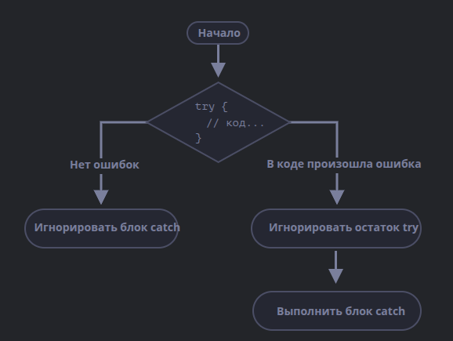

# **1.3.4 Обработка исключений**

> [Index](./0%20Index.md)
> || [1.3 Управляющие конструкции](./1.3%20Управляющие%20конструкции.md)

Обработка исключений — это механизм, позволяющий программам продолжать работу даже при возникновении ошибок, не прерывая выполнения. Он используется для захвата, управления и обработки ошибок, которые возникают во время выполнения программы.

---

## **Основные концепции**

1. **Исключения (Exceptions):**
   Исключения возникают, когда программа сталкивается с критической ошибкой (например, деление на ноль или доступ к несуществующему элементу массива).

2. **Конструкция `try-catch-finally`:**

    - `try`: Блок кода, где могут возникнуть ошибки.
    - `catch`: Обрабатывает исключения, которые произошли в блоке `try`.
    - `finally`: Блок, который выполняется всегда, независимо от того, произошла ошибка или нет.

3. **Создание пользовательских исключений:**
   Программисты могут вызывать свои исключения с помощью `throw`.

---

## **Синтаксис**

Конструкция `try..catch` состоит из двух основных блоков: `try`, затем `catch`:

```javascript
try {
    // Код, который может вызвать исключение
} catch (error) {
    // Обработка исключения
} finally {
    // Код, который выполнится в любом случае
}
```

Работает она так:

1. Сначала выполняется код внутри блока `try {...}`.
2. Если в нём нет ошибок, то блок `catch(err)` игнорируется: выполнение доходит до конца `try` и потом далее, полностью пропуская `catch`.
3. Если же в нём возникает ошибка, то выполнение `try` прерывается, и поток управления переходит в начало `catch(err)`. Переменная `err` (можно использовать любое имя) содержит объект ошибки с подробной информацией о произошедшем.
4. Блок `finally` выполняется в любом случае, получена ошибка или нет.



Таким образом, при ошибке в блоке `try {…}` скрипт не «падает», и мы получаем возможность обработать ошибку внутри `catch`.

> [!CAUTION]
>
> **`try..catch` работает только для ошибок, возникающих во время выполнения кода**
>
> Чтобы `try..catch` работал, код должен быть выполнимым. Другими словами, это должен быть корректный JavaScript-код.
>
> Он не сработает, если код синтаксически неверен, например, содержит несовпадающее количество фигурных скобок:
>
> ```plaintext
> try {
> {{{{{{{{{{{{
> } catch(e) {
>     alert("Движок не может понять этот код, он некорректен");
> }
> ```
>
> JavaScript-движок сначала читает код, а затем исполняет его. Ошибки, которые возникают во время фазы чтения, называются ошибками парсинга. Их нельзя обработать (изнутри этого кода), потому что движок не понимает код.
>
> Таким образом, `try..catch` может обрабатывать только ошибки, которые возникают в корректном коде. Такие ошибки называют «ошибками во время выполнения», а иногда «исключениями».

> [!CAUTION]
>
> **`try..catch` работает синхронно**
> Исключение, которое произойдёт в коде, запланированном «на будущее», например в `setTimeout`, `try..catch` не поймает:
>
> ```js
> try {
>     setTimeout(function () {
>         noSuchVariable; // скрипт упадёт тут
>     }, 1000);
> } catch (e) {
>     alert('не сработает');
> }
> ```
>
> Это потому, что функция выполняется позже, когда движок уже покинул конструкцию `try..catch`.
>
> Чтобы поймать исключение внутри запланированной функции, `try..catch` должен находиться внутри самой этой функции:
>
> ```js
> setTimeout(function () {
>     try {
>         noSuchVariable; // try..catch обрабатывает ошибку!
>     } catch {
>         alert('ошибка поймана!');
>     }
> }, 1000);
> ```

---

## **Объект ошибки**

Когда возникает ошибка, JavaScript генерирует объект, содержащий её детали. Затем этот объект передаётся как аргумент в блок `catch`:

```js
try {
    // ...
} catch (err) {
    // <-- объект ошибки, можно использовать другое название вместо err
    // ...
}
```

Для всех встроенных ошибок этот объект имеет два основных свойства:

-   `name`: Имя ошибки. Например, для неопределённой переменной это "ReferenceError".
-   `message`: Текстовое сообщение о деталях ошибки.

В большинстве окружений доступны и другие, нестандартные свойства. Одно из самых широко используемых и поддерживаемых – это:

-   `stack`: Текущий стек вызова: строка, содержащая информацию о последовательности вложенных вызовов, которые привели к ошибке. Используется в целях отладки.

**Например:**

```js
try {
    lalala; // ошибка, переменная не определена!
} catch (err) {
    alert(err.name); // ReferenceError
    alert(err.message); // lalala is not defined
    alert(err.stack); // ReferenceError: lalala is not defined at (...стек вызовов)

    // Можем также просто вывести ошибку целиком
    // Ошибка приводится к строке вида "name: message"
    alert(err); // ReferenceError: lalala is not defined
}
```

## **Блок `«catch»` без переменной**

> [!CAUTION]
>
> Новая возможность
> Эта возможность была добавлена в язык недавно. В старых браузерах может понадобиться полифил.
> Если нам не нужны детали ошибки, в `catch` можно её пропустить:

```js
try {
    // ...
} catch {
    // <-- без (err)
    // ...
}
```

## **Использование «try…catch»**

Давайте рассмотрим реальные случаи использования `try..catch`.

Как мы уже знаем, JavaScript поддерживает метод `JSON.parse(str)` для чтения **JSON**.

Обычно он используется для декодирования данных, полученных по сети, от сервера или из другого источника.

Мы получаем их и вызываем `JSON.parse` вот так:

```js
let json = '{"name":"John", "age": 30}'; // данные с сервера

let user = JSON.parse(json); // преобразовали текстовое представление в JS-объект

// теперь user - объект со свойствами из строки
alert(user.name); // John
alert(user.age); // 30
```

Если `json` некорректен, `JSON.parse` генерирует ошибку, то есть скрипт «падает».

Устроит ли нас такое поведение? Конечно нет!

Получается, что если вдруг что-то не так с данными, то посетитель никогда (если, конечно, не откроет консоль) об этом не узнает. А люди очень не любят, когда что-то «просто падает» без всякого сообщения об ошибке.

Давайте используем `try..catch` для обработки ошибки:

```js
let json = '{ некорректный JSON }';

try {
    let user = JSON.parse(json); // <-- тут возникает ошибка...
    alert(user.name); // не сработает
} catch (e) {
    // ...выполнение прыгает сюда
    alert('Извините, в данных ошибка, мы попробуем получить их ещё раз.');
    alert(e.name);
    alert(e.message);
}
```

Здесь мы используем блок `catch` только для вывода сообщения, но мы также можем сделать гораздо больше: отправить новый сетевой запрос, предложить посетителю альтернативный способ, отослать информацию об ошибке на сервер для логирования, … Всё лучше, чем просто «падение».

## **Генерация собственных ошибок**

Что если `json` синтаксически корректен, но не содержит необходимого свойства `name`?

Например, так:

```js
let json = '{ "age": 30 }'; // данные неполны

try {
    let user = JSON.parse(json); // <-- выполнится без ошибок
    alert(user.name); // нет свойства name!
} catch (e) {
    alert('не выполнится');
}
```

Здесь `JSON.parse` выполнится без ошибок, но на самом деле отсутствие свойства `name` для нас ошибка.

Для того, чтобы унифицировать обработку ошибок, мы воспользуемся оператором `throw`.

### **Оператор «throw»**

Оператор `throw` генерирует ошибку.

Синтаксис:

```js
throw <объект ошибки>
```

Технически в качестве объекта ошибки можно передать что угодно. Это может быть даже примитив, число или строка, но всё же лучше, чтобы это был объект, желательно со свойствами `name` и `message` (для совместимости со встроенными ошибками).

В JavaScript есть множество встроенных конструкторов для стандартных ошибок: `Error`, `SyntaxError`, `ReferenceError`, `TypeError` и другие. Можно использовать и их для создания объектов ошибки.

Их синтаксис:

```js
let error = new Error(message);
// или
let error = new SyntaxError(message);
let error = new ReferenceError(message);
// ...
```

Для встроенных ошибок (не для любых объектов, только для ошибок), свойство `name` – это в точности имя конструктора. А свойство `message` берётся из аргумента.

**Например:**

```js
let error = new Error('Ого, ошибка! o_O');

alert(error.name); // Error
alert(error.message); // Ого, ошибка! o_O
```

Давайте посмотрим, какую ошибку генерирует `JSON.parse`:

```js
try {
    JSON.parse('{ некорректный json o_O }');
} catch (e) {
    alert(e.name); // SyntaxError
    alert(e.message); // Expected property name or '}' in JSON at position 2 (line 1 column 3)
}
```

Как мы видим, это `SyntaxError`.

В нашем случае отсутствие свойства `name` – это ошибка, ведь пользователи должны иметь имена.

Сгенерируем её:

```js
let json = '{ "age": 30 }'; // данные неполны

try {
    let user = JSON.parse(json); // <-- выполнится без ошибок

    if (!user.name) {
        throw new SyntaxError('Данные неполны: нет имени'); // (*)
    }

    alert(user.name);
} catch (e) {
    alert('JSON Error: ' + e.message); // JSON Error: Данные неполны: нет имени
}
```

В строке `(*)` оператор `throw` генерирует ошибку `SyntaxError` с сообщением `message`. Точно такого же вида, как генерирует сам JavaScript. Выполнение блока `try` немедленно останавливается, и поток управления прыгает в `catch`.

Теперь блок `catch` становится единственным местом для обработки всех ошибок: и для `JSON.parse` и для других случаев.

## **Проброс исключения**

В примере выше мы использовали `try..catch` для обработки некорректных данных. А что, если в блоке `try {...}` возникнет другая неожиданная ошибка? Например, программная (неопределённая переменная) или какая-то ещё, а не ошибка, связанная с некорректными данными.

**Пример:**

```js
let json = '{ "age": 30 }'; // данные неполны

try {
    user = JSON.parse(json); // <-- забыл добавить "let" перед user

    // ...
} catch (err) {
    alert('JSON Error: ' + err); // JSON Error: ReferenceError: user is not defined
    // (не JSON ошибка на самом деле)
}
```

Конечно, возможно все! Программисты совершают ошибки. Даже в утилитах с открытым исходным кодом, используемых миллионами людей на протяжении десятилетий – вдруг может быть обнаружена ошибка, которая приводит к ужасным взломам.

В нашем случае `try..catch` предназначен для выявления ошибок, связанных с некорректными данными. Но по своей природе `catch` получает все свои ошибки из `try`. Здесь он получает неожиданную ошибку, но всё также показывает то же самое сообщение `"JSON Error"`. Это неправильно и затрудняет отладку кода.

К счастью, мы можем выяснить, какую ошибку мы получили, например, по её свойству `name`:

```js
try {
    user = {
        /*...*/
    };
} catch (e) {
    alert(e.name); // "ReferenceError" из-за неопределённой переменной
}
```

Есть простое правило:

> **Блок `catch` должен обрабатывать только те ошибки, которые ему известны, и «пробрасывать» все остальные.**

Техника «проброс исключения» выглядит так:

1. Блок `catch` получает все ошибки.
2. В блоке `catch(err) {...}` мы анализируем объект ошибки `err`.
3. Если мы не знаем как её обработать, тогда делаем `throw err`.

В коде ниже мы используем проброс исключения, `catch` обрабатывает только `SyntaxError`:

```js
let json = '{ "age": 30 }'; // данные неполны
try {
    let user = JSON.parse(json);

    if (!user.name) {
        throw new SyntaxError('Данные неполны: нет имени');
    }

    blabla(); // неожиданная ошибка

    alert(user.name);
} catch (e) {
    if (e.name == 'SyntaxError') {
        alert('JSON Error: ' + e.message);
    } else {
        throw e; // проброс (*)
    }
}
```

Ошибка в строке `(*)` из блока `catch` «выпадает наружу» и может быть поймана другой внешней конструкцией `try..catch` (если есть), или «убьёт» скрипт.

Таким образом, блок `catch` фактически обрабатывает только те ошибки, с которыми он знает, как справляться, и пропускает остальные.

Пример ниже демонстрирует, как такие ошибки могут быть пойманы с помощью ещё одного уровня `try..catch`:

```js
function readData() {
    let json = '{ "age": 30 }';

    try {
        // ...
        blabla(); // ошибка!
    } catch (e) {
        // ...
        if (e.name != 'SyntaxError') {
            throw e; // проброс исключения (не знаю как это обработать)
        }
    }
}

try {
    readData();
} catch (e) {
    alert('Внешний catch поймал: ' + e); // поймал!
}
```

Здесь `readData` знает только, как обработать `SyntaxError`, тогда как внешний блок `try..catch` знает, как обработать всё.

## **try…catch…finally**

Конструкция `try..catch` может содержать ещё одну секцию: `finally`.

Если секция есть, то она выполняется в любом случае:

-   после `try`, если не было ошибок,
-   после `catch`, если ошибки были.

Расширенный синтаксис выглядит следующим образом:

```js
try {
... пробуем выполнить код...
} catch(e) {
... обрабатываем ошибки ...
} finally {
... выполняем всегда ...
}
```

Попробуйте запустить такой код:

```js
try {
    alert('try');
    if (confirm('Сгенерировать ошибку?')) BAD_CODE();
} catch (e) {
    alert('catch');
} finally {
    alert('finally');
}
```

У кода есть два пути выполнения:

1. Если вы ответите на вопрос «Сгенерировать ошибку?» утвердительно, то `try -> catch -> finally`.
2. Если ответите отрицательно, то `try -> finally`.

Секцию `finally` часто используют, когда мы начали что-то делать и хотим завершить это вне зависимости от того, будет ошибка или нет.

Например, мы хотим измерить время, которое занимает функция чисел Фибоначчи `fib(n)`. Естественно, мы можем начать измерения до того, как функция начнёт выполняться и закончить после. Но что делать, если при вызове функции возникла ошибка? В частности, реализация `fib(n)` в коде ниже возвращает ошибку для отрицательных и для нецелых чисел.

Секция `finally` отлично подходит для завершения измерений несмотря ни на что.

Здесь `finally` гарантирует, что время будет измерено корректно в обеих ситуациях – и в случае успешного завершения `fib` и в случае ошибки:

```js
let num = +prompt('Введите положительное целое число?', 35);

let diff, result;

function fib(n) {
    if (n < 0 || Math.trunc(n) != n) {
        throw new Error('Должно быть целое неотрицательное число');
    }
    return n <= 1 ? n : fib(n - 1) + fib(n - 2);
}

let start = Date.now();

try {
    result = fib(num);
} catch (e) {
    result = 0;
} finally {
    diff = Date.now() - start;
}

alert(result || 'возникла ошибка');

alert(`Выполнение заняло ${diff}ms`);
```

Вы можете это проверить, запустив этот код и введя `35` в `prompt` – код завершится нормально, `finally` выполнится после `try`. А затем введите `-1` – незамедлительно произойдёт ошибка, выполнение займёт `0ms`. Оба измерения выполняются корректно.

Другими словами, неважно как завершилась функция: через `return` или `throw`. Секция `finally` срабатывает в обоих случаях.

> [!NOTE]
>
> **Переменные внутри try..catch..finally локальны**
> Обратите внимание, что переменные `result` и `diff` в коде выше объявлены до `try..catch`.
>
> Если переменную объявить в блоке, например, в `try`, то она не будет доступна после него.

> [!NOTE]
>
> **finally и return**
> Блок `finally` срабатывает при любом выходе из `try..catch`, в том числе и `return`.
>
> В примере ниже из `try` происходит `return`, но `finally` получает управление до того, как контроль возвращается во внешний код.
>
> ```js
> function func() {
>     try {
>         return 1;
>     } catch (e) {
>         /* ... */
>     } finally {
>         alert('finally');
>     }
> }
>
> alert(func()); // сначала срабатывает alert из finally, а затем этот код
> ```

> [!NOTE] > **try..finally**
> Конструкция `try..finally` без секции `catch` также полезна. Мы применяем её, когда не хотим здесь обрабатывать ошибки (пусть выпадут), но хотим быть уверены, что начатые процессы завершились.
>
> ```js
> function func() {
>     // начать делать что-то, что требует завершения (например, измерения)
>     try {
>         // ...
>     } finally {
>         // завершить это, даже если все упадёт
>     }
> }
> ```
>
> В приведённом выше коде ошибка всегда выпадает наружу, потому что тут нет блока `catch`. Но `finally` отрабатывает до того, как поток управления выйдет из функции.

## **Глобальный catch**

> [!CAUTION]
>
> Зависит от окружения
> Информация из данной секции не является частью языка JavaScript.

Давайте представим, что произошла фатальная ошибка (программная или что-то ещё ужасное) снаружи `try..catch`, и скрипт упал.

Существует ли способ отреагировать на такие ситуации? Мы можем захотеть залогировать ошибку, показать что-то пользователю (обычно они не видят сообщение об ошибке) и т.д.

Такого способа нет в спецификации, но обычно окружения предоставляют его, потому что это весьма полезно. Например, в **Node.js** для этого есть `process.on("uncaughtException")`. А в браузере мы можем присвоить функцию специальному свойству `window.onerror`, которая будет вызвана в случае необработанной ошибки.

Синтаксис:

```js
window.onerror = function (message, url, line, col, error) {
    // ...
};
```

-   `message`: Сообщение об ошибке.
-   `url`: URL скрипта, в котором произошла ошибка.
-   `line, col`: Номера строки и столбца, в которых произошла ошибка.
-   `error`: Объект ошибки.

**Пример:**

```html
<script>
    window.onerror = function (message, url, line, col, error) {
        alert(`${message}\n В ${line}:${col} на ${url}`);
    };

    function readData() {
        badFunc(); // Ой, что-то пошло не так!
    }

    readData();
</script>
```

Роль глобального обработчика `window.onerror` обычно заключается не в восстановлении выполнения скрипта – это скорее всего невозможно в случае программной ошибки, а в отправке сообщения об ошибке разработчикам.

Существуют также веб-сервисы, которые предоставляют логирование ошибок для таких случаев, такие как [https://www.muscula.com](https://www.muscula.com).

Они работают так:

-   Мы регистрируемся в сервисе и получаем небольшой JS-скрипт (или URL скрипта) от них для вставки на страницы.
-   Этот JS-скрипт ставит свою функцию `window.onerror`.
-   Когда возникает ошибка, она выполняется и отправляет сетевой запрос с информацией о ней в сервис.
-   Мы можем войти в веб-интерфейс сервиса и увидеть ошибки.

## **Итого**

Конструкция `try..catch` позволяет обрабатывать ошибки во время исполнения кода. Она позволяет запустить код и перехватить ошибки, которые могут в нём возникнуть.

Синтаксис:

```js
try {
    // исполняем код
} catch (err) {
    // если случилась ошибка, прыгаем сюда
    // err - это объект ошибки
} finally {
    // выполняется всегда после try/catch
}
```

Секций `catch` или `finally` может не быть, то есть более короткие конструкции `try..catch` и `try..finally` также корректны.

Объекты ошибок содержат следующие свойства:

-   `message` – понятное человеку сообщение.
-   `name` – строка с именем ошибки (имя конструктора ошибки).
-   `stack` (нестандартное, но хорошо поддерживается) – стек на момент ошибки.

Если объект ошибки не нужен, мы можем пропустить его, используя `catch {` вместо `catch(err) {`.

Мы можем также генерировать собственные ошибки, используя оператор `throw`. Аргументом `throw` может быть что угодно, но обычно это объект ошибки, наследуемый от встроенного класса `Error`.

Проброс исключения – это очень важный приём обработки ошибок: блок `catch` обычно ожидает и знает, как обработать определённый тип ошибок, поэтому он должен пробрасывать дальше ошибки, о которых он не знает.

Даже если у нас нет `try..catch`, большинство сред позволяют настроить «глобальный» обработчик ошибок, чтобы ловить ошибки, которые «выпадают наружу». В браузере это `window.onerror`.

---

## **Примеры кода**

### **Пример 1: Деление на ноль**

```javascript
function divide(a, b) {
    try {
        if (b === 0) {
            throw new Error('На ноль делить нельзя!');
        }
        return a / b;
    } catch (error) {
        console.error('Ошибка:', error.message);
    } finally {
        console.log('Операция завершена.');
    }
}

divide(10, 2); // 5
divide(10, 0); // Ошибка: На ноль делить нельзя!
```

---

### **Пример 2: Обработка отсутствия файла**

```javascript
const fs = require('fs');

function readFile(filePath) {
    try {
        const data = fs.readFileSync(filePath, 'utf-8');
        console.log('Содержимое файла:', data);
    } catch (error) {
        console.error('Ошибка при чтении файла:', error.message);
    } finally {
        console.log('Завершение операции чтения.');
    }
}

readFile('./existing-file.txt'); // Читает файл
readFile('./missing-file.txt'); // Ошибка при чтении файла
```

---

### **Пример 3: Пользовательское исключение**

```javascript
function checkAge(age) {
    try {
        if (age < 0) {
            throw new Error('Возраст не может быть отрицательным!');
        } else if (age < 18) {
            throw new Error('Возраст меньше 18!');
        }
        console.log('Возраст принят.');
    } catch (error) {
        console.error('Ошибка:', error.message);
    }
}

checkAge(25); // Возраст принят.
checkAge(-5); // Ошибка: Возраст не может быть отрицательным!
checkAge(15); // Ошибка: Возраст меньше 18!
```

---

### **Пример 4: Перехват конкретных типов ошибок**

```javascript
function parseJson(jsonString) {
    try {
        const data = JSON.parse(jsonString);
        console.log('Успешно разобран JSON:', data);
    } catch (error) {
        if (error instanceof SyntaxError) {
            console.error('Ошибка синтаксиса JSON:', error.message);
        } else {
            console.error('Неизвестная ошибка:', error.message);
        }
    }
}

parseJson('{"name":"John"}'); // Успешно разобран JSON
parseJson('Invalid JSON'); // Ошибка синтаксиса JSON
```

---

## **Преимущества обработки исключений**

1. Позволяет предотвратить краш приложения.
2. Улучшает читаемость кода при сложной логике.
3. Помогает централизовать обработку ошибок.
4. Обеспечивает возможность выполнения завершающего кода (`finally`).

---

## **Недостатки обработки исключений**

1. Неправильное использование может привести к запутанному коду.
2. Ловля исключений, которые можно было бы предотвратить, снижает производительность.
3. Сложность отладки, если исключения слишком общие или плохо документированы.

---

## **Задачи**

1. **Деление на ноль**
   Напишите функцию `divide(a, b)`, которая принимает два аргумента `a` и `b`. Если `b` равно нулю, функция должна выбрасывать исключение с сообщением `"Division by zero is not allowed"`. В противном случае функция должна возвращать результат деления `a` на `b`.

2. **Проверка возраста**
   Напишите функцию `checkAge(age)`, которая принимает аргумент `age`. Если возраст меньше `18`, функция должна выбрасывать исключение с сообщением `"You must be at least 18 years old"`. В противном случае функция должна возвращать сообщение `"Access granted"`. Используйте блок `try...catch` для вызова функции и обработки исключения.

3. **Чтение JSON**
   Напишите функцию `parseJSON(jsonString)`, которая принимает строку в формате `JSON` и возвращает объект, если строка правильно отформатирована. Если строка содержит ошибку, функция должна выбрасывать исключение с сообщением `"Invalid JSON format"`. Используйте блок `try...catch` для вызова функции и обработки исключения.

4. **Проверка ввода пользователя**
   Напишите функцию `validateInput(input)`, которая принимает строковый аргумент `input`. Если строка пуста, функция должна выбрасывать исключение с сообщением `"Input cannot be empty"`. Если строка содержит не буквенно-цифровые символы, функция должна выбрасывать исключение с сообщением `"Input must be alphanumeric"`. В противном случае функция должна возвращать сообщение `"Input is valid"`. Используйте `блок try...catch` для обработки возможных исключений.

5. Напишите функцию, которая проверяет, является ли переданная строка числом. Если нет — выбрасывайте исключение.
6. Реализуйте функцию, которая бросает исключение, если массив пустой.
7. Реализуйте игру "Угадай число". При вводе нечисловых значений выбрасывайте исключение.
8. Создайте функцию, которая принимает объект с обязательными полями. Если поле отсутствует, выбрасывайте исключение.
9. `Finally` или просто код?
   Сравните два фрагмента кода.

Первый использует `finally` для выполнения кода после `try..catch`:

```js
try {
  начать работу
  работать
} catch (e) {
  обработать ошибку
} finally {
  очистить рабочее пространство
}
```

Второй фрагмент просто ставит очистку после `try..catch`:

```js
try {
начать работу
работать
} catch (e) {
обработать ошибку
}

очистить рабочее пространство
```

Нам определённо нужна очистка после работы, неважно возникли ошибки или нет.

Есть ли здесь преимущество в использовании `finally` или оба фрагмента кода одинаковы? Если такое преимущество есть, то дайте пример, когда оно проявляется.
