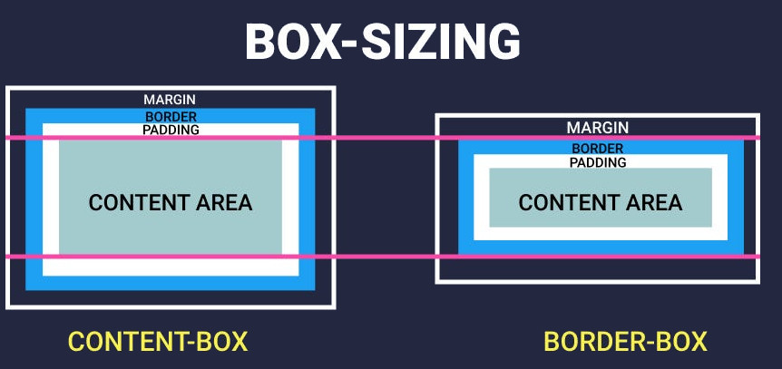

# **1.3. Основы верстки**

> [Home](../readme.md)
> || [A1](./0%20Index.md)

---

## |1| **Основы блочной модели**

CSS (Cascading Style Sheets) предоставляет возможность управлять размерами и расположением элементов на веб-странице с помощью блочной модели.

**Блочная модель (Box Model)** — это фундаментальная концепция CSS, описывающая, как элементы отображаются на веб-странице. Каждый HTML-элемент (блочный или строчно-блочный) представляется в виде прямоугольного контейнера. Каждый контейнер состоит из нескольких слоев, которые суммарно определяют итоговые размеры и поведение элемента на странице.

1. **Content (Содержимое):**
   Область, где располагается непосредственно контент элемента (текст, изображение и т.д.). Размеры этой области задаются свойствами `width` и `height`.
2. **Padding (Внутренний отступ):**
   Пространство между содержимым и границей элемента. Оно «внутри» элемента и увеличивает его визуальный размер, не влияя на размеры содержимого. Задается свойством `padding`.
3. **Border (Граница):**
   Линия, окружающая содержимое и внутренний отступ. Обрамляет элемент, располагаясь между внутренними и внешними отступами. Размер рамки добавляется к общему размеру элемента. Задается свойством `border`.
4. **Margin (Внешний отступ):**
   Пространство между границей элемента и соседними элементами, которое отделяет элемент от соседних элементов. Это расстояние между внешними границами элемента и окружающими элементами. Задается свойством `margin`.

Блочная модель является фундаментом для верстки, так как она влияет на:

-   Расположение элементов на странице.
-   Расчёт отступов между элементами.
-   Визуальное отображение границ и фоновых заливок.

### 1. **Свойства блочной модели**

Рассмотрим ключевые свойства, управляющие размерами и отступами элемента.

#### **1.1. Ширина и высота - `width` и `height`**

Свойства `width` (ширина) и `height` (высота) задают размеры контента элемента. Измеряется без учета полей, отступов и границ.

**Синтаксис:**

```css
width: <значение>;
height: <значение>;
```

**Значения:**

-   Ключевые слова: `auto` (по умолчанию), `max-content`, `min-content`.
-   Абсолютные единицы: `px`, `cm`, `mm`.
-   Относительные единицы: `%`, `vw`, `vh`, `rem`.

**Пример:**

```css
div {
    width: 300px; /* Фиксированная ширина */
    height: 200px; /* Фиксированная высота */
}
div {
    width: 50%; /* Ширина 50% от родительского элемента */
    height: 50%; /* Высота 50% от родительского элемента */
}
```

**Особенности:**

-   Если элемент имеет `padding` или `border`, общая ширина/высота элемента увеличивается (если не используется `box-sizing: border-box`).
-   Для адаптивности используйте относительные единицы (`%`, `vw`).
-   При задании этих свойств учитывается только область содержимого (content area).
-   Если размеры не заданы явно, элемент может принимать размеры в зависимости от его содержимого и контекста (например, блочные элементы по умолчанию занимают 100% доступной ширины родительского контейнера).

#### **1.2. Внутренние отступы `padding`**

Свойство `padding` задает внутренние отступы элемента, которые определяют пространство между контентом элемента и его границей.

**Синтаксис:**

```css
padding: <все_стороны>; /* 1 значение */
padding: <верх_низ> <лево_право>; /* 2 значения */
padding: <верх> <лево_право> <низ>; /* 3 значения */
padding: <верх> <право> <низ> <лево>; /* 4 значения */
```

**Значения:**

-   Единицы измерения: `px`, `em`, `%` (относительно ширины родителя).
-   Внутренние отступы могут задаваться для всех сторон одновременно или для каждой стороны отдельно (`padding-top`, `padding-right`, `padding-bottom`, `padding-left`).

**Пример:**

```css
div {
    padding: 20px; /* Внутренний отступ 20px для всех сторон */
    padding: 10px 20px; /* Внутренний отступ 10px сверху и снизу, 20px справа и слева */
    padding: 5px 10px 15px 20px; /* Верх, право, низ, лево */
    padding-top: 10px; /* Внутренний отступ сверху */
    padding-right: 20px; /* Внутренний отступ справа */
    padding-bottom: 30px; /* Внутренний отступ снизу */
    padding-left: 40px; /* Внутренний отступ слева */
}
```

**Особенности:**

-   Может быть задан отдельно для каждой стороны: `padding-top`, `padding-right`, `padding-bottom`, `padding-left`.
-   Внутренние отступы увеличивают область элемента, но не влияют на размеры содержимого, если они не заданы отдельно через `width` и `height` (если элементу задана фиксированная ширина, то `padding` прибавляется к этой ширине для расчёта итогового размера, если не используется модель `box-sizing: border-box`).

#### **1.3. Граница `border`**

Свойство `border` задает границу элемента. Граница может иметь ширину, стиль и цвет.

**Синтаксис:**

```css
border: <толщина> <стиль> <цвет>;
```

**Свойства:**

-   `border-width`: толщина границы (`thin`, `medium`, `thick` или конкретное значение в пикселях).
-   `border-style`: стиль (`solid`, `dashed`, `dotted`, `double`, `none`).
-   `border-color`: цвет (HEX, RGB, HSL).
-   Границы могут задаваться для всех сторон одновременно или для каждой стороны отдельно (`border-top`, `border-right`, `border-bottom`, `border-left`).

**Пример:**

```css
div {
    border: 2px solid #000; /* Граница толщиной 2px, сплошная, черного цвета */
    border-width: 2px; /* Толщина границы */
    border-style: dashed; /* Стиль границы (пунктирная) */
    border-color: #ff0000; /* Цвет границы (красный) */
    border-top: 1px solid #000; /* Граница сверху */
    border-right: 2px dashed #ff0000; /* Граница справа */
    border-bottom: 3px dotted #00ff00; /* Граница снизу */
    border-left: 4px double #0000ff; /* Граница слева */
}
```

**Особенности:**

-   Граница добавляется к общему размеру элемента (если не задано `box-sizing: border-box`).
-   Можно задавать границы для отдельных сторон:  
    `border-top`, `border-right`, `border-bottom`, `border-left`.

#### **1.4. Внешние отступы `margin`**

Свойство `margin` задает внешние отступы элемента, которые определяют пространство между границей элемента и соседними элементами.

**Синтаксис:**

```css
margin: <все_стороны>; /* 1 значение */
margin: <верх_низ> <лево_право>; /* 2 значения */
margin: <верх> <лево_право> <низ>; /* 3 значения */
margin: <верх> <право> <низ> <лево>; /* 4 значения */
```

**Значения:**

-   `auto`: центрирует элемент по горизонтали (если задана ширина).
-   Единицы измерения: `px`, `em`, `%`.
-   Отрицательные значения: позволяют "вытягивать" элемент за пределы родительского контейнера.
-   Внешние отступы могут задаваться для всех сторон одновременно или для каждой стороны отдельно (`margin-top`, `margin-right`, `margin-bottom`, `margin-left`).

**Пример:**

```css
div {
    margin: 20px; /* Внешний отступ 20px для всех сторон */
    margin: 10px 20px; /* Внешний отступ 10px сверху и снизу, 20px справа и слева */
    margin-top: 10px; /* Внешний отступ сверху */
    margin-right: 20px; /* Внешний отступ справа */
    margin-bottom: 30px; /* Внешний отступ снизу */
    margin-left: 40px; /* Внешний отступ слева */
}
```

**Особенности:**

-   Margin влияет на его позиционирование элемента, а не на его размер.
-   Вертикальные отступы (`margin-top` и `margin-bottom`) двух соседних по вертикали блоков могут **«схлопываться»**, то есть суммарное расстояние между элементами будет равно большему из этих значений, а не их сумме. Это поведение важно учитывать при построении макетов.
-   Можно задавать отдельно для каждой стороны:  
    `margin-top`, `margin-right`, `margin-bottom`, `margin-left`.

### 2. **Вычисление размеров элементов**

Свойство `box-sizing` переопределяет стандартное поведение Box Model, упрощая расчеты размеров элементов. Управляет тем, как вычисляются размеры элементов с учетом внутренних отступов и границ.

По сути `box-sizing` определяет будут ли значения свойств `width` и `height` включать в себя значения `padding` и `border` или нет.

Оно может принимать два значения: `content-box` (значение по умолчанию) и `border-box`.

> [!TIP]
>
> **Исторический контекст и современные практики**
>
> -   **Ранние версии CSS:**
>     Только `content-box`, что усложняло верстку.
> -   **Стандартизация `border-box`:**
>     В 2012 году Paul Irish предложил глобальное применение `border-box`, что стало популярным решением.
> -   **Современные фреймворки:**
>     Bootstrap, Foundation используют `border-box` по умолчанию.

#### **2.1. Значение `content-box` (по умолчанию)**

Значение `content-box` означает, что свойства `width` и `height` определяют **только размер содержимого**. Свойства `padding` и `border` добавляются к ним, увеличивая итоговую «физическую» ширину и высоту элемента.

**Формулы:**

-   **Общая ширина** = `width` + `padding-left` + `padding-right` + `border-left-width` + `border-right-width`
-   **Общая высота** = `height` + `padding-top` + `padding-bottom` + `border-top-width` + `border-bottom-width`

**Пример:**

```css
div {
    width: 200px;
    height: 100px;
    padding: 20px;
    border: 5px solid #000;
    box-sizing: content-box;
}
```

_Объяснение:_

-   **Фактическая ширина:** `200px + 20px*2 + 5px*2 = 250px`
-   **Фактическая высота:** `100px + 20px*2 + 5px*2 = 150px`

**Преимущества:**  
Подходит для простых случаев, когда нужно задать только размеры содержимого, и вы хотите явно контролировать добавляемые отступы.

**Недостатки:**  
Может привести к неожиданным переполнениям или нарушению макета, если к фиксированным размерам добавляются большие padding или border.

#### **2.2. Значение `border-box`**

Значение `border-box` означает, что свойства `width` и `height` включают **содержимое, padding и border**. Margin по-прежнему не учитывается. Это значение делает размеры элемента более предсказуемыми и облегчает управление макетом.

**Формулы:**

-   **Общая ширина** = `width` (уже включает `padding` и `border`)
-   **Общая высота** = `height` (уже включает `padding` и `border`)

**Пример:**

```css
div {
    width: 200px;
    height: 100px;
    padding: 20px;
    border: 5px solid #000;
    box-sizing: border-box;
}
```

_Объяснение:_

-   **Ширина содержимого:** `200px - 20px*2 - 5px*2 = 150px`
-   **Высота содержимого:** `100px - 20px*2 - 5px*2 = 50px`

**Преимущества:**  
Упрощает разработку адаптивных макетов, так как итоговый размер элемента становится предсказуемым и не зависит от добавления внутренних отступов или рамок.

**Недостатки:**  
Может потребовать изменения привычного подхода к расчетам размеров для разработчиков, привыкших к модели `content-box`.

#### **2.3. Наследование `box-sizing`**

-   Свойство `box-sizing` не наследуется.
-   Для дочерних элементов нужно явно задавать значение, если требуется.
-   Используйте значение `inherit` для наследования.

```css
* {
    box-sizing: content-box;
}
.header {
    box-sizing: border-box;
}
```

```html
<body>
    <div class="header">
        <p>Text</p>
    </div>
</body>
```

_Объяснение:_

-   Для элемента с классом `header` будет установлено `box-sizing: border-box;`
-   Для элемента параграф будет установлено `box-sizing: content-box;`

#### **2.4. Глобальная настройка**

На практике, современные веб-разработчики часто используют модель `border-box` для всего проекта, поскольку она упрощает расчеты и уменьшает вероятность ошибок в макете. Это можно сделать глобально, используя универсальный селектор:

```css
/* Глобальное применение border-box для всех элементов */
*,
*::before,
*::after {
    box-sizing: border-box;
}
```

_Объяснение:_

Такой подход гарантирует, что все элементы, а также их псевдоэлементы `::before` и `::after`, будут рассчитываться по модели, где padding и border включены в заданное значение `width` и `height`.

**Преимущества:**

-   Упрощает расчеты ширины и высоты. Вы избавляетесь от необходимости учитывать дополнительные значения при построении макета.
-   Избегает проблем с переполнением контейнеров. Если элементу задана фиксированная ширина, она останется неизменной независимо от его внутренних отступов и рамок.
-   Совместимо с современными методами верстки (Flexbox, Grid).

#### **2.5. Поддержка браузерами**

-   Свойство **`box-sizing`** поддерживается всеми современными браузерами, включая IE8+.
-   Для IE7 и ниже можно использовать полифиллы или условные комментарии.

#### **2.6. Визуализация**



### 3. **Пример использования всех свойств блочной модели**

#### **3.1. Пример, включающий все вышеописанные свойства для работы с блочной моделью:**

```css
/* file `styles.css` */
body {
    background-color: #f0f0f0; /* Цвет фона для всего документа */
    font-family: Arial, sans-serif;
}

.box {
    background-color: #ff6347; /* Цвет фона */
    width: 300px; /* Ширина */
    height: 200px; /* Высота */
    padding: 10px; /* Внутренние отступы */
    border: 2px solid #000; /* Граница */
    margin: 20px auto; /* Внешние отступы */
    color: white; /* Цвет текста */
    line-height: 100px; /* Межстрочный интервал для центрирования текста */
    text-align: center; /* Выравнивание текста по центру */
}
```

```html
<!DOCTYPE html>
<html lang="ru">
    <head>
        <meta charset="UTF-8" />
        <title>Пример работы с блочной моделью в CSS</title>
        <link rel="stylesheet" href="styles.css" />
    </head>
    <body>
        <div class="box">
            <p>Содержимое элемента</p>
        </div>
    </body>
</html>
```

_Объяснение:_

-   Элемент `body` имеет светло-серый цвет фона.
-   Элемент `div` с классом `box` имеет следующие стили:
    -   Ширина `300px` и высота `200px`.
    -   Внешние отступы `20px` и центрирование с использованием автомаржинов.
    -   Внутренние отступы `10px`.
    -   Граница толщиной `2px`, сплошная, черного цвета.
    -   Фоновый цвет `#ff6347`.
    -   Цвет текста белый.

#### **3.2. Пример, включающий использование свойства `box-sizing`:**

```css
/* file `styles.css` */
body {
    background-color: #f0f0f0; /* Цвет фона для всего документа */
    height: 100vh;
    font-family: Arial, sans-serif;
}

div {
    background-color: #ff6347;
    width: 200px;
    height: 100px;
    padding: 20px;
    border: 10px solid #000;
    color: white;
    line-height: 100px;
    text-align: center;
}

.content-box {
    box-sizing: content-box; /* Значение по умолчанию */
}

.border-box {
    box-sizing: border-box;
}
```

```html
<!DOCTYPE html>
<html lang="ru">
    <head>
        <meta charset="UTF-8" />
        <title>Пример box-sizing в CSS</title>
        <link rel="stylesheet" href="styles.css" />
    </head>
    <body>
        <div class="content-box">Контент Box (content-box)</div>
        <div class="border-box">Контент Box (border-box)</div>
    </body>
</html>
```

_Объяснение:_

-   Элемент `div` с классом `content-box` использует значение `content-box` для свойства `box-sizing`, что увеличивает его общий размер за счет внутренних отступов и границы.
-   Элемент `div` с классом `border-box` использует значение `border-box` для свойства `box-sizing`, что делает его общий размер предсказуемым и не изменяет его за счет внутренних отступов и границы.

#### **3.3. Проблема: Неожиданное увеличение размеров**

**Сценарий:**

```css
.box {
    width: 300px;
    padding: 20px;
    border: 5px solid #000;
}
```

_Объяснение:_

-   **Итоговая ширина:** `300px + 20px*2 + 5px*2 = 350px`.
-   Если родительский контейнер имеет ширину `300px`, элемент выйдет за его границы.

**Решение:**

```css
.box {
    box-sizing: border-box;
    width: 300px;
    padding: 20px;
    border: 5px solid #000;
}
```

_Объяснение:_

-   **Итоговая ширина:** `300px` (включая padding и border).

#### **3.4. Адаптивный дизайн с `border-box`**

Пример адаптивной колонки:

```css
.column {
    box-sizing: border-box;
    width: 50%;
    padding: 20px;
    border: 2px solid #ccc;
}
```

_Объяснение:_

-   Даже при изменении ширины экрана, `padding` и `border` не нарушат макет.

### 4. **Подводные камни и рекомендации**

#### **4.1. Использование в комбинации с медиа-запросами**

-   **Адаптивность:**  
    При разработке адаптивных макетов важно понимать, как изменяется размер элемента в зависимости от модели. При использовании `border-box` вы можете задавать размеры блоков в процентах, не опасаясь, что внутренние отступы увеличат итоговую ширину.
-   **Медиа-запросы:**  
    Если вы переключаете стили через медиа-запросы, убедитесь, что глобальное правило `box-sizing` применяется ко всем элементам, чтобы избежать расхождений в расчете размеров на разных устройствах.

#### **4.2. Совместимость с устаревшими браузерами**

-   **Поддержка:**  
    Современные браузеры поддерживают свойство `box-sizing` уже много лет, однако для крайне старых браузеров может потребоваться полифил или специальная настройка. Обычно такой вопрос не актуален для современных проектов.

#### **4.3. Интеграция с CSS-фреймворками**

-   **Фреймворки:**  
    Многие CSS-фреймворки (например, Bootstrap) уже используют глобальное правило `box-sizing: border-box`. При разработке собственных стилей рекомендуется либо следовать аналогичной схеме, либо чётко документировать выбранную модель для избежания конфликтов.

#### **4.4. Документация и код-ревью**

-   **Поддержка проекта:**  
    При работе в команде крайне важно документировать выбранную модель и стандарты написания CSS. Это поможет избежать путаницы при работе с размерами элементов и гарантировать единообразное поведение во всем проекте.

### **Заключение**

-   **Блочная модель** — основа позиционирования и размеров элементов в CSS.
    -   Размеры элемента (его полная ширина и высота) складываются из размеров содержимого, внутреннего отступа, границы и внешнего отступа.
-   **Основные свойства:**
    -   `width`/`height`: размер содержимого.
    -   `padding`: внутренний отступ.
    -   `border`: граница.
    -   `margin`: внешний отступ.
-   **`box-sizing: border-box`:**
    -   упрощает контроль размеров, включая `padding` и `border` в `width`/`height`.
    -   упрощает создание адаптивных макетов.
    -   совместимо с современными инструментами верстки.
    -   всегда устанавливайте `box-sizing: border-box` глобально.
    -   используйте инструменты разработчика для визуализации Box Model.
    -   учитывайте схлопывание margin'ов при вертикальном расположении элементов.

#### **Отладка Box Model**

**Инструменты разработчика браузера** (Chrome DevTools, Firefox Inspector) позволяют детально изучить Box Model:

1. Нажмите `F12` или **ПКМ → Inspect** → вкладка **Elements** (Chrome) или **Inspector** (Firefox).
2. Выберите элемент → во вкладке **Computed** отобразятся все компоненты блочной модели.
    - Content (синий),
    - Padding (зеленый),
    - Border (коричневый),
    - Margin (оранжевый).

---

## |2| **Основы позиционирования**

Позиционирование в CSS определяет, как элементы располагаются на веб-странице. Оно включает:

-   **Тип отображения** (`display`):
    Как элемент взаимодействует с потоком документа.
-   **Тип позиционирования** (`position`):
    Как элемент позиционируется относительно других элементов или окна браузера.
-   **Смещение** (`top`, `right`, `bottom`, `left`):
    Точное управление положением элемента.
-   **Слои** (`z-index`):
    Управление порядком наложения элементов.

### 1. **Свойство `display`**

Свойство `display` определяет, как элемент ведет себя в документе — как блочный, строчный или другой тип контейнера. Оно влияет на то, как элемент занимает пространство, как располагаются его содержимое и соседние элементы. Оно может принимать различные значения, среди которых наиболее часто используются `inline` и `block`.

#### **1.1. Значение `inline`**

Значение `inline` указывает, что элемент является строчным и будет отображаться в одной строке с другими элементами. Элементы с `display: inline` не начинают новую строку и занимают только необходимое пространство. Ширина и высота определяются содержимым. Нельзя задавать `width`, `height`, вертикальные `margin` и `padding`.

**Примеры элементов:** `<span>`, `<a>`, `<strong>`.

**Пример:**

```css
div.inline {
    display: inline;
}
```

```html
<p>Это <div class="inline">строчный элемент</div> в тексте.</p>
```

_Объяснение:_

В этом примере элемент `<div>` является строчным и находится в одной строке с текстом внутри абзаца `<p>`.

#### **1.2. Значение `block`**

Значение `block` указывает, что элемент является блочным и будет начинать новую строку. Элементы с `display: block` занимают всю доступную ширину родителя и могут иметь размеры, заданные с помощью свойств `width` и `height`, а также поддерживают все виды отступов.

**Примеры элементов:** `<div>`, `<p>`, `<h1>`.

**Пример:**

```css
span.block {
    display: block;
}
```

```html
<span class="block">Это блочный элемент</span>
<p>Текст после блочного элемента</p>
```

_Объяснение:_

В этом примере элемент `<span>` является блочным и начинает новую строку, разделяя текст на две отдельные строки.

#### **1.3. Значение `table`?**

Свойство `display: table` — это CSS-свойство, которое заставляет элемент вести себя как HTML-таблица (`<table>`). Оно позволяет создавать табличные структуры без использования тегов `<table>`, `<tr>`, `<td>`, что полезно для семантически нейтральной вёрстки или решения специфических задач.

**Основные значения для табличной структуры:**

-   `display: table` — контейнер, аналогичный `<table>`.
-   `display: table-row` — строка, аналогичная `<tr>`.
-   `display: table-cell` — ячейка, аналогичная `<td>`.
-   `display: table-header-group` — группа заголовков, аналогичная `<thead>`.
-   `display: table-footer-group` — группа подвала, аналогичная `<tfoot>`.
-   `display: table-caption` — заголовок таблицы, аналогичный `<caption>`.

**Пример:**

```css
.table {
    display: table;
    width: 100%;
    border-collapse: collapse; /* Убирает двойные границы */
}

.row {
    display: table-row;
}

.cell {
    display: table-cell;
    padding: 10px;
    border: 1px solid #ccc;
}
```

```html
<div class="table">
    <div class="row">
        <div class="cell">Ячейка 1</div>
        <div class="cell">Ячейка 2</div>
    </div>
    <div class="row">
        <div class="cell">Ячейка 3</div>
        <div class="cell">Ячейка 4</div>
    </div>
</div>
```

**Особенности:**

1.  **Семантическая нейтральность**

    -   Если данные не являются табличными, использование `<table>` нарушает семантику.
    -   Пример: Вёрстка форм или карточек с выравниванием.

2.  **Вертикальное центрирование**

    -   Ячейки автоматически растягиваются по высоте контейнера (`display: table`).
    -   Табличные ячейки (`table-cell`) поддерживают вертикальное выравнивание через `vertical-align`.

    ```css
    .container {
        display: table;
        height: 300px;
    }

    .content {
        display: table-cell;
        vertical-align: middle; /* Центрирование по вертикали */
    }
    ```

    -   Нельзя задать `margin`, но можно `padding`.

    ```css
    .cell {
        display: table-cell;
        vertical-align: middle;
        padding: 20px;
    }
    ```

3.  **Адаптивность**
    Столбцы автоматически подстраиваются под контент, как в HTML-таблицах.

    ```css
    .table {
        display: table;
        width: 100%;
    }

    .cell {
        display: table-cell;
        width: 50%; /* Колонки займут равную ширину */
    }
    ```

4.  **Работа с границами и отступами**

    -   **`border-collapse`:**
        Управляет объединением границ (аналог `border-collapse` для `<table>`).

    ```css
    .table {
        border-collapse: collapse; /* или `separate` */
    }
    ```

    -   **`border-spacing`:**
        Задает расстояние между ячейками (работает только при `border-collapse: separate`).

    ```css
    .table {
        border-spacing: 10px; /* Отступы между ячейками */
    }
    ```

**Проблемы и ограничения:**

1. **Высота контейнера**
   Если у `.table` не задана высота, ячейки не будут растягиваться на всю высоту.

    **Решение:**

    ```css
    .table {
        display: table;
        height: 100%; /* Родитель должен иметь высоту */
    }
    ```

2. **Отсутствие аналога `colspan`/`rowspan`**

    В CSS нет прямых аналогов, но можно использовать вложенные структуры:

    ```html
    <div class="row">
        <div class="cell" style="display: table-cell;">Ячейка</div>
        <div style="display: table-cell;">
            <div class="nested-row">
                <div class="cell">Вложенная ячейка 1</div>
                <div class="cell">Вложенная ячейка 2</div>
            </div>
        </div>
    </div>
    ```

3. **Сложность вложенности**
   Глубокие структуры трудно поддерживать.
4. **Устаревший подход**
   Для современных макетов лучше использовать Flexbox или Grid.

**Сравнение с HTML-таблицами:**

| Параметр          | `display: table`        | HTML-таблицы (`<table>`)      |
| ----------------- | ----------------------- | ----------------------------- |
| **Семантика**     | Не подходит для данных  | Идеально для табличных данных |
| **Доступность**   | Требует ARIA-ролей      | Семантически корректна        |
| **Гибкость**      | Легко стилизуется       | Стилизация сложнее            |
| **Использование** | Для вёрстки интерфейсов | Для данных                    |

**Рекомендации:**

1. **Использовать**

-   Для вертикального центрирования без Flexbox/Grid.
-   Для совместимости со старыми браузерами.
-   Для имитации таблиц без семантического загрязнения.

1. **Не использовать**, если:

-   У вас табличные данные (лучше `<table>`).
-   Нужны сложные адаптивные макеты (выбирайте Flexbox/Grid).

#### **1.4. Другие значения `display`**

-   **`inline-block`:** Элемент ведет себя как строчный, но позволяет задавать размеры.
-   **`none`:** Элемент не отображается на странице.
-   **`flex`:** Включает Flexbox-контейнер.
-   **`grid`:** Включает Grid-контейнер.

**Пример:**

```css
span {
    display: inline-block;
    width: 100px;
    height: 50px;
}
```

```html
<p>Это <span>строчно-блочный элемент</span> в тексте.</p>
```

#### **1.5. Примеры использования**

1. **Вертикальное центрирование**

```css
.centered-container {
    display: table;
    width: 100%;
    height: 300px;
}

.centered-content {
    display: table-cell;
    vertical-align: middle;
    text-align: center;
}
```

```html
<div class="centered-container">
    <div class="centered-content">Текст по центру</div>
</div>
```

2. **Адаптивные колонки**

```css
.table {
    display: table;
    width: 100%;
}

.cell {
    display: table-cell;
    width: 33.33%; /* Три колонки */
}
```

### 2. **Свойство `position`**

Свойство `position` определяет метод позиционирования элемента на странице. Управляет тем, как элемент позиционируется относительно нормального потока документа и его родительских элементов. Оно может принимать различные значения, среди которых `static`, `relative`, `absolute` и `fixed`.

#### **2.1. Значение `static`**

-   Значение по умолчанию для свойства `position`.
-   Элементы располагаются в порядке их следования в HTML-коде.
-   Свойства `top`, `right`, `bottom` и `left` не действуют.

**Пример:**

```css
div {
    position: static;
}
```

_Объяснение:_

В этом примере элемент `<div>` занимает свое обычное положение в потоке документа.

#### **2.2. Значение `relative`**

-   Элемент остается в потоке документа, но его можно сместить относительно своего исходного положения с помощью свойств `top`, `right`, `bottom` и `left`.
-   Смещение не влияет на положение других элементов.
-   Место под элементом сохраняется (другие элементы не занимают его позицию). Остальные элементы располагаются так, как будто позиция не изменилась (то есть место, которое элемент занимал изначально, остается «резервированным»).
-   Часто используется для создания контекста позиционирования для абсолютно позиционированных дочерних элементов.

**Пример:**

```css
div {
    position: relative;
    top: 10px; /* Смещение вниз на 10 пикселей */
    left: 20px; /* Смещение вправо на 20 пикселей */
}
```

_Объяснение:_

В этом примере элемент `<div>` смещается вниз на 10 пикселей и вправо на 20 пикселей относительно своего обычного положения.

#### **2.3. Значение `absolute`**

-   Элемент выводится из потока документа и позиционируется относительно ближайшего позиционированного родительского элемента. (значение `position` отличное от `static`).
-   Если у элемента нет позиционированного родителя, он позиционируется относительно начального контейнера (обычно `<html>` или `body`).
-   Свойства `top`, `right`, `bottom` и `left` задают смещение относительно углов родительского элемента или документа.
-   Абсолютно позиционированные элементы могут перекрывать другие элементы.

**Пример:**

```css
div {
    position: absolute;
    top: 50px; /* Смещение вниз на 50 пикселей */
    right: 100px; /* Смещение влево на 100 пикселей */
}
```

_Объяснение:_

В этом примере элемент `<div>` смещается вниз на 50 пикселей и влево на 100 пикселей относительно родительского элемента.

#### **2.4. Значение `fixed`**

-   Элемент выводится из потока документа и позиционируется относительно области просмотра (_viewport_).
-   Он остается на месте при прокрутке страницы.
-   Свойства `top`, `right`, `bottom` и `left` задают смещение относительно углов окна браузера.
-   Элемент всегда виден независимо от прокрутки страницы.
-   Фиксированно позиционированные элементы могут перекрывать другие элементы.

**Пример:**

```css
div {
    position: fixed;
    top: 0; /* Прикреплен к верхней части окна */
    right: 0; /* Прикреплен к правой части окна */
}
```

_Объяснение:_

В этом примере элемент `<div>` будет прикреплен к верхнему правому углу окна браузера и останется на месте при прокрутке страницы.

#### **2.5. Значение `sticky`**

-   Гибрид `relative` и `fixed`.
-   Элемент ведет себя как `relative`, пока не достигнет заданной позиции при прокрутке, затем становится `fixed`.
-   Требует указания хотя бы одного из `top`, `right`, `bottom`, `left`.

**Пример:**

```html
<div style="position: sticky; top: 0; background: lightgreen;">
    Липкий заголовок
</div>
```

_Объяснение:_

Заголовок прилипает к верху окна при прокрутке.

#### **2.6 Контейнер позиционирования**

**Контейнер позиционирования** — это элемент, относительно которого происходит позиционирование другого элемента с `position: absolute`, `fixed`, `relative` или `sticky`. Это ключевое понятие в CSS, которое определяет, как и где будет расположен элемент на странице.

**Ключевые моменты:**

1. **Для `position: absolute`:**  
   Контейнером позиционирования является **ближайший родительский элемент**, у которого задано `position: relative`, `absolute`, `fixed` или `sticky`.

    - Если такого родителя нет, контейнером становится `<html>` (или `<body>` в некоторых браузерах).

2. **Для `position: fixed`:**  
   Контейнером позиционирования всегда является **окно браузера (viewport)**.

    - Элемент игнорирует родительские контейнеры и привязывается к области просмотра.

3. **Для `position: relative`:**  
   Контейнером позиционирования является **сам элемент**.

    - Смещение (`top`, `right`, `bottom`, `left`) рассчитывается относительно его исходного положения в потоке документа.

4. **Для `position: sticky`:**  
   Контейнером позиционирования является **ближайший родительский элемент с overflow: visible**.

    - Элемент "прилипает" к границам контейнера при прокрутке.

**Примеры:**

**1. `position: absolute`**

```css
.parent {
    position: relative; /* Контейнер позиционирования */
    width: 300px;
    height: 200px;
    border: 2px solid #333;
}

.child {
    position: absolute;
    top: 0;
    left: 0;
    width: 100px;
    height: 100px;
    background: coral;
}
```

```html
<div class="parent">
    <div class="child"></div>
</div>
```

_Объяснение:_

Контейнер `.child` позиционируется относительно `.parent`, так как он имеет `position: relative`.

**2. `position: fixed`**

```css
.child {
    position: fixed;
    top: 0;
    left: 0;
    width: 100px;
    height: 100px;
    background: lightblue;
}
```

_Объяснение:_

Контейнер `.child` позиционируется относительно окна браузера, игнорируя родительские элементы.

**3. `position: sticky`**

```css
.parent {
    height: 500px;
    overflow: auto; /* Контейнер позиционирования */
}

.sticky {
    position: sticky;
    top: 0;
    background: lightgreen;
}
```

```html
<div class="parent">
    <div class="sticky"></div>
</div>
```

_Объяснение:_

Контейнер `.sticky` прилипает к верхней границе `.parent` при прокрутке.

### 3. **Смещение элементов**

Свойства `top`, `right`, `bottom`, `left` используются для смещения элемента относительно его **контейнера позиционирования** (определяется `position` родителя). Эти свойства применяются только к элементам с `position: relative`, `absolute` или `fixed`. Они указывают расстояние от соответствующей стороны родительского элемента или окна браузера.

-   **`top`:**  
    Определяет смещение от верхней границы родительского элемента (при `absolute` и `relative`) или области просмотра (при `fixed`).
-   **`right`:**  
    Смещение от правой границы.
-   **`bottom`:**  
    Смещение от нижней границы.
-   **`left`:**  
    Смещение от левой границы.

#### **3.1. Значения:**

-   Ключевые слова: `auto` (по умолчанию).
-   Абсолютные единицы: `px`.
-   Относительные единицы: `%`, `vw`, `vh`, `em`, `rem`.
-   Отрицательные значения: Сдвигают элемент за пределы контейнера.

#### **3.2. Правила работы:**

1. **Для `position: relative`:**

-   Смещение рассчитывается от исходной позиции элемента.
-   **Пример:** `top: 10px` сдвигает элемент на 10px вниз от его обычного положения.

2. **Для `position: absolute/fixed/sticky`:**

-   Смещение рассчитывается от краев контейнера позиционирования.
-   **Пример:** `left: 50%` размещает элемент на 50% от левого края контейнера.
-   Если заданы противоположные свойства `left` и `right` или `top` и `bottom` и заданы размеры блока соответственно `width` или `height`, то блок будет расположен относительно верхнего левого угла **контейнера позиционирования**, а значения `right` или `bottom` будут проигнорированы.

#### **3.3. Примеры**

```css
/* Относительное позиционирование */
.relative-box {
    position: relative;
    top: -10px; /* Сдвиг вверх на 10px */
    left: 20px; /* Сдвиг вправо на 20px */
}

/* Абсолютное позиционирование */
.absolute-box {
    position: absolute;
    bottom: 0; /* Прижат к низу контейнера */
    right: 0; /* Прижат к правому краю контейнера */
}

/* Фиксированное позиционирование */
.fixed-box {
    position: fixed;
    top: 50%; /* Центр по вертикали */
    left: 50%; /* Центр по горизонтали */
}

/* Центрирование элемента по вертикали и горизонтали */
.element {
    position: absolute;
    top: 50%;
    left: 50%;
    transform: translate(-50%, -50%); /* Рассмотрим это свойство позже */
}

/* Фиксированное меню внизу экрана */
.menu {
    position: fixed;
    bottom: 0;
    left: 0;
    width: 100%;
}

/* Липкий заголовок */
.header {
    position: sticky;
    top: 0;
    z-index: 100;
}
```

### 4. **Особенности верстки блоков с `position: absolute` и `position: fixed`**

#### **4.1. Растянуть блок на всю ширину экрана**

Элемент должен занимать 100% ширины области просмотра (_viewport_).

1. **Для `position: fixed`**

**Поведение:**  
Элемент привязан к окну браузера.  
Для растяжения достаточно задать `left: 0` и `right: 0`.

**Пример:**

```css
.fixed-width {
    position: fixed;
    left: 0;
    right: 0;
    height: 60px;
    background: #333;
}
```

**Особенности:**

-   Не зависит от родительского контейнера.
-   Всегда занимает всю ширину экрана.

2. **Для `position: absolute`**

**Поведение:**  
Элемент позиционируется относительно ближайшего родителя с `position: relative/absolute/fixed`.  
Чтобы растянуть на всю ширину экрана, родитель должен быть `<body>` или иметь ширину экрана.

**Пример:**

```css
.parent {
    position: relative; /* Контейнер позиционирования */
    width: 100vw; /* Ширина экрана */
}

.absolute-width {
    position: absolute;
    left: 0;
    right: 0;
    height: 60px;
    background: #333;
}
```

```html
<body>
    <div class="parent">
        <div class="absolute-width"></div>
    </div>
</body>
```

**Проблемы:**

-   Если родитель уже, чем экран, блок не займет 100% ширины.
-   Решение: Убедиться, что родитель имеет `width: 100vw`.

#### **4.2. Растянуть блок на всю высоту экрана**

Элемент должен занимать 100% высоты области просмотра (viewport).

1. **Для `position: fixed`**

**Поведение:**  
Элемент привязан к окну браузера.  
Для растяжения задайте `top: 0` и `bottom: 0`.

**Пример:**

```css
.fixed-height {
    position: fixed;
    top: 0;
    bottom: 0;
    width: 200px;
    background: #444;
}
```

**Особенности:**

-   Не зависит от родителя.
-   Всегда занимает всю высоту экрана.

2. **Для `position: absolute`**

**Поведение:**  
Родитель должен иметь высоту экрана (`height: 100vh`), иначе блок растянется только до его границ.

**Пример:**

```css
.parent {
    position: relative;
    height: 100vh; /* Высота экрана */
}

.absolute-height {
    position: absolute;
    top: 0;
    bottom: 0;
    width: 200px;
    background: #444;
}
```

```html
<div class="parent">
    <div class="absolute-height"></div>
</div>
```

**Проблемы:**

-   Если у родителя `height: auto`, элемент не растянется.
-   Решение: Все родители в цепочке до `<body>` должны иметь `height: 100%`.

#### **4.3. Растянуть блок на всю высоту документа**

Элемент должен занимать 100% высоты всего HTML-документа (даже если контент длиннее экрана).

1. **Для `position: fixed`**

**Проблема:**  
Свойство `position: fixed` привязывает элемент к окну браузера, поэтому он не может растянуться на высоту документа.

**Решение:**
Использовать `position: absolute`.

2. **Для `position: absolute`**

**Поведение:**  
Родительский контейнер (например, `<body>`) должен иметь высоту документа.

**Пример:**

```css
html,
body {
    height: 100%; /* Высота документа */
    margin: 0;
}

.absolute-full-height {
    position: absolute;
    top: 0;
    bottom: 0;
    width: 200px;
    background: #555;
}
```

```html
<body>
    <div class="absolute-full-height"></div>
</body>
```

**Особенности:**

-   Если контент страницы длиннее экрана, блок растянется на всю высоту документа.
-   Если родитель (например, `<body>`) не имеет `height: 100%`, элемент не растянется.

### 5. **Управление слоями `z-index`**

-   Свойство `z-index` определяет порядок наложения элементов друг на друга.
-   Элемент с большим значением `z-index` будет располагаться поверх элемента с меньшим значением.
-   Если у двух элементов одинаковое значение `z-index`, то порядок наложения определяется порядком их появления в HTML (позднее – поверх предыдущего).
-   Каждый элемент с заданным `z-index` и отличным от `static` значением `position` создаёт собственный контекст наложения. Элементы внутри этого контекста сортируются относительно друг друга по их `z-index`.

**Работает только с позиционированными элементами** (`position: relative`, `absolute`, `fixed`, `sticky`).

**Значения:**
Целое число (чем выше, тем выше слой). Может быть отрицательным.

**Пример:**

```css
.modal {
    position: fixed;
    z-index: 1000; /* Поверх других элементов */
}
```

**Ограничения и нюансы:**

-   **Контексты наложения:**  
    Если элемент создаёт новый контекст наложения (например, имеет `position: relative` и определённый `z-index`), то вложенные в него элементы не могут выйти за пределы этого контекста даже с очень высоким `z-index`.
-   **Негативные значения:**  
    Использование отрицательных значений позволяет разместить элемент «под» элементами, имеющими нулевой или положительный `z-index`.

### 6. **Примеры использования**

#### **6.1. Выпадающее меню**

```html
<div style="position: relative;">
    <button>Меню</button>
    <div
        style="position: absolute; top: 100%; left: 0; background: white; display: none;"
    >
        Пункт 1<br />Пункт 2
    </div>
</div>
```

_Объяснение:_

При наведении на кнопку меню отображается под ней.

#### **6.2. Фиксированная шапка**

```css
.header {
    position: fixed;
    top: 0;
    left: 0;
    z-index: 100;
    background: white;
    width: 100%;
}
```

#### **6.3. Липкий сайдбар**

```css
.sidebar {
    position: sticky;
    top: 20px; /* Прилипает после прокрутки на 20px */
}
```

#### **6.4. Общий пример**

Рассмотрим пример, включающий использование всех вышеописанных свойств позиционирования:

```css
/* file `styles.css` */
body {
    background-color: #f0f0f0; /* Цвет фона для всего документа */
    height: 2000px; /* Увеличенная высота для демонстрации прокрутки */
    padding: 0;
    margin: 0;
    font-family: Arial, sans-serif;
}

header {
    position: static;
    background-color: #ff6347; /* Красный цвет */
    padding: 10px 0;
    color: white;
    text-align: center;
}

.relative {
    position: relative;
    top: 20px; /* Смещение вниз на 20 пикселей */
    left: 20px; /* Смещение вправо на 20 пикселей */
    background-color: #4caf50; /* Зеленый цвет */
    padding: 20px;
    color: white;
}

.absolute {
    position: absolute;
    top: 100px; /* Смещение вниз на 100 пикселей */
    right: 50px; /* Смещение влево на 50 пикселей */
    background-color: #2196f3; /* Синий цвет */
    padding: 20px;
    color: white;
}

.fixed {
    position: fixed;
    top: 10px; /* Прикреплен к верхней части окна */
    right: 10px; /* Прикреплен к правой части окна */
    background-color: #ffeb3b; /* Желтый цвет */
    padding: 20px;
    color: black;
}
```

```html
<!DOCTYPE html>
<html lang="ru">
    <head>
        <meta charset="UTF-8" />
        <title>Пример позиционирования в CSS</title>
        <link rel="stylesheet" href="styles.css" />
    </head>
    <body>
        <header class="static">Static</header>
        <div class="relative">Relative</div>
        <div class="absolute">Absolute</div>
        <div class="fixed">Fixed</div>
    </body>
</html>
```

### 7. **Распространенные проблемы и решения**

#### **7.1. Элемент не позиционируется как ожидается**

-   **Причина:**
    Родительский контейнер не имеет `position: relative`, `absolute`, `fixed` или `sticky`.
-   **Решение:**
    Добавьте `position: relative` родителю.

#### **7.2. Фиксированный элемент перекрывает контент**

-   **Причина:**
    Не учтено место под фиксированный элемент.
-   **Решение:**
    Добавьте `margin-top` к контенту, равный высоте фиксированной шапки.

#### **7.3. `z-index` не работает**

-   **Причина:**
    Элемент не позиционирован (`position: static`).
-   **Решение:**
    Установите `position: relative`, `absolute`, `fixed` или `sticky`.

#### **7.4. Элемент не растягивается на высоту документа**

-   **Причина:**
    Родители (включая `<body>` и `<html>`) не имеют `height: 100%`.
-   **Решение:**
    Добавьте `height: 100%;` или `height: 100vh;` родителю (включая `<body>` и `<html>`).

### **Заключение**

Понимание основ позиционирования позволяет:

-   Точно контролировать расположение элементов.
-   Создавать сложные макеты (модальные окна, фиксированные меню, липкие элементы).
-   Избегать типичных ошибок верстки.

**Главное правило:** Всегда учитывайте **контейнер позиционирования** и влияние свойств на поток документа.

**Рекомендации:**

1.  **Используйте `position: relative` для родительских контейнеров**, чтобы ограничить область позиционирования `absolute` элементов.
2.  **Избегайте злоупотребления `fixed`** на мобильных устройствах (может вызывать лаги).
3.  **Проверяйте `z-index`** для сложных интерфейсов с множеством слоев.
4.  **Тестируйте sticky-элементы** в разных браузерах (не все поддерживают сложные сценарии).
5.  **`position: fixed`** идеален для элементов, которые должны быть привязаны к окну (шапки, меню).
6.  **`position: absolute`** подходит для позиционирования внутри родителя, но требует контроля над его размерами.
7.  Для растягивания на всю высоту документа используйте цепочку `height: 100%` от `<html>` до целевого элемента.

---

## |3| **Введение в адаптивность**

**Адаптивная вёрстка** — это подход, при котором макет страницы автоматически подстраивается под размеры экрана.

До появления современных методов верстки (таких как Flexbox и CSS Grid) разработчики активно использовали такие свойства, как `float`, `clear` и `overflow`, чтобы организовать многоколоночные и адаптивные макеты. Эти свойства позволяли:

-   Выстраивать элементы по сторонам (например, создавать колонки, боковые панели);
-   Управлять потоками содержимого при обтекании изображений или блоков;
-   Автоматически «очищать» контейнеры от «выходящих» из нормального потока элементов (флотов).
-   Поддержка старых браузеров.
-   Понимание legacy-кода.

В адаптивном дизайне, где размеры элементов и их расположение меняются в зависимости от ширины экрана, грамотное использование этих свойств помогает создавать гибкие структуры и избегать «обваливания» макета.

### 1. **Свойство `float` (Обтекание)**

Свойство `float` позволяет элементам "всплыть" над обычным потоком документа и выравниваться по левому или правому краю контейнера и обтекаться другими элементами, что делает его полезным для создания много-колоночных макетов.

**Значения:**

-   **`none`:** Значение по умолчанию, элемент не выравнивается по краю и не обтекается другими элементами.
-   **`left`:** Элемент выравнивается по левому краю контейнера, а остальные элементы обтекают его справа.
-   **`right`:** Элемент выравнивается по правому краю контейнера, а остальные элементы обтекают его слева.

**Особенности:**

-   Плавающие элементы **вырываются из нормального потока документа**, поэтому они не влияют на высоту родительского элемента, если он не очищен (см. `clear`).
-   Остальной контент, особенно текст, обтекает флоатированный элемент, занимая оставшееся пространство.
-   Родительский элемент, содержащий плавающие элементы, может **"схлопнуться"**, если не содержит других элементов в потоке или не предпринять специальных мер (например, использовать `overflow: hidden;`).
-   Плавающие элементы могут создавать проблемы с выравниванием и позиционированием других элементов.

**Пример:**

```css
.float-left {
    float: left;
    width: 200px;
    margin: 10px;
}
.float-right {
    float: right;
    width: 200px;
    margin: 10px;
}
```

```html
<div class="float-left">Это плавающий элемент, выровненный по левому краю.</div>
<div class="float-right">
    Это плавающий элемент, выровненный по правому краю.
</div>
<p>Этот абзац текста обтекает плавающие элементы слева и справа.</p>
```

_Объяснение:_

В этом примере два элемента с классами `float-left` и `float-right` выровнены по левому и правому краю соответственно, а текст абзаца обтекает их.

**Использование**

Флоаты активно использовались для создания многоколоночных макетов:

-   **Колонки и боковые панели:** Элемент с `float: left` может стать левосторонней колонкой, а другой с `float: right` – правой.
-   **Текст вокруг изображений:** Классический пример – текст обтекает изображение, если изображение установлено как `float: left` или `float: right`.

**Проблемы с `float`:**

-   **Схлопывание родителя:**  
    Если все дочерние элементы имеют `float`, высота родителя становится `0`.  
    **Решение:** Использовать `clearfix`.

-   **Наложение элементов:**  
    Элементы с `float` могут перекрывать друг друга.

### 2. **Свойство `clear` (Очистка)**

Свойство `clear` используется для прекращения обтекания элемента плавающими элементами. Оно применяется к элементу, который должен отображаться ниже плавающих элементов, не обтекая их.

**Значения:**

-   **`none`:** Значение по умолчанию, элемент может обтекать плавающие элементы.
-   **`left`:** Элемент не обтекает плавающие элементы, выровненные по левому краю.
-   **`right`:** Элемент не обтекает плавающие элементы, выровненные по правому краю.
-   **`both`:** Элемент не обтекает плавающие элементы, выровненные как по левому, так и по правому краю.

**Пример:**

```css
.clear-both {
    clear: both;
}
```

```html
<div class="float-left">Это плавающий элемент, выровненный по левому краю.</div>
<div class="float-right">
    Это плавающий элемент, выровненный по правому краю.
</div>
<div class="clear-both"></div>
<p>Этот абзац текста отображается ниже плавающих элементов.</p>
```

_Объяснение:_

В этом примере элемент с классом `clear-both` прекращает обтекание плавающих элементов, и следующий абзац текста отображается ниже.

**Когда применять `clear`:**

-   Часто применяется для «очистки» контейнера после ряда флоатированных элементов, чтобы родительский контейнер «обнял» их высоту. Если этого не сделать, родительский контейнер может схлопнуться по высоте.
-   После последнего элемента с `float` в контейнере. Обычно применяется к элементу, который должен располагаться ниже плавающих элементов.
-   Если нужно, чтобы следующий элемент начинался с новой строки.

### 3. **Техника `clearfix`**

#### **3.1. Проблема схлопывания родителя**

Если все дочерние элементы имеют `float`, родительский контейнер теряет высоту.

**Пример:**

```css
.child-float {
    float: left;
    width: 50%;
}
```

```html
<div class="parent">
    <div class="child-float"></div>
    <div class="child-float"></div>
</div>
```

_Объяснение:_

Родитель `.parent` будет иметь высоту `0`.

#### **3.2. Решение через `overflow`**

Установите родителю `overflow: auto` или `overflow: hidden`, чтобы активировать **блочный контекст форматирования** (BFC):

```css
.parent {
    overflow: auto; /* Или hidden */
}
```

**Плюсы:** Простота.  
**Минусы:** Может вызвать нежелательные полосы прокрутки.

#### **3.3. Классический clearfix**

Этот «clearfix» гарантирует, что родительский блок будет учитывать высоту своих флоатированных детей. Добавьте псевдоэлемент `::after` к родителю:

```css
.clearfix::after {
    content: '';
    display: block;
    clear: both;
}
```

```html
<div class="parent clearfix">
    <div class="child-float"></div>
</div>
```

### 4. **Свойство `overflow` (Переполнение)**

Свойство `overflow` управляет отображением содержимого, которое выходит за границы установленного размера контейнера. Это полезно для управления содержимым, которое может быть обрезано или прокручено.

Его можно использовать для:

-   Создания полос прокрутки;
-   Сокрытия избыточного содержимого;
-   Автоматического «очищения» контейнеров от флоатов.

**Значения:**

-   **`visible`:** Значение по умолчанию, содержимое отображается полностью, даже если оно выходит за границы элемента.
-   **`hidden`:** Содержимое, выходящее за границы элемента, обрезается и не отображается.
-   **`scroll`:** Появляются полосы прокрутки, которые позволяют прокручивать содержимое, выходящее за границы элемента.
-   **`auto`:** Появляются полосы прокрутки только в случае необходимости, если содержимое выходит за границы элемента.

**Пример:**

```css
.overflow-hidden {
    width: 200px;
    height: 100px;
    overflow: hidden;
    border: 1px solid #000;
}
.overflow-scroll {
    width: 200px;
    height: 100px;
    overflow: scroll;
    border: 1px solid #000;
}
```

```html
<div class="overflow-hidden">
    Это содержимое слишком большое для блока и будет обрезано. Lorem ipsum dolor
    sit amet, consectetur adipiscing elit. Sed do eiusmod tempor incididunt ut
    labore et dolore magna aliqua.
</div>
<div class="overflow-scroll">
    Это содержимое слишком большое для блока и будет прокручиваться. Lorem ipsum
    dolor sit amet, consectetur adipiscing elit. Sed do eiusmod tempor
    incididunt ut labore et dolore magna aliqua.
</div>
```

_Объяснение:_

-   Элемент с классом `overflow-hidden` обрезает содержимое, выходящее за границы блока.
-   Элемент с классом `overflow-scroll` отображает полосы прокрутки, позволяя прокручивать содержимое, выходящее за границы блока.

**Использование `overflow` для адаптивности**

-   **Создание BFC:**  
    `overflow: auto` или `hidden` заставляет родителя охватывать `float`-элементы. Часто используется для предотвращения "схлопывания" родительского элемента, содержащего плавающие элементы.

    ```css
    .responsive-box {
        width: 100%;
        overflow: hidden; /* Обрезает контент при уменьшении экрана */
    }
    ```

    Такой подход полезен, когда вы не хотите использовать дополнительные псевдоэлементы для очистки.

-   **Скрытие лишнего контента:**
    `overflow: scroll;` или `overflow: auto;` могут быть полезны для отображения содержимого, которое не помещается в заданные размеры элемента.

    ```css
    .responsive-box {
        width: 100%;
        overflow: scroll; /* Обрезает контент при уменьшении экрана */
    }
    ```

### 5. **Примеры**

#### **5.1. Двухколоночный макет**

Макет страницы с динамической шириной боковой колонки.

```css
.container {
    overflow: auto; /* Clearfix */
}

.sidebar {
    float: left;
    width: 25%;
}

.content {
    float: left;
    width: 75%;
}
```

```html
<div class="container">
    <div class="sidebar"></div>
    <div class="content"></div>
</div>
```

#### **5.2. Двухколоночный макет (Вариант 2)**

Макет с фиксированной широной боковой колонки.

```css
.container {
    width: 100vw;
    border: 1px solid #ccc;
}

.sidebar {
    float: left;
    width: 200px; /* фиксированная ширина */
    background: #f9f9f9;
}

.content {
    margin-left: 210px; /* учитывая отступы и промежуток */
    background: #e9e9e9;
}
```

```html
<div class="container">
    <div class="sidebar"></div>
    <div class="content"></div>
</div>
```

_Объяснение:_

-   Элемент `.sidebar` вырывается из обычного потока, занимая `200px` слева.
-   Чтобы основной блок не «залезал» под боковую панель, ему задаётся левый внешний отступ (`margin-left`) больше ширины боковой панели.

#### **5.3. Адаптивная сетка**

```css
.grid-item {
    float: left;
    width: 20%; /* 5 колонок */
    box-sizing: border-box;
}
```

```html
<div class="container">
    <div class="grid-item"></div>
    <div class="grid-item"></div>
    <div class="grid-item"></div>
    <div class="grid-item"></div>
    <div class="grid-item"></div>
    <div class="grid-item"></div>
    <div class="grid-item"></div>
    <div class="grid-item"></div>
    <div class="grid-item"></div>
</div>
```

_Объяснение:_

Блоки `grid-item` будут выводиться по 5 в ряд

#### **5.3. Адаптивная галерея**

```css
.gallery {
    overflow: auto; /* Родитель охватывает float-элементы */
}

.gallery-item {
    width: 33.33%;
    padding: 5px;
    float: left;
    box-sizing: border-box;
}
```

```html
<div class="gallery clearfix">
    
    
</div>
```

#### **5.4. Использования всех свойств**

Рассмотрим пример, включающий использование всех вышеописанных свойств для работы с адаптивностью:

```css
/* file `styles.css` */
body {
    background-color: #f0f0f0; /* Цвет фона для всего документа */
    margin: 0;
    padding: 0;
    display: flex;
    flex-direction: column;
    align-items: center;
    font-family: Arial, sans-serif;
}

.float-left {
    background-color: #4caf50; /* Зеленый цвет */
    width: 200px;
    margin: 10px;
    float: left;
    color: white;
    text-align: center;
}

.float-right {
    background-color: #2196f3; /* Синий цвет */
    width: 200px;
    margin: 10px;
    float: right;
    color: white;
    text-align: center;
}

.clear-both {
    width: 100%;
    height: 0;
    clear: both;
}

.overflow-hidden,
.overflow-scroll {
    width: 200px;
    height: 100px;
    border: 1px solid #000;
    margin: 10px 0;
}

.overflow-hidden {
    overflow: hidden;
}

.overflow-scroll {
    overflow: scroll;
}
```

```html
<!DOCTYPE html>
<html lang="ru">
    <head>
        <meta charset="UTF-8" />
        <title>Пример адаптивности в CSS</title>
        <link rel="stylesheet" href="styles.css" />
    </head>
    <body>
        <div class="float-left">
            Плавающий элемент, выровненный по левому краю.
        </div>
        <div class="float-right">
            Плавающий элемент, выровненный по правому краю.
        </div>
        <div class="clear-both"></div>
        <p>
            Этот абзац текста отображается ниже плавающих элементов благодаря
            свойству `clear`.
        </p>
        <div class="overflow-hidden">
            Это содержимое слишком большое для блока и будет обрезано. Lorem
            ipsum dolor sit amet, consectetur adipiscing elit. Sed do eiusmod
            tempor incididunt ut labore et dolore magna aliqua.
        </div>
        <div class="overflow-scroll">
            Это содержимое слишком большое для блока и будет прокручиваться.
            Lorem ipsum dolor sit amet, consectetur adipiscing elit. Sed do
            eiusmod tempor incididunt ut labore et dolore magna aliqua.
        </div>
    </body>
</html>
```

### **Заключение**

Свойства **`float`**, **`clear`** и **`overflow`** являются мощными инструментами для управления адаптивными макетами в CSS, особенно в эпоху до появления Flexbox и Grid. Основные моменты:

1.  **Создание колонок:**
    С помощью `float` можно создавать многоколоночные макеты. Например, задав нескольким элементам `float: left;`, они будут располагаться рядом друг с другом.
    При использовании `float` для создания многоколоночного макета всегда следите за тем, чтобы контейнер корректно учитывал высоту флоатированных элементов. Если не хочется использовать псевдоэлементы, задайте `overflow: auto`.
2.  **Очистка потока:**
    Свойство `clear` используется для того, чтобы элементы, расположенные ниже колонок, не обтекали их. Обычно для этого создается пустой элемент (`<div style="clear: both;"></div>`) или используется псевдоэлемент `::after` у родительского элемента.
3.  **Предотвращение "схлопывания" родителя:**
    Флоатированные элементы не учитываются при расчёте высоты родительского блока. Для решения этой проблемы можно использовать:
    -   Свойство `clear` с использованием псевдоэлементов (clearfix).
    -   Свойство `overflow: auto` или `overflow: hidden` для родительского контейнера.
4.  **Прокрутка и видимость содержимого:**  
    Если содержимое блока выходит за его границы, `overflow` позволяет контролировать, будет ли оно видно или появятся полосы прокрутки. Это критично в адаптивном дизайне, где размеры меняются в зависимости от устройства. Также, если элементы растягиваются, `overflow: auto` помогает избежать «вылазания» контента за границы контейнера.
    Используйте `overflow` с умом – скрытие избыточного содержимого может привести к тому, что часть информации станет недоступной для пользователя, поэтому решайте, нужно ли применять прокрутку (`overflow: auto`) или обрезание (`overflow: hidden`).
5.  **Где применять:**

    -   Легаси-проекты.
    -   Простые сетки и обтекание текстом.

6.  **Где не применять:**

    -   Сложные адаптивные интерфейсы.
    -   Динамические макеты с переменным количеством элементов.

7.  **Альтернативы:**
    В современных реалиях для создания адаптивных макетов рекомендуется использовать Flexbox и Grid. Эти технологии предоставляют более мощные и гибкие инструменты для управления расположением элементов на странице.
    Для новых проектов используйте Flexbox или Grid, но понимание `float` необходимо для работы с устаревшим кодом.

#### **Ограничения `float` для адаптивности**

1. **Сложность управления вертикальным выравниванием**.
2. **Нужны дополнительные обёртки** для сложных макетов.
3. **Проблемы с порядком элементов** (HTML-структура влияет на отображение).
4. **Не поддерживает автоматическое перенос** элементов (в отличие от Flexbox).

#### **Лучшие практики**

1. **Используйте `box-sizing: border-box`**, чтобы `padding` и `border` не ломали расчёты ширины.
2. **Добавляйте `clearfix`** ко всем контейнерам с `float`.
3. **Избегайте вложенных `float`** — это усложняет поддержку.
4. **Комбинируйте с медиазапросами** для адаптивности.

---

## **Практика**

Для закрепления теоретических знаний и практических навыков в области CSS, выполните следующие задания, которые охватывают темы: основы блочной модели, основы позиционирования и введение в адаптивность.

### 1. **Критерии оценки**

1. **Блочная модель:**
    - Корректное использование `margin`, `padding`, `border`.
    - Правильное применение `box-sizing`.
2. **Позиционирование:**
    - Элементы не накладываются друг на друга (кроме случаев с `z-index`).
    - Фиксированные элементы не ломают макет.
3. **Адаптивность:**
    - Контент не выходит за границы экрана.
4. **Чистота кода:**
    - Использование семантических тегов (если применимо).
    - Отсутствие !important.
5. **Рекомендации:**
    - Используйте инструменты разработчика в браузере для отладки стилей.
    - Экспериментируйте с разными вариантами решений, чтобы лучше понять принципы работы CSS.
    - Старайтесь писать чистый и понятный код, используйте комментарии.

### 2. **Основы блочной модели**

#### **2.1. Создание блока с заданными размерами и отступами**

-   Создайте HTML-страницу с блоком `<div>` с классом `box`.
-   Задайте блоку следующие стили:
    -   Ширина: 300px
    -   Высота: 200px
    -   Внешние отступы: 20px
    -   Внутренние отступы: 15px
    -   Граница: 2px solid #000
-   Примените свойство `box-sizing` и проверьте, как изменится размер блока при значениях `content-box` и `border-box`.

#### **2.2. Создание адаптивной карточки продукта**

-   Создайте карточку продукта с фиксированной шириной содержимого и заданными отступами, рамками и внешними отступами.
    -   Используйте свойства `width` и `height` для задания размера содержимого.
    -   Определите `padding` и `margin` для создания пространства внутри и вокруг карточки.
    -   Задайте рамку с помощью свойства `border`.
    -   Настройте модель вычисления размеров, используя `box-sizing` (например, `border-box`).

#### **2.3. Сравнение моделей box-sizing**

-   Создайте два блока с идентичным содержимым и размерами, один с моделью по умолчанию (`content-box`), другой — с `box-sizing: border-box`.
    -   Задайте одинаковые значения для `width`, `padding` и `border` в обоих блоках.
    -   Разместите блоки рядом для наглядного сравнения итоговых размеров и поведения.
    -   Продемонстрируйте, как влияет модель вычисления на итоговую ширину элемента.

#### **2.4. Создание макета с несколькими блоками**

-   Создайте HTML-страницу с тремя блоками `<div>` с классами `box1`, `box2`, `box3`.
-   Задайте каждому блоку следующие стили:
    -   Ширина: 200px
    -   Высота: 100px
    -   Разные внешние и внутренние отступы
    -   Разные границы
-   Настройте макет так, чтобы блоки располагались горизонтально в один ряд.
-   Экспериментируйте с `box-sizing`, чтобы добиться желаемого эффекта при изменении размеров.

#### **2.5. Создание макета визитной карточки**

-   Карточка должна иметь размеры 300px в ширину и 150px в высоту.
-   Имя и должность должны быть выделены жирным шрифтом и иметь больший размер.
-   Контактная информация (телефон, email) должна быть расположена ниже.
-   Используйте `margin` для создания отступов между элементами.
-   Используйте `padding` для создания внутреннего отступа в карточке.
-   Используйте `border` для создания рамки вокруг карточки.
-   Экспериментируйте с разными значениями `width`, `height`, `margin`, `padding` и `border`, чтобы добиться желаемого результата.
-   Используйте `box-sizing: border-box;` для более удобного управления размерами элементов.

#### **2.6. Создание макета страницы "О нас"**

-   Страница должна содержать заголовок, несколько абзацев текста и изображение.
-   Используйте `div` для создания блоков с текстом и изображением.
-   Используйте `width` и `height` для задания размеров блоков.
-   Используйте `margin` для создания отступов между блоками.
-   Используйте `padding` для создания внутреннего отступа в блоках.
-   Используйте `border` для создания рамки вокруг блоков (по желанию).
-   Экспериментируйте с разными значениями `width`, `height`, `margin`, `padding` и `border`, чтобы добиться желаемого результата.
-   Используйте `box-sizing: border-box;` для более удобного управления размерами элементов.

### 3. **Основы позиционирования**

#### **3.1. Использование свойства `display`**

-   Создайте HTML-страницу с несколькими элементами: `<div>`, `<span>`, `<p>`, `<table>`.
-   Примените к ним различные значения свойства `display`:
    -   `inline`
    -   `block`
    -   `inline-block`
    -   `none`
-   Проанализируйте, как изменяется расположение и отображение элементов в зависимости от значения свойства `display`.

#### **3.2 Позиционирование элементов**

-   Создайте HTML-страницу с несколькими блоками `<div>` с классами `static`, `relative`, `absolute`, `fixed`.
-   Задайте каждому блоку следующие стили:
    -   `static`: базовые стили без изменения
    -   `relative`: смещение `top`, `left`
    -   `absolute`: смещение `top`, `right`
    -   `fixed`: смещение `bottom`, `right`
-   Примените к блокам разные значения свойства `position` и настройте смещение с помощью свойств `top`, `right`, `bottom`, `left`.

#### **3.3. Использование свойства `z-index`**

-   Создайте HTML-страницу с несколькими перекрывающимися блоками `<div>` с разными значениями `z-index`.
-   Проанализируйте, как изменяется порядок наложения блоков при изменении значения `z-index`.

#### **3.4. Шаблон страницы**

-   Фиксированная шапка (`position: fixed`), прижатая к верху экрана.
-   Боковое меню (`position: absolute`), прижатое к левому краю.
-   Основной контент (`position: relative`), обтекающий меню.
-   Всплывающее окно (`position: absolute`), центрированное по вертикали и горизонтали.
-   Используйте `z-index` для управления слоями (шапка поверх контента).
-   Убедитесь, что основной контент не перекрывается меню.

#### **3.5. Создание макета шапки сайта**

-   Шапка должна содержать логотип, меню и кнопку поиска.
-   Используйте `display: inline-block;` для размещения элементов в одну линию.
-   Используйте `position: relative;` для позиционирования элементов относительно друг друга.
-   Используйте `top`, `right`, `bottom` и `left` для точной настройки положения элементов.
-   Используйте `z-index` для управления порядком наложения элементов (например, чтобы выпадающее меню перекрывало другие элементы).

#### **3.6. Создание макета "липкого" меню**

-   Меню должно оставаться закрепленным в верхней части экрана при прокрутке страницы.
-   Используйте `position: fixed;` для создания "липкого" эффекта.
-   Используйте `top`, `right`, `bottom` и `left` для задания положения меню.
-   Используйте `z-index` для того, чтобы меню всегда было поверх других элементов.

#### **3.7. Создание макета модального окна**

-   Модальное окно должно распологаться поверх основного контента.
-   Испотльзуйте блок с затемнением основного контента.
-   Используйте `position: fixed;` для создания модального окна.
-   Используйте `top`, `right`, `bottom` и `left` для центрирования модального окна.
-   Используйте `z-index` для того, чтобы модальное окно было поверх других элементов.

### 4. **Введение в адаптивность**

#### **4.1. Создание адаптивного макета с использованием `float`**

-   Создайте HTML-страницу с несколькими блоками `<div>` с классами `float-left`, `float-right`, `clear-both`.
-   Задайте следующие стили:
    -   `float-left`: выравнивание по левому краю с использованием свойства `float: left`
    -   `float-right`: выравнивание по правому краю с использованием свойства `float: right`
    -   `clear-both`: прекращение обтекания с использованием свойства `clear: both`
-   Настройте макет так, чтобы блоки корректно располагались и не перекрывались друг с другом.

#### **4.2. Управление переполнением содержимого с помощью свойства `overflow`**

-   Создайте HTML-страницу с блоками `<div>` с классами `overflow-hidden`, `overflow-scroll`, `overflow-auto`.
-   Задайте следующие стили:
    -   `overflow-hidden`: скрыть переполнение
    -   `overflow-scroll`: добавить полосы прокрутки
    -   `overflow-auto`: добавить полосы прокрутки только при необходимости
-   Проверьте, как изменяется отображение содержимого при различных значениях свойства `overflow`.

#### **4.3. Создание макета страницы с тремя колонками**

-   Колонки должны располагаться рядом друг с другом на больших экранах и перестраиваться в одну колонку на маленьких экранах.
-   Используйте `float: left;` для создания колонок.
-   Используйте `clear: both;` для очистки потока после колонок.
-   Используйте `overflow: hidden;` для предотвращения "схлопывания" родительского элемента.

#### **4.4. Создание макета галереи изображений**

-   Изображения должны располагаться в несколько рядов, адаптируясь под размер экрана.
-   Используйте `float: left;` для размещения изображений в ряд.
-   Используйте `clear: both;` для очистки потока после каждого ряда.
-   Используйте `overflow: hidden;` для предотвращения "схлопывания" родительского элемента.

### 5. **Варианты контента для практических заданий**

1. **Создание веб-страницы портфолио:**
    - Работы с превью и описанием.
    - Включите фотографии,
    - Описания и контакты,
    - Модальное окно с полным описанием работы.
    - Фиксированное меню с фильтрами.
    - Используя элементы блочной модели и позиционирование.
2. **Создание новостного сайта:**
    - Организуйте статьи и разделы новостей с помощью свойств позиционирования и адаптивного дизайна.
3. **Создание интернет-магазина:**
    - Карточки товаров с изображением, названием и ценой,
    - Фиксированная корзина в правом верхнем углу.
    - Выпадающее меню категорий.
    - Фильтры,
    - Используя различные значения свойства `display`.
4. **Блог**
    - Посты с заголовком, текстом и датой.
    - Липкий заголовок блога (`position: sticky`).
    - Кнопка «Наверх» в правом нижнем углу.

---
