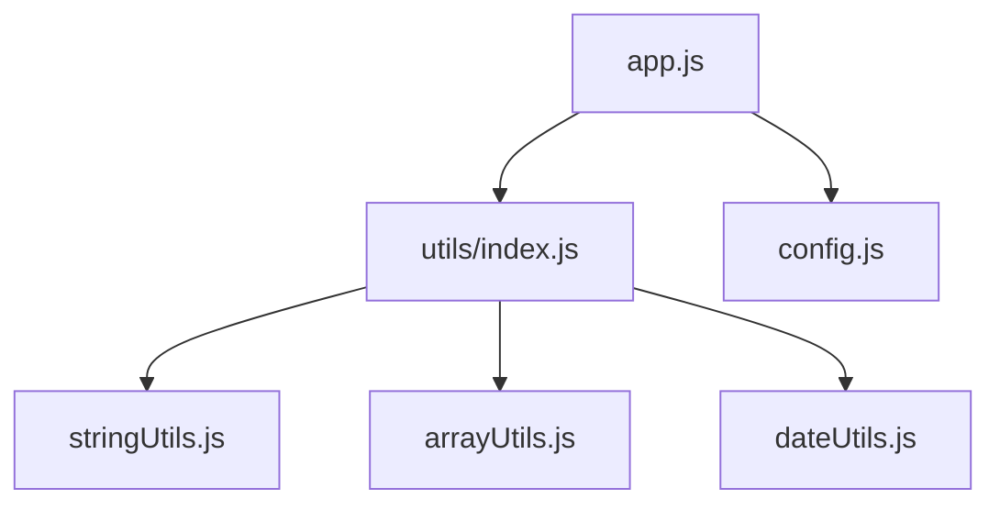

# **4.2. Модули в JavaScript**

Модули — это эффективный способ разделения кода на независимые, переиспользуемые блоки. Представьте, что ваш код — это конструктор LEGO: вместо одной огромной неразборной детали вы создаете маленькие блоки, которые легко соединять и заменять.

В этой главе мы изучим современный стандарт **ES-модулей**, который позволяет браузеру и Node.js эффективно загружать только нужные части вашего приложения.

---

- [🏠 Главная](../../readme.md)
- [📚 Все уровни](../index.md)
- [📖 Справочники](../../guides/index.md)
- [🔧 Введение](../../Intro/index.md)
- [⬅️ Предыдущий документ](./4.1-objects.md)
- [➡️ Следующий документ](./4.3-projects.md)

---

## **Содержание**

1. [**Что такое модули?**](#1-что-такое-модули)
2. [**ES6 Modules (стандарт)**](#2-es6-modules-современный-стандарт)
3. [**Практические примеры**](#3-практические-примеры)
4. [**Конфигурация и паттерны**](#4-модули-для-конфигурации)
5. [**Динамический импорт**](#5-динамический-импорт)

---

## |1| **Что такое модули?**

До появления модулей весь JavaScript-код часто писался в одном огромном файле или подключался множеством тегов `<script>`, что приводило к конфликтам имен (когда две переменные называются одинаково).

**Модули решают эти проблемы:**
- **Изоляция**: переменные внутри модуля не видны снаружи, если их явно не "выставить" (экспортировать).
- **Переиспользование**: один и тот же файл `math.js` можно использовать в десяти разных проектах.
- **Древовидная зависимость**: браузер понимает, какой файл от какого зависит.



---

## |2| **ES6 Modules (современный стандарт)**

Это официальный стандарт JavaScript (ESM). Главное правило: один файл = один модуль.

### 1. **Экспорт (export)**

Чтобы сделать функцию или переменную доступной для других файлов, используется ключевое слово `export`.

#### 1.1. **Именованный экспорт**
Позволяет экспортировать несколько сущностей из одного файла. При импорте нужно использовать их точные имена.

```javascript
// math.js
export const PI = 3.14159;

export function add(a, b) {
  return a + b;
}

export function subtract(a, b) {
  return a - b;
}

// Альтернативный способ
const multiply = (a, b) => a * b;
const divide = (a, b) => a / b;

export { multiply, divide };
```

#### 1.2. **Экспорт по умолчанию (default export)**
Используется, если модуль содержит одну главную сущность (например, класс или функцию). В файле может быть только **один** `export default`.

```javascript
// calculator.js
class Calculator {
  constructor() {
    this.result = 0;
  }

  add(number) {
    this.result += number;
    return this;
  }

  subtract(number) {
    this.result -= number;
    return this;
  }

  getResult() {
    return this.result;
  }
}

export default Calculator;
```

#### 1.3. **Смешанный экспорт**

```javascript
// utils.js
export const VERSION = "1.0.0";

export function formatDate(date) {
  return date.toLocaleDateString();
}

export function formatCurrency(amount) {
  return `₽${amount.toFixed(2)}`;
}

// Экспорт по умолчанию
class Logger {
  static log(message) {
    console.log(`[${new Date().toISOString()}] ${message}`);
  }
}

export default Logger;
```

### 2. **Импорт (import)**

Для использования кода из другого модуля используется `import`. 

> [!IMPORTANT]
> При импорте локальных файлов в браузере **обязательно** указывайте расширение `.js`.

#### 2.1. **Именованный импорт**

```javascript
// main.js
import { add, subtract, PI } from "./math.js";

console.log(add(5, 3)); // 8
console.log(subtract(10, 4)); // 6
console.log(PI); // 3.14159
```

#### 2.2. **Импорт с переименованием**

```javascript
import { add as sum, subtract as diff } from "./math.js";

console.log(sum(5, 3)); // 8
console.log(diff(10, 4)); // 6
```

#### 2.3. **Импорт всех экспортов**

```javascript
import * as MathUtils from "./math.js";

console.log(MathUtils.add(5, 3)); // 8
console.log(MathUtils.PI); // 3.14159
```

#### 2.4. **Импорт по умолчанию**

```javascript
import Calculator from "./calculator.js";

const calc = new Calculator();
const result = calc.add(10).subtract(3).getResult();
console.log(result); // 7
```

#### 2.5. **Смешанный импорт**

```javascript
import Logger, { VERSION, formatDate } from "./utils.js";

Logger.log(`Application version: ${VERSION}`);
console.log(formatDate(new Date()));
```

---

## |3| **Практические примеры**

### 1. **Создание библиотеки утилит**

**stringUtils.js:**

```javascript
// Функции для работы со строками
export function capitalize(str) {
  return str.charAt(0).toUpperCase() + str.slice(1).toLowerCase();
}

export function reverseString(str) {
  return str.split("").reverse().join("");
}

export function countWords(str) {
  return str.trim().split(/\s+/).length;
}

export function truncate(str, length) {
  return str.length > length ? str.slice(0, length) + "..." : str;
}

// Экспорт объекта с функциями
export const StringUtils = {
  capitalize,
  reverseString,
  countWords,
  truncate,
};
```

**arrayUtils.js:**

```javascript
// Функции для работы с массивами
export function unique(array) {
  return [...new Set(array)];
}

export function shuffle(array) {
  const shuffled = [...array];
  for (let i = shuffled.length - 1; i > 0; i--) {
    const j = Math.floor(Math.random() * (i + 1));
    [shuffled[i], shuffled[j]] = [shuffled[j], shuffled[i]];
  }
  return shuffled;
}

export function chunk(array, size) {
  const chunks = [];
  for (let i = 0; i < array.length; i += size) {
    chunks.push(array.slice(i, i + size));
  }
  return chunks;
}

export function flatten(array) {
  return array.reduce((flat, item) => {
    return flat.concat(Array.isArray(item) ? flatten(item) : item);
  }, []);
}
```

**dateUtils.js:**

```javascript
// Функции для работы с датами
export function formatDate(date, format = "DD.MM.YYYY") {
  const day = date.getDate().toString().padStart(2, "0");
  const month = (date.getMonth() + 1).toString().padStart(2, "0");
  const year = date.getFullYear();

  return format.replace("DD", day).replace("MM", month).replace("YYYY", year);
}

export function addDays(date, days) {
  const result = new Date(date);
  result.setDate(result.getDate() + days);
  return result;
}

export function daysBetween(date1, date2) {
  const timeDiff = Math.abs(date2.getTime() - date1.getTime());
  return Math.ceil(timeDiff / (1000 * 3600 * 24));
}

export function isWeekend(date) {
  const day = date.getDay();
  return day === 0 || day === 6; // воскресенье или суббота
}
```

**index.js (главный файл библиотеки):**

```javascript
// Переэкспорт всех утилит
export * from "./stringUtils.js";
export * from "./arrayUtils.js";
export * from "./dateUtils.js";

// Или создание единого объекта
export { StringUtils } from "./stringUtils.js";
export * as ArrayUtils from "./arrayUtils.js";
export * as DateUtils from "./dateUtils.js";
```

### 2. **Использование библиотеки**

**app.js:**

```javascript
import {
  capitalize,
  unique,
  formatDate,
  StringUtils,
  ArrayUtils,
  DateUtils,
} from "./utils/index.js";

// Использование отдельных функций
console.log(capitalize("привет мир")); // "Привет мир"
console.log(unique([1, 2, 2, 3, 3, 4])); // [1, 2, 3, 4]
console.log(formatDate(new Date())); // "18.09.2023"

// Использование через объекты
const text = "JavaScript модули очень полезны";
console.log(StringUtils.countWords(text)); // 4
console.log(StringUtils.truncate(text, 20)); // "JavaScript модули..."

const numbers = [1, 2, 3, 4, 5];
console.log(ArrayUtils.shuffle(numbers)); // случайный порядок

const today = new Date();
const tomorrow = DateUtils.addDays(today, 1);
console.log(DateUtils.daysBetween(today, tomorrow)); // 1
```

---

## |4| **Модули для конфигурации**

### 1. **Файл конфигурации**

**config.js:**

```javascript
// Конфигурация приложения
export const API_CONFIG = {
  baseURL: "https://api.example.com",
  timeout: 5000,
  retryAttempts: 3,
};

export const UI_CONFIG = {
  theme: "light",
  language: "ru",
  itemsPerPage: 10,
};

export const VALIDATION_RULES = {
  email: /^[^\s@]+@[^\s@]+\.[^\s@]+$/,
  phone: /^\+7\d{10}$/,
  password: {
    minLength: 8,
    requireSpecialChar: true,
    requireNumber: true,
  },
};

// Функции для работы с конфигурацией
export function getApiUrl(endpoint) {
  return `${API_CONFIG.baseURL}/${endpoint}`;
}

export function validateEmail(email) {
  return VALIDATION_RULES.email.test(email);
}

export function validatePassword(password) {
  const rules = VALIDATION_RULES.password;

  if (password.length < rules.minLength) {
    return { valid: false, message: `Минимум ${rules.minLength} символов` };
  }

  if (rules.requireNumber && !/\d/.test(password)) {
    return { valid: false, message: "Должна содержать цифру" };
  }

  if (rules.requireSpecialChar && !/[!@#$%^&*]/.test(password)) {
    return { valid: false, message: "Должна содержать специальный символ" };
  }

  return { valid: true, message: "Пароль корректен" };
}
```

---

## |5| **Паттерны организации модулей**

### 1. **Модуль-сервис**

**userService.js:**

```javascript
// Сервис для работы с пользователями
class UserService {
  constructor() {
    this.users = [];
    this.currentUserId = 1;
  }

  createUser(userData) {
    const user = {
      id: this.currentUserId++,
      ...userData,
      createdAt: new Date(),
    };

    this.users.push(user);
    return user;
  }

  getUserById(id) {
    return this.users.find((user) => user.id === id);
  }

  updateUser(id, updates) {
    const userIndex = this.users.findIndex((user) => user.id === id);
    if (userIndex !== -1) {
      this.users[userIndex] = { ...this.users[userIndex], ...updates };
      return this.users[userIndex];
    }
    return null;
  }

  deleteUser(id) {
    const userIndex = this.users.findIndex((user) => user.id === id);
    if (userIndex !== -1) {
      return this.users.splice(userIndex, 1)[0];
    }
    return null;
  }

  getAllUsers() {
    return [...this.users];
  }
}

// Экспортируем экземпляр сервиса (Singleton)
export default new UserService();
```

### 2. **Модуль-константы**

**constants.js:**

```javascript
// Константы приложения
export const HTTP_STATUS = {
  OK: 200,
  CREATED: 201,
  BAD_REQUEST: 400,
  UNAUTHORIZED: 401,
  FORBIDDEN: 403,
  NOT_FOUND: 404,
  INTERNAL_SERVER_ERROR: 500,
};

export const COLORS = {
  PRIMARY: "#007bff",
  SECONDARY: "#6c757d",
  SUCCESS: "#28a745",
  DANGER: "#dc3545",
  WARNING: "#ffc107",
  INFO: "#17a2b8",
};

export const ROUTES = {
  HOME: "/",
  ABOUT: "/about",
  CONTACT: "/contact",
  LOGIN: "/login",
  DASHBOARD: "/dashboard",
};

export const LOCAL_STORAGE_KEYS = {
  USER_TOKEN: "userToken",
  USER_PREFERENCES: "userPreferences",
  CART_ITEMS: "cartItems",
};
```

---

## |6| **Динамический импорт**

### 1. **Условный импорт**

```javascript
// Загрузка модуля по условию
async function loadFeature(featureName) {
  try {
    if (featureName === "charts") {
      const chartModule = await import("./charts.js");
      return chartModule.default;
    } else if (featureName === "analytics") {
      const analyticsModule = await import("./analytics.js");
      return analyticsModule.default;
    }
  } catch (error) {
    console.error("Ошибка загрузки модуля:", error);
  }
}

// Использование
loadFeature("charts").then((Charts) => {
  if (Charts) {
    const chart = new Charts();
    chart.render();
  }
});
```

### 2. **Ленивая загрузка**

```javascript
// Модуль загружается только при необходимости
class FeatureManager {
  async getImageProcessor() {
    if (!this.imageProcessor) {
      const module = await import("./imageProcessor.js");
      this.imageProcessor = new module.ImageProcessor();
    }
    return this.imageProcessor;
  }

  async getDataAnalyzer() {
    if (!this.dataAnalyzer) {
      const module = await import("./dataAnalyzer.js");
      this.dataAnalyzer = new module.DataAnalyzer();
    }
    return this.dataAnalyzer;
  }
}

export default new FeatureManager();
```

---

## |7| **Рекомендации по организации модулей**

### 1. **Структура проекта**

```
project/
├── src/
│   ├── components/        # Компоненты UI
│   ├── services/         # Бизнес-логика
│   ├── utils/            # Утилиты
│   ├── constants/        # Константы
│   ├── config/           # Конфигурация
│   └── types/            # Типы данных
├── tests/
└── docs/
```

### 2. **Соглашения по именованию**

```javascript
// Файлы с классами - PascalCase
// UserService.js, ImageProcessor.js

// Файлы с функциями - camelCase
// stringUtils.js, arrayHelpers.js

// Константы - UPPER_SNAKE_CASE
// API_ENDPOINTS.js, HTTP_STATUS.js
```

### 3. **Индексные файлы (Re-export)**

Использование `index.js` позволяет объединить экспорт из нескольких модулей в один, что упрощает импорт в других частях приложения.

**utils/index.js:**

```javascript
export * from "./stringUtils.js";
export * from "./arrayUtils.js";
export * from "./dateUtils.js";
```

**Пример использования:**

```javascript
import { capitalize, unique, formatDate } from "./utils/index.js";
```

## **Итог**

В этом разделе мы рассмотрели:
- Разницу между именованным экспортом и экспортом по умолчанию.
- Как импортировать модули и переименовывать их.
- Динамический импорт для оптимизации производительности.
- Организацию структуры проекта с использованием индексных файлов.

## **Практика**

Для закрепления материала и повторения пройденных тем, выполните следующие задания:

### 1. **Библиотека расчетов (Функции и Экспорт)**
Создайте модуль `calculator.js`. В нем реализуйте и экспортируйте:
- Именованный экспорт: функцию `sumAll(...numbers)`, которая использует цикл `for...of` для подсчета суммы (повторение циклов).
- Именованный экспорт: константу `TAX_RATE = 0.13`.
- Экспорт по умолчанию: функцию, которая принимает сумму и возвращает её с учетом налога.
**В файле `app.js`:** импортируйте всё и выведите в консоль результат суммы массива `[100, 200, 300]` и итоговую сумму с налогом.

### 2. **Проверка доступа (Логика и Модули)**
Создайте модуль `auth.js`. 
- Экспортируйте функцию `canAccess(user)`, которая принимает объект пользователя `{age: number, role: string}`.
- Функция должна возвращать `true`, если возраст больше или равен 18 **И** роль равна "admin" (повторение логических операторов `&&`).
**В файле `main.js`:** создайте объект пользователя, импортируйте функцию и выведите результат проверки в консоль.

### 3. **Трансформация данных (Массивы и Re-export)**
Создайте два модуля:
1. `formatters.js`: функция `toUpper(str)` (возвращает строку в верхнем регистре).
2. `utils.js`: переэкспортируйте (`export *`) всё из `formatters.js`.
**В основном файле:** импортируйте `toUpper` из `utils.js` и используйте её внутри цикла для обработки массива строк `["apple", "banana", "cherry"]`.

---

- [🏠 Главная](../../readme.md)
- [📚 Все уровни](../index.md)
- [⬅️ Предыдущий документ](./4.1-objects.md)
- [➡️ Следующий документ](./4.3-projects.md)
