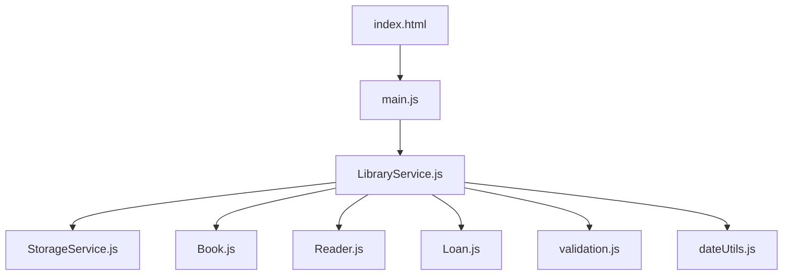

# **4.3. Проекты для закрепления**

В данном разделе мы объединим все полученные знания о **объектах**, **классах** и **модулях** для создания полноценных приложений. Разработка небольших проектов помогает закрепить понимание принципов **модульности**, **инкапсуляции** и разделения ответственности.

Вы научитесь проектировать структуру приложения, взаимодействовать между различными частями кода и организовывать логику так, чтобы она была легко расширяемой и читаемой.

---

- [🏠 Главная](../../readme.md)
- [📚 Все уровни](../index.md)
- [📖 Справочники](../../guides/index.md)
- [🔧 Введение](../../Intro/index.md)
- [⬅️ Предыдущий документ](./4.2-modules.md)
- [➡️ Следующий документ](./5.1-nodejs.md)

---

## **Содержание**

1. [**Система управления библиотекой**](#1-система-управления-библиотекой)
2. [**Модульный калькулятор**](#2-модульный-калькулятор)
3. [**Система управления задачами**](#3-система-управления-задачами)
4. [**Итог**](#итог)
5. [**Практика**](#практика)

---

## |1| **Система управления библиотекой**

Создайте модульную систему для управления библиотекой с использованием объектов и модулей.

### Задача

Разработать систему управления библиотекой, которая позволяет добавлять книги, регистрировать читателей и отслеживать выдачи книг.

### Структура проекта

```
library-system/
├── index.html
├── src/
│   ├── models/
│   │   ├── Book.js
│   │   ├── Reader.js
│   │   └── Loan.js
│   ├── services/
│   │   ├── LibraryService.js
│   │   └── StorageService.js
│   ├── utils/
│   │   ├── validation.js
│   │   └── dateUtils.js
│   └── main.js
└── style.css
```



### Реализация


**index.html:**

```html
<!DOCTYPE html>
<html lang="ru">
  <head>
    <meta charset="UTF-8" />
    <meta name="viewport" content="width=device-width, initial-scale=1.0" />
    <title>Система управления библиотекой</title>
    <link rel="stylesheet" href="style.css" />
  </head>
  <body>
    <div class="container">
      <header>
        <h1>📚 Система управления библиотекой</h1>
      </header>

      <main>
        <section class="actions">
          <button onclick="showAddBookForm()">Добавить книгу</button>
          <button onclick="showRegisterReaderForm()">
            Регистрация читателя
          </button>
          <button onclick="showBorrowForm()">Выдать книгу</button>
          <button onclick="showReturnForm()">Вернуть книгу</button>
          <button onclick="showStatistics()">Статистика</button>
        </section>

        <section id="content">
          <p>Выберите действие для начала работы с системой.</p>
        </section>
      </main>
    </div>

    <script type="module" src="src/main.js"></script>
  </body>
</html>
```

**main.js:**

```javascript
import LibraryService from "./services/LibraryService.js";

// --- ЧАСТЬ 1: Демонстрация работы (для консоли) ---
console.log("=== Система управления библиотекой: Демонстрация ===\n");

try {
  // Добавление книг
  const book1 = LibraryService.addBook(
    "978-5-17-082568-5",
    "Война и мир",
    "Лев Толстой",
    1869,
    "Классическая литература"
  );
  console.log("Добавлена книга:", book1.getInfo());

  const book2 = LibraryService.addBook(
    "978-0-452-28423-4",
    "1984",
    "Джордж Оруэлл",
    1949,
    "Антиутопия"
  );
  console.log("Добавлена книга:", book2.getInfo());

  // Регистрация читателей
  const reader1 = LibraryService.registerReader(
    "Иван Петров",
    "ivan@example.com",
    "+7-900-123-45-67"
  );
  console.log("Зарегистрирован читатель:", reader1.name);

  const reader2 = LibraryService.registerReader(
    "Мария Сидорова",
    "maria@example.com",
    "+7-900-765-43-21"
  );
  console.log("Зарегистрирован читатель:", reader2.name);

  // Выдача книг
  const loan1 = LibraryService.borrowBook(book1.isbn, reader1.id);
  console.log(loan1.message);

  const loan2 = LibraryService.borrowBook(book2.isbn, reader2.id);
  console.log(loan2.message);

  // Поиск книг
  console.log('\nПоиск книг по слову "война":');
  const searchResults = LibraryService.searchBooks("война");
  searchResults.forEach((book) => console.log(`- ${book.getInfo()}`));

  // Статистика библиотеки
  console.log("\nСтатистика библиотеки:");
  const stats = LibraryService.getLibraryStatistics();
  console.log(`Всего книг: ${stats.totalBooks}`);
  console.log(`Доступно: ${stats.availableBooks}`);
  console.log(`В выдаче: ${stats.borrowedBooks}`);
  console.log(`Читателей: ${stats.totalReaders}`);
  console.log(`Активных выдач: ${stats.activeLoans}`);

  // Статистика читателя
  console.log(`\nСтатистика читателя ${reader1.name}:`);
  const readerStats = LibraryService.getReaderStatistics(reader1.id);
  console.log(`Взято книг: ${readerStats.totalBooks}`);
  console.log(`На руках: ${readerStats.currentBooks}`);
} catch (error) {
  console.error("Ошибка при демонстрации:", error.message);
}

// --- ЧАСТЬ 2: Интерактивность (для кнопок в HTML) ---
// Экспортируем функции в глобальную область window, чтобы они были доступны для onclick в HTML
window.showAddBookForm = () => {
  const isbn = prompt("Введите ISBN книги:");
  const title = prompt("Введите название:");
  const author = prompt("Введите автора:");
  const year = parseInt(prompt("Введите год издания:"));
  const genre = prompt("Введите жанр:");

  try {
    const book = LibraryService.addBook(isbn, title, author, year, genre);
    alert(`Книга "${book.title}" успешно добавлена!`);
  } catch (error) {
    alert(`Ошибка: ${error.message}`);
  }
};

window.showRegisterReaderForm = () => {
  const name = prompt("Введите ФИО читателя:");
  const email = prompt("Введите Email:");
  const phone = prompt("Введите телефон:");

  try {
    const reader = LibraryService.registerReader(name, email, phone);
    alert(`Читатель ${reader.name} зарегистрирован. ID: ${reader.id}`);
  } catch (error) {
    alert(`Ошибка: ${error.message}`);
  }
};

window.showBorrowForm = () => {
  const isbn = prompt("Введите ISBN книги:");
  const readerId = parseInt(prompt("Введите ID читателя:"));

  try {
    const result = LibraryService.borrowBook(isbn, readerId);
    alert(result.message);
  } catch (error) {
    alert(`Ошибка: ${error.message}`);
  }
};

window.showReturnForm = () => {
  const isbn = prompt("Введите ISBN книги:");
  const readerId = parseInt(prompt("Введите ID читателя:"));

  try {
    const result = LibraryService.returnBook(isbn, readerId);
    alert(`${result.message}`);
  } catch (error) {
    alert(`Ошибка: ${error.message}`);
  }
};

window.showStatistics = () => {
  const stats = LibraryService.getLibraryStatistics();
  const content = document.getElementById("content");
  
  content.innerHTML = `
    <h3>Статистика библиотеки:</h3>
    <ul>
      <li>Всего книг: ${stats.totalBooks}</li>
      <li>Доступно: ${stats.availableBooks}</li>
      <li>Выдано: ${stats.borrowedBooks}</li>
      <li>Читателей: ${stats.totalReaders}</li>
      <li>Активных выдач: ${stats.activeLoans}</li>
      <li>Просрочено: ${stats.overdueLoans}</li>
    </ul>
  `;
};
```

**services/LibraryService.js:**

```javascript
import Book from "../models/Book.js";
import Reader from "../models/Reader.js";
import Loan from "../models/Loan.js";
import StorageService from "./StorageService.js";
import { ValidationRules } from "../utils/validation.js";
import { addDays, formatDate } from "../utils/dateUtils.js";

class LibraryService {
  constructor() {
    this.books = this.loadBooks();
    this.readers = this.loadReaders();
    this.loans = this.loadLoans();
    this.nextReaderId = this.getNextReaderId();
  }

  // Управление книгами
  addBook(isbn, title, author, year, genre) {
    // Валидация
    if (!ValidationRules.book.isbn(isbn)) {
      throw new Error("Некорректный ISBN");
    }

    if (!ValidationRules.book.year(year)) {
      throw new Error("Некорректный год издания");
    }

    // Проверка на дубликаты
    if (this.books.find((book) => book.isbn === isbn)) {
      throw new Error("Книга с таким ISBN уже существует");
    }

    const book = new Book(isbn, title, author, year, genre);
    this.books.push(book);
    this.saveBooks();

    return book;
  }

  findBookByISBN(isbn) {
    return this.books.find((book) => book.isbn === isbn);
  }

  searchBooks(query) {
    const lowercaseQuery = query.toLowerCase();
    return this.books.filter(
      (book) =>
        book.title.toLowerCase().includes(lowercaseQuery) ||
        book.author.toLowerCase().includes(lowercaseQuery) ||
        book.genre.toLowerCase().includes(lowercaseQuery)
    );
  }

  getAvailableBooks() {
    return this.books.filter((book) => book.isAvailable);
  }

  // Управление читателями
  registerReader(name, email, phone) {
    // Валидация
    if (!ValidationRules.reader.email(email)) {
      throw new Error("Некорректный email");
    }

    if (!ValidationRules.reader.phone(phone)) {
      throw new Error("Некорректный номер телефона");
    }

    // Проверка на дубликаты
    if (this.readers.find((reader) => reader.email === email)) {
      throw new Error("Читатель с таким email уже зарегистрирован");
    }

    const reader = new Reader(this.nextReaderId++, name, email, phone);
    this.readers.push(reader);
    this.saveReaders();

    return reader;
  }

  findReaderById(id) {
    return this.readers.find((reader) => reader.id === id);
  }

  // Управление выдачами
  borrowBook(bookIsbn, readerId, loanDays = 14) {
    const book = this.findBookByISBN(bookIsbn);
    const reader = this.findReaderById(readerId);

    if (!book) {
      throw new Error("Книга не найдена");
    }

    if (!reader) {
      throw new Error("Читатель не найден");
    }

    if (!book.isAvailable) {
      throw new Error("Книга недоступна для выдачи");
    }

    const dueDate = addDays(new Date(), loanDays);
    const loan = new Loan(bookIsbn, readerId, dueDate);

    book.setAvailable(false);
    reader.borrowBook(bookIsbn);
    this.loans.push(loan);

    this.saveAll();

    return {
      loan,
      message: `Книга "${book.title}" выдана до ${formatDate(dueDate)}`,
    };
  }

  returnBook(bookIsbn, readerId) {
    const book = this.findBookByISBN(bookIsbn);
    const reader = this.findReaderById(readerId);

    if (!book || !reader) {
      throw new Error("Книга или читатель не найдены");
    }

    const loan = this.loans.find(
      (l) => l.bookIsbn === bookIsbn && l.readerId === readerId && !l.isReturned
    );

    if (!loan) {
      throw new Error("Активная выдача не найдена");
    }

    loan.markAsReturned();
    book.setAvailable(true);
    reader.returnBook(bookIsbn);

    this.saveAll();

    const fine = loan.getDaysOverdue() * 10; // 10 рублей за день просрочки

    return {
      loan,
      fine,
      message: `Книга "${book.title}" возвращена${
        fine > 0 ? `, штраф: ${fine} руб.` : ""
      }`,
    };
  }

  // Отчеты и статистика
  getOverdueLoans() {
    return this.loans.filter((loan) => loan.isOverdue());
  }

  getReaderStatistics(readerId) {
    const reader = this.findReaderById(readerId);
    if (!reader) return null;

    const readerLoans = this.loans.filter((loan) => loan.readerId === readerId);
    const returned = readerLoans.filter((loan) => loan.isReturned);
    const overdue = readerLoans.filter((loan) => loan.isOverdue());

    return {
      reader: reader.getContactInfo(),
      totalBooks: readerLoans.length,
      returnedBooks: returned.length,
      currentBooks: reader.borrowedBooks.length,
      overdueBooks: overdue.length,
    };
  }

  getLibraryStatistics() {
    return {
      totalBooks: this.books.length,
      availableBooks: this.books.filter((book) => book.isAvailable).length,
      borrowedBooks: this.books.filter((book) => !book.isAvailable).length,
      totalReaders: this.readers.length,
      activeLoans: this.loans.filter((loan) => !loan.isReturned).length,
      overdueLoans: this.getOverdueLoans().length,
    };
  }

  // Методы сохранения и загрузки
  saveAll() {
    this.saveBooks();
    this.saveReaders();
    this.saveLoans();
  }

  saveBooks() {
    StorageService.save("books", this.books);
  }

  saveReaders() {
    StorageService.save("readers", this.readers);
    StorageService.save("nextReaderId", this.nextReaderId);
  }

  saveLoans() {
    StorageService.save("loans", this.loans);
  }

  loadBooks() {
    const books = StorageService.load("books");
    return books ? books.map((data) => Object.assign(new Book(), data)) : [];
  }

  loadReaders() {
    const readers = StorageService.load("readers");
    return readers
      ? readers.map((data) => Object.assign(new Reader(), data))
      : [];
  }

  loadLoans() {
    const loans = StorageService.load("loans");
    return loans ? loans.map((data) => Object.assign(new Loan(), data)) : [];
  }

  getNextReaderId() {
    return StorageService.load("nextReaderId") || 1;
  }
}

export default new LibraryService();
```

**services/StorageService.js:**

```javascript
class StorageService {
  constructor() {
    this.prefix = "library_";
  }

  save(key, data) {
    try {
      localStorage.setItem(this.prefix + key, JSON.stringify(data));
      return true;
    } catch (error) {
      console.error("Ошибка сохранения данных:", error);
      return false;
    }
  }

  load(key) {
    try {
      const data = localStorage.getItem(this.prefix + key);
      return data ? JSON.parse(data) : null;
    } catch (error) {
      console.error("Ошибка загрузки данных:", error);
      return null;
    }
  }

  remove(key) {
    localStorage.removeItem(this.prefix + key);
  }

  clear() {
    const keys = Object.keys(localStorage);
    keys.forEach((key) => {
      if (key.startsWith(this.prefix)) {
        localStorage.removeItem(key);
      }
    });
  }
}

export default new StorageService();
```

**utils/validation.js:**

```javascript
export function validateISBN(isbn) {
  // Упрощенная проверка ISBN
  const cleanISBN = isbn.replace(/[-\s]/g, "");
  return /^\d{10}(\d{3})?$/.test(cleanISBN);
}

export function validateEmail(email) {
  const emailRegex = /^[^\s@]+@[^\s@]+\.[^\s@]+$/;
  return emailRegex.test(email);
}

export function validatePhone(phone) {
  const phoneRegex = /^\+?[\d\s\-\(\)]{10,}$/;
  return phoneRegex.test(phone);
}

export function validateYear(year) {
  const currentYear = new Date().getFullYear();
  return year >= 1000 && year <= currentYear;
}

export const ValidationRules = {
  book: {
    isbn: validateISBN,
    year: validateYear,
  },
  reader: {
    email: validateEmail,
    phone: validatePhone,
  },
};
```

**utils/dateUtils.js:**

```javascript
export function addDays(date, days) {
  const result = new Date(date);
  result.setDate(result.getDate() + days);
  return result;
}

export function formatDate(date) {
  return date.toLocaleDateString("ru-RU");
}

export function daysBetween(date1, date2) {
  const timeDiff = Math.abs(date2.getTime() - date1.getTime());
  return Math.ceil(timeDiff / (1000 * 3600 * 24));
}

export function isDateInFuture(date) {
  return date > new Date();
}
```

**models/Loan.js:**

```javascript
export class Loan {
  constructor(bookIsbn, readerId, dueDate) {
    this.id = Date.now() + Math.random();
    this.bookIsbn = bookIsbn;
    this.readerId = readerId;
    this.borrowDate = new Date();
    this.dueDate = dueDate;
    this.returnDate = null;
    this.isReturned = false;
  }

  markAsReturned() {
    this.isReturned = true;
    this.returnDate = new Date();
  }

  isOverdue() {
    return !this.isReturned && new Date() > this.dueDate;
  }

  getDaysOverdue() {
    if (!this.isOverdue()) return 0;
    const today = new Date();
    const timeDiff = today.getTime() - this.dueDate.getTime();
    return Math.ceil(timeDiff / (1000 * 3600 * 24));
  }
}

export default Loan;
```

**models/Reader.js:**

```javascript
export class Reader {
  constructor(id, name, email, phone) {
    this.id = id;
    this.name = name;
    this.email = email;
    this.phone = phone;
    this.registeredAt = new Date();
    this.borrowedBooks = [];
  }

  borrowBook(bookIsbn) {
    if (!this.borrowedBooks.includes(bookIsbn)) {
      this.borrowedBooks.push(bookIsbn);
    }
  }

  returnBook(bookIsbn) {
    const index = this.borrowedBooks.indexOf(bookIsbn);
    if (index > -1) {
      this.borrowedBooks.splice(index, 1);
    }
  }

  getContactInfo() {
    return {
      name: this.name,
      email: this.email,
      phone: this.phone,
    };
  }
}

export default Reader;
```

**models/Book.js:**

```javascript
export class Book {
  constructor(isbn, title, author, year, genre) {
    this.isbn = isbn;
    this.title = title;
    this.author = author;
    this.year = year;
    this.genre = genre;
    this.isAvailable = true;
    this.createdAt = new Date();
  }

  getInfo() {
    return `"${this.title}" - ${this.author} (${this.year})`;
  }

  setAvailable(available) {
    this.isAvailable = available;
  }
}

export default Book;
```


---

## |2| **Модульный калькулятор**

Создайте расширяемый калькулятор, где каждая математическая операция вынесена в отдельный модуль. Это идеальный проект для понимания того, как модули могут быть «плагинами», которые легко добавлять или удалять без изменения основного ядра системы.

### **Что уже реализовано:**
- **Ядро (`Calculator.js`)**: Класс, который объединяет все операции (`this.operations`) и умеет вести историю вычислений.
- **Базовые операции (`operations/basic.js`)**: Функции `add`, `subtract`, `multiply`, `divide`.
- **Сложные операции (`operations/advanced.js`)**: Функции `power`, `sqrt`, `factorial`.

---

### **Ваше задание:**

Выберите путь реализации, который вам ближе, или выполните оба последовательно для лучшего усвоения:

#### **Вариант А: Консольный интерфейс (Уровень A1.1)**
Реализуйте логику взаимодействия в `main.js`:
1. Используйте `prompt()` для запроса имени операции (например, "add") и чисел.
2. Обработайте ввод: если операция не найдена в `Calculator.operations`, выведите ошибку через `alert()`.
3. После каждого вычисления выводите в консоль текущую историю всех операций через `getHistory()`.

#### **Вариант Б: Веб-интерфейс (Уровень A1.2)**
Создайте интерактивную оболочку, используя приемы из **Проекта 1**:
1. Подготовьте в `index.html` кнопки для цифр и символы операций.
2. В `main.js` создайте функции, которые считывают значения из "дисплея" (текстового блока) и вызывают `Calculator.calculate()`.
3. Результат выводите обратно на экран страницы. Это покажет вам, как одна и та же бизнес-логика может работать в разных интерфейсах!

---

### **Код проекта:**

```javascript
// operations/basic.js
export const add = (a, b) => a + b;
export const subtract = (a, b) => a - b;
export const multiply = (a, b) => a * b;
export const divide = (a, b) => {
  if (b === 0) throw new Error("Деление на ноль");
  return a / b;
};

// operations/advanced.js
export const power = (base, exponent) => Math.pow(base, exponent);
export const sqrt = (number) => Math.sqrt(number);
export const factorial = (n) => {
  if (n < 0) throw new Error("Факториал отрицательного числа");
  if (n === 0 || n === 1) return 1;
  return n * factorial(n - 1);
};

// Calculator.js
import * as basic from "./operations/basic.js";
import * as advanced from "./operations/advanced.js";

export class Calculator {
  constructor() {
    this.operations = { ...basic, ...advanced };
    this.history = [];
  }

  calculate(operation, ...args) {
    if (!this.operations[operation]) {
      throw new Error(`Операция ${operation} не поддерживается`);
    }

    const result = this.operations[operation](...args);
    this.history.push({ operation, args, result, timestamp: new Date() });
    return result;
  }

  getHistory() {
    return [...this.history];
  }
}
```

---

## |3| **Система управления задачами**

Создайте архитектуру для Todo-приложения. Этот проект объединяет всё: классы (модели), сервисы (логика), утилиты (фильтрация) и сохранение данных. Здесь вы научитесь строить связь между 4-5 разными файлами.

### **Дорожная карта реализации (Roadmap):**

1.  **Модель (`models/Task.js`)**: Создайте класс `Task` с полями `id`, `text`, `priority` и `isCompleted`.
2.  **Сервис хранилища (`services/StorageService.js`)**: Можно использовать код из первого проекта для работы с `localStorage`. Обеспечьте автоматический экспорт состояния в хранилище при каждом изменении (добавлении или удалении задачи).
3.  **Логика (`services/TaskService.js`)**: Создайте сервис, который умеет добавлять задачи в массив, удалять их и сохранять текущее состояние.
4.  **Скрипт фильтрации (`utils/FilterService.js`)**: Напишите функции для поиска задач (по тексту) и фильтрации (например, вернуть только "важные" или "выполненные").
5. **Интерфейс**: Начните с вывода списка задач в консоль (`console.table`), а затем попробуйте реализовать интерактивные кнопки, как в первом проекте.

---

### **Ваше задание:**
Основная цель — реализовать **логику взаимодействия**. 
1. В `FilterService.js` создайте функцию `getCompletedTasks(tasks)`, которая принимает массив объектов и возвращает новый массив только с завершенными задачами (используйте `.filter()`).
2. В `main.js` продемонстрируйте работу системы: создайте 3 задачи, отметьте одну как выполненную, примените фильтр и выведите итоговый список в консоль через `console.table()`.


---

## **Итог**

В этом разделе мы рассмотрели, как реальные задачи решаются с помощью **объектно-ориентированного** подхода и **модульной архитектуры**. Мы научились:
- Разделять приложение на логические слои (модели, сервисы, утилиты).
- Связывать модули через `export` и `import`.
- Реализовывать интерфейс взаимодействия между кодом и HTML-страницей.
- Использовать `localStorage` для сохранения состояния приложения.

Эти навыки являются фундаментом для перехода к более сложным темам, таким как работа с API и разработка серверной части на Node.js.

---

## **Практика**

Ниже приведены задачи для закрепления основ **модульности** и **ООП**. Все задания выполняются исключительно через **консоль браузера** (без работы с DOM), чтобы вы могли сфокусироваться на чистоте кода и передаче данных.

### 1. **Система учета склада (Inventory)**
Создайте три модуля:
- `Product.js`: Класс товара (имя, цена, остаток на складе).
- `Warehouse.js`: Объект/класс с методами `addProduct()` и `sellProduct()`.
- Реализуйте функцию «Ревизия», которая выводит список товаров, количество которых меньше 5 штук.

### 2. **Студенческий журнал (Gradebook)**
Разработайте систему учета успеваемости:
- Модуль `Student.js`: Хранит имя и массив оценок. Добавьте метод `getAverageGrade()`.
- Модуль `Journal.js`: Управляет списком студентов. Реализуйте метод `findTopStudent()`, который возвращает студента с самым высоким средним баллом.

### 3. **Конвертер валют (Exchange Service)**
Создайте модульный конвертер:
- `Rates.js`: Модуль, хранящий объект с актуальными курсами (например, USD, EUR, RUB).
- `Converter.js`: Класс, который умеет пересчитывать суммы и вести историю последних 3-х обменов.
- Реализуйте возможность «смены основного курса» через метод класса, чтобы все последующие расчеты использовали новую базовую валюту.

---

### **Критерии успеха:**
- [ ] Код разделен на независимые файлы и папки (`models`, `services`, `utils`).
- [ ] Данные управляются через методы классов или объекты, а не глобальные переменные.
- [ ] Используются современные методы массивов (`map`, `filter`, `find`).
- [ ] Все модули логически связаны через `export` и `import`.

---

- [🏠 Главная](../../readme.md)
- [📚 Все уровни](../index.md)
- [⬅️ Назад к модулям](./4.2-modules.md)
- [➡️ Далее к Node.js](./5.1-nodejs.md)
