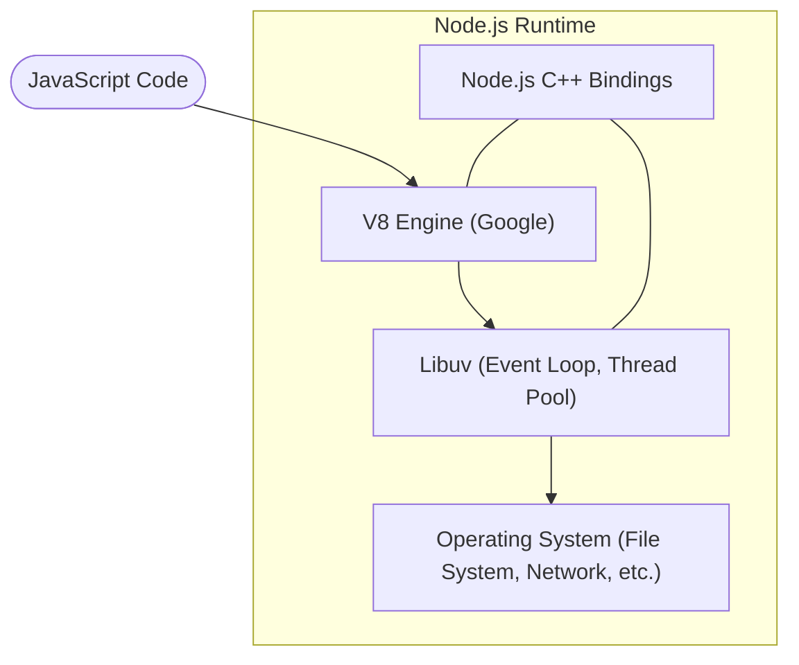

# **5.1. Введение в Node.js**

**Node.js** — это мощная среда выполнения (**Runtime**) JavaScript, построенная на движке **V8**. Она позволяет перенести магию JavaScript за пределы браузера — на сторону **сервера**. В этом разделе мы познакомимся с основами работы в этой среде и узнаем, почему она стала стандартом современной веб-разработки.

---

- [🏠 Главная](../../readme.md)
- [📚 Все уровни](../index.md)
- [📖 Справочники](../../guides/index.md)
- [🔧 Введение](../../Intro/index.md)
- [⬅️ Предыдущий документ](./4.3-projects.md)
- [➡️ Следующий документ](./5.2-node-modules.md)

---

## **Содержание**

1. [**Что такое Node.js?**](#1-что-такое-nodejs)
2. [**Установка Node.js**](#2-установка-nodejs)
3. [**Первые шаги с Node.js**](#3-первые-шаги-с-nodejs)
4. [**Глобальные объекты в Node.js**](#4-глобальные-объекты-в-nodejs)
5. [**Работа с файловой системой**](#5-работа-с-файловой-системой)
6. [**Создание простых программ**](#6-создание-простых-программ)
7. [**Интерактивная программа**](#7-интерактивная-программа)
8. [**Итог**](#итог)
9. [**Практика**](#практика)

---

## |1| **Что такое Node.js?**



> [!NOTE]
> 
> **Как это работает:** Ваш код попадает в быстрый движок **V8**, который превращает его в команды для системы. Библиотека **Libuv** берет на себя тяжелую работу (чтение файлов, сеть), позволяя JavaScript не ждать завершения этих операций и работать максимально быстро.

Node.js — это среда выполнения JavaScript, построенная на движке V8 от Google Chrome. Она позволяет запускать JavaScript код на сервере, а не только в браузере.

### Основные особенности Node.js:

- **Асинхронность** - неблокирующий ввод/вывод
- **Событийно-ориентированная архитектура** - обработка событий
- **Один поток** - event loop для обработки операций
- **Быстродействие** - движок V8 компилирует JS в машинный код
- **NPM** - огромная экосистема пакетов

---

## |2| **Установка Node.js**

### Официальная установка

1. Перейдите на [nodejs.org](https://nodejs.org/)
2. Скачайте LTS версию (рекомендуется)
3. Запустите установщик и следуйте инструкциям

### Проверка установки

```bash
# Проверка версии Node.js
node --version
# или
node -v

# Проверка версии npm (устанавливается вместе с Node.js)
npm --version
# или
npm -v
```

### Установка через пакетные менеджеры

**Ubuntu/Debian:**

```bash
sudo apt update
sudo apt install nodejs npm
```

**macOS (Homebrew):**

```bash
brew install node
```

**Windows (Chocolatey):**

```bash
choco install nodejs
```

---

## |3| **Первые шаги с Node.js**

### Запуск JavaScript кода

Создайте файл `hello.js`:

```javascript
console.log("Привет из Node.js!");
console.log("Версия Node.js:", process.version);
console.log("Платформа:", process.platform);
```

Запустите его:

```bash
node hello.js
```

### Интерактивная консоль (REPL)

REPL (Read-Eval-Print Loop) позволяет выполнять JavaScript код интерактивно:

```bash
node
```

В интерактивной консоли:

```javascript
> console.log('Привет!')
Привет!
undefined

> 2 + 2
4

> const arr = [1, 2, 3]
undefined

> arr.map(x => x * 2)
[ 2, 4, 6 ]

> .exit // выход из REPL
```

### Полезные команды REPL:

- `.help` - справка по командам
- `.clear` - очистка контекста
- `.save filename` - сохранение сессии в файл
- `.load filename` - загрузка файла
- `.exit` - выход

---

## |4| **Глобальные объекты в Node.js**

### Объект `global`

В Node.js глобальный объект называется `global` (аналог `window` в браузере):

```javascript
// Добавление глобальной переменной
global.myGlobalVar = "Я глобальная переменная";

// Проверка в другом файле
console.log(global.myGlobalVar);
```

### Объект `process`

Содержит информацию о текущем процессе Node.js:

```javascript
// Информация о процессе
console.log("PID процесса:", process.pid);
console.log("Версия Node.js:", process.version);
console.log("Платформа:", process.platform);
console.log("Архитектура:", process.arch);

// Аргументы командной строки
console.log("Аргументы:", process.argv);

// Переменные окружения
console.log("Домашний каталог:", process.env.HOME);
console.log("Все переменные:", process.env);

// Рабочий каталог
console.log("Текущий каталог:", process.cwd());

// Время работы процесса
console.log("Время работы (сек):", process.uptime());
```

### Буферы и потоки

#### `process.stdin` - стандартный ввод

```javascript
// Чтение ввода пользователя
console.log("Введите ваше имя:");

process.stdin.setEncoding("utf8");

process.stdin.on("data", (data) => {
  const name = data.trim();
  console.log(`Привет, ${name}!`);
  process.exit(0);
});
```

#### `process.stdout` - стандартный вывод

```javascript
// Вывод без переноса строки
process.stdout.write("Загрузка");

let counter = 0;
const interval = setInterval(() => {
  process.stdout.write(".");
  counter++;

  if (counter === 5) {
    console.log(" Готово!");
    clearInterval(interval);
  }
}, 500);
```

#### `process.stderr` - стандартный поток ошибок

```javascript
// Вывод ошибки
process.stderr.write("Ошибка: что-то пошло не так!\n");

// Альтернативно
console.error("Ошибка: что-то пошло не так!");
```

---

## |5| **Работа с файловой системой**

### Модуль `fs` (File System)

Это один из самых важных модулей. Он позволяет создавать, читать, обновлять и удалять файлы и папки. В Node.js почти все методы `fs` имеют две версии: синхронную (блокирует поток) и асинхронную (использует колбэки или промисы).

```javascript
const fs = require("fs");

// Чтение файла (синхронно)
try {
  const data = fs.readFileSync("file.txt", "utf8");
  console.log("Содержимое файла:", data);
} catch (error) {
  console.error("Ошибка чтения файла:", error.message);
}

// Чтение файла (асинхронно через callback)
fs.readFile("file.txt", "utf8", (error, data) => {
  if (error) {
    console.error("Ошибка чтения файла:", error.message);
    return;
  }
  console.log("Содержимое файла:", data);
});

// Запись в файл
const content = "Привет, Node.js!";

fs.writeFile("hello.txt", content, "utf8", (error) => {
  if (error) {
    console.error("Ошибка записи:", error.message);
    return;
  }
  console.log("Файл успешно создан!");
});
```

#### **Продвинутая работа: Класс-обертка для файлов**

Для удобства разработки часто создают классы-обертки, которые инкапсулируют работу с файловой системой и превращают старые колбэки в современные `Promise`.

```javascript
class FileManager {
  // Чтение файла (возвращает Promise)
  static readFile(filename) {
    return new Promise((resolve, reject) => {
      fs.readFile(filename, "utf8", (error, data) => {
        if (error) reject(error);
        else resolve(data);
      });
    });
  }

  // Запись файла
  static writeFile(filename, content) {
    return new Promise((resolve, reject) => {
      fs.writeFile(filename, content, "utf8", (error) => {
        if (error) reject(error);
        else resolve();
      });
    });
  }

  // Получение списка файлов в директории
  static listFiles(directory) {
    return new Promise((resolve, reject) => {
      fs.readdir(directory, (error, files) => {
        if (error) reject(error);
        else resolve(files);
      });
    });
  }
}

// Использование через async/await
async function run() {
  await FileManager.writeFile("./test.txt", "Hello logic!");
  const files = await FileManager.listFiles("./");
  console.log("Файлы в папке:", files);
}
```

### Модуль `path`

Работа с путями к файлам может быть сложной из-за различий в операционных системах (Windows использует `\`, а Linux `/`). Модуль `path` решает эту проблему, предоставляя универсальные методы для склейки и анализа путей.

```javascript
const path = require("path");

// Получение информации о пути
const filePath = "/home/user/documents/file.txt";

console.log("Директория:", path.dirname(filePath)); // /home/user/documents
console.log("Имя файла:", path.basename(filePath)); // file.txt
console.log("Расширение:", path.extname(filePath)); // .txt
console.log("Без расширения:", path.parse(filePath).name); // file

// Построение пути (автоматически выберет правильный разделитель / или \)
const fullPath = path.join("/home", "user", "documents", "file.txt");
console.log("Полный путь:", fullPath);

// Разрешение относительных путей
const resolvedPath = path.resolve("../documents/file.txt");
console.log("Абсолютный путь:", resolvedPath);

// Получение относительного пути
const relativePath = path.relative(
  "/home/user",
  "/home/user/documents/file.txt"
);
console.log("Относительный путь:", relativePath); // documents/file.txt
```

#### **Утилиты для работы с путями**

Использование `path` внутри классов помогает сделать код более чистым и независимым от окружения.

```javascript
class PathUtils {
  // Получение абсолютного пути
  static getAbsolutePath(relativePath) {
    return path.resolve(relativePath);
  }

  // Получение полной информации о файле в виде объекта
  static getFileInfo(filePath) {
    return {
      directory: path.dirname(filePath),
      filename: path.basename(filePath),
      extension: path.extname(filePath),
      name: path.basename(filePath, path.extname(filePath)),
    };
  }

  // Проверка расширения (без учета регистра)
  static hasExtension(filePath, extension) {
    return path.extname(filePath).toLowerCase() === extension.toLowerCase();
  }
}
```

---

## |6| **Создание простых программ**

### Программа для подсчета слов в файле

```javascript
const fs = require("fs");
const path = require("path");

function countWords(filename) {
  try {
    // Чтение файла
    const content = fs.readFileSync(filename, "utf8");

    // Подсчет слов
    const words = content
      .split(/\s+/) // Разделение по пробелам
      .filter((word) => word.length > 0); // Удаление пустых строк

    // Статистика
    const stats = {
      filename: path.basename(filename),
      characters: content.length,
      words: words.length,
      lines: content.split("\n").length,
    };

    return stats;
  } catch (error) {
    console.error("Ошибка:", error.message);
    return null;
  }
}

// Использование
const filename = process.argv[2]; // Получение имени файла из аргументов

if (!filename) {
  console.log("Использование: node wordcount.js <имя_файла>");
  process.exit(1);
}

const stats = countWords(filename);
if (stats) {
  console.log(`Статистика для файла "${stats.filename}":`);
  console.log(`Символов: ${stats.characters}`);
  console.log(`Слов: ${stats.words}`);
  console.log(`Строк: ${stats.lines}`);
}
```

### Простой файловый менеджер

```javascript
const fs = require("fs");
const path = require("path");

class SimpleFileManager {
  constructor() {
    this.currentDir = process.cwd();
  }

  // Список файлов в директории
  listFiles(directory = this.currentDir) {
    try {
      const files = fs.readdirSync(directory);

      console.log(`Содержимое директории: ${directory}`);
      console.log("─".repeat(50));

      files.forEach((file) => {
        const fullPath = path.join(directory, file);
        const stats = fs.statSync(fullPath);

        const type = stats.isDirectory() ? "[DIR]" : "[FILE]";
        const size = stats.isFile() ? `${stats.size} байт` : "";

        console.log(`${type} ${file} ${size}`);
      });
    } catch (error) {
      console.error("Ошибка чтения директории:", error.message);
    }
  }

  // Создание директории
  createDirectory(name) {
    const dirPath = path.join(this.currentDir, name);

    try {
      fs.mkdirSync(dirPath);
      console.log(`Директория "${name}" создана`);
    } catch (error) {
      console.error("Ошибка создания директории:", error.message);
    }
  }

  // Создание файла
  createFile(name, content = "") {
    const filePath = path.join(this.currentDir, name);

    try {
      fs.writeFileSync(filePath, content);
      console.log(`Файл "${name}" создан`);
    } catch (error) {
      console.error("Ошибка создания файла:", error.message);
    }
  }

  // Копирование файла
  copyFile(source, destination) {
    try {
      const sourcePath = path.join(this.currentDir, source);
      const destPath = path.join(this.currentDir, destination);

      const content = fs.readFileSync(sourcePath);
      fs.writeFileSync(destPath, content);

      console.log(`Файл "${source}" скопирован в "${destination}"`);
    } catch (error) {
      console.error("Ошибка копирования:", error.message);
    }
  }

  // Удаление файла
  deleteFile(name) {
    const filePath = path.join(this.currentDir, name);

    try {
      fs.unlinkSync(filePath);
      console.log(`Файл "${name}" удален`);
    } catch (error) {
      console.error("Ошибка удаления:", error.message);
    }
  }
}

// Использование
const fileManager = new SimpleFileManager();

// Демонстрация функций
fileManager.listFiles();
fileManager.createFile("test.txt", "Привет из Node.js!");
fileManager.copyFile("test.txt", "copy.txt");
fileManager.listFiles();
```

#---

## |7| **Интерактивная программа**

```javascript
const readline = require("readline");

// Создание интерфейса для чтения ввода
const rl = readline.createInterface({
  input: process.stdin,
  output: process.stdout,
});

class InteractiveCalculator {
  constructor() {
    this.history = [];
  }

  start() {
    console.log("=== Интерактивный калькулятор ===");
    console.log("Доступные операции: +, -, *, /");
    console.log('Для выхода введите "exit"');
    console.log('Для истории введите "history"');
    console.log("");

    this.askQuestion();
  }

  askQuestion() {
    rl.question("Введите выражение (например: 2 + 3): ", (input) => {
      if (input.toLowerCase() === "exit") {
        console.log("До свидания!");
        rl.close();
        return;
      }

      if (input.toLowerCase() === "history") {
        this.showHistory();
        this.askQuestion();
        return;
      }

      this.calculate(input);
      this.askQuestion();
    });
  }

  calculate(expression) {
    try {
      // Простая проверка безопасности
      if (!/^[\d\s+\-*/().]+$/.test(expression)) {
        throw new Error("Недопустимые символы в выражении");
      }

      const result = eval(expression);
      console.log(`Результат: ${result}`);

      this.history.push({
        expression,
        result,
        timestamp: new Date().toLocaleString(),
      });
    } catch (error) {
      console.error("Ошибка вычисления:", error.message);
    }
  }

  showHistory() {
    if (this.history.length === 0) {
      console.log("История пуста");
      return;
    }

    console.log("\n=== История вычислений ===");
    this.history.forEach((item, index) => {
      console.log(
        `${index + 1}. ${item.expression} = ${item.result} (${item.timestamp})`
      );
    });
    console.log("");
  }
}

// Запуск калькулятора
const calculator = new InteractiveCalculator();
calculator.start();

// Обработка завершения программы
rl.on("close", () => {
  process.exit(0);
});
```


---

## **Итог**

В данном вводном уроке мы узнали, что **Node.js** — это не просто инструмент, а целая экосистема, позволяющая JavaScript дышать полной грудью на сервере. Мы научились устанавливать среду, запускать файлы и взаимодействовать с операционной системой через встроенные модули.

Основные выводы:
- `global` — это наш новый `window`.
- `process` — это пульт управления текущим приложением.
- `fs` и `path` — наши основные инструменты для работы с данными на диске.

---

## **Практика**

Ниже приведены задачи для закрепления основ работы в среде Node.js.

### 1. **Анализатор текста**
Создайте программу, которая читает текстовый файл и выводит статистику: количество слов, символов и строк. Используйте модуль `fs`.

### 2. **Генератор файлов**
Напишите скрипт, который создаёт директорию `temp` и наполняет её 5-ю текстовыми файлами с названиями `test_1.txt`, `test_2.txt` и т.д.

### 3. **Простой HTTP-сервер**
Используя модуль `http` (изучите его самостоятельно или дождитесь следующего урока), создайте сервер, который всегда отвечает "Hello World" на любой запрос.

### 4. **Интерактивный опросник**
Напишите программу, которая задаёт пользователю 3 вопроса через `readline` и сохраняет его ответы в файл `result.txt`.

---

## **Полезные ресурсы**

- [Официальная документация Node.js](https://nodejs.org/docs/)
- [Node.js API Reference](https://nodejs.org/api/)
- [NPM Registry](https://www.npmjs.com/)

---

- [🏠 Главная](../../readme.md)
- [📚 Все уровни](../index.md)
- [⬅️ Назад к проектам](./4.3-projects.md)
- [➡️ Далее к модулям Node](./5.2-node-modules.md)
