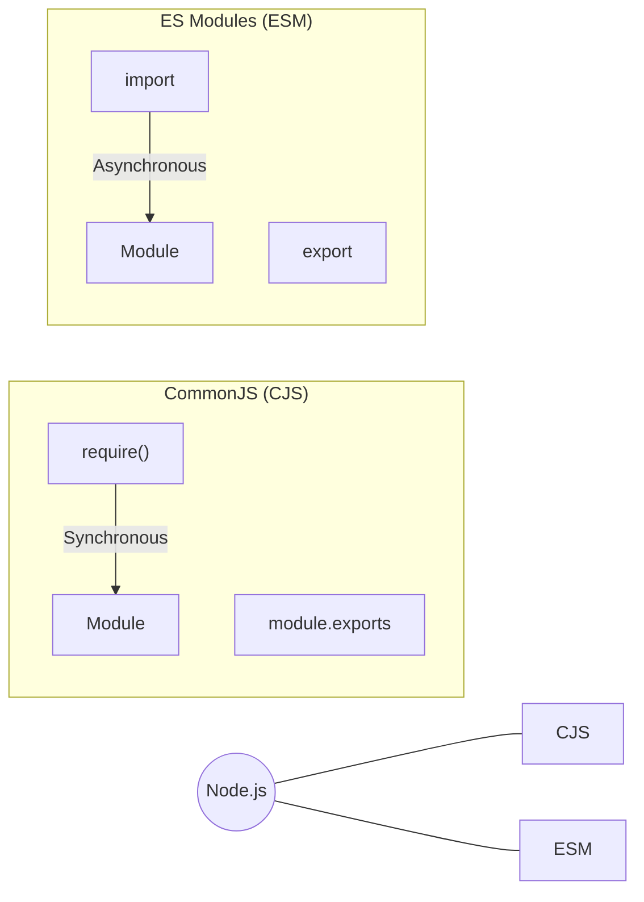

# **5.2. Модули в Node.js**

В Node.js модули — это кирпичики, из которых строится всё здание приложения. Понимание разницы между традиционным **CommonJS** и современным **ES Modules** критически важно для любого разработчика. В этом уроке мы научимся правильно экспортировать и импортировать код, а также познакомимся с мощными встроенными модулями системы.

---

- [🏠 Главная](../../readme.md)
- [📚 Все уровни](../index.md)
- [📖 Справочники](../../guides/index.md)
- [🔧 Введение](../../Intro/index.md)
- [⬅️ Предыдущий документ](./5.1-nodejs.md)
- [➡️ Следующий документ](./5.3-npm.md)

---

## **Содержание**

1. [**Система модулей в Node.js**](#1-система-модулей-в-nodejs)
2. [**CommonJS модули**](#2-commonjs-модули)
3. [**ES Modules в Node.js**](#3-es-modules-в-nodejs)
4. [**Встроенные модули Node.js**](#4-встроенные-модули-nodejs)
5. [**Создание собственных модулей**](#5-создание-собственных-модулей)
6. [**Использование созданных модулей**](#6-использование-созданных-модулей)
7. [**Итог**](#итог)
8. [**Практика**](#практика)

---

## |1| **Система модулей в Node.js**



Node.js поддерживает два основных типа модулей:

- **CommonJS** (традиционная система, по умолчанию)
- **ES Modules** (современный стандарт ES6+)

---

## |2| **CommonJS модули**

Это «родная» и самая старая система модулей в Node.js. Она работает **синхронно**, что означает: пока один модуль не загрузится полностью, выполнение кода не пойдет дальше. Это идеально подходит для серверных приложений, где все файлы обычно находятся на одном диске.

### Экспорт с `module.exports`

Для того чтобы сделать функции или классы доступными для других файлов, мы используем объект `module.exports`. Вы можете экспортировать как один объект (например, класс), так и набор функций.

**math.js:**

```javascript
// Экспорт функций
function add(a, b) {
  return a + b;
}

function subtract(a, b) {
  return a - b;
}

// Способ 1: присвоение объекта
module.exports = {
  add: add,
  subtract: subtract,
};

// Способ 2: сокращенная запись
module.exports = { add, subtract };
```

Вы также можете экспортировать целые классы, что является стандартом для создания сервисов и моделей.

**calculator.js:**

```javascript
// Экспорт класса
class Calculator {
  constructor() {
    this.result = 0;
  }

  add(number) {
    this.result += number;
    return this;
  }

  getResult() {
    return this.result;
  }
}

module.exports = Calculator;
```

**utils.js:**

```javascript
// Экспорт отдельных свойств
module.exports.formatDate = function (date) {
  return date.toLocaleDateString();
};

module.exports.generateId = function () {
  return Date.now() + Math.random();
};

// Или через exports (сокращение)
exports.VERSION = "1.0.0";
exports.API_URL = "https://api.example.com";
```

### Импорт с `require()`

```javascript
// Импорт модуля целиком
const math = require("./math");
console.log(math.add(5, 3)); // 8

// Деструктуризация при импорте
const { add, subtract } = require("./math");
console.log(add(10, 5)); // 15

// Импорт класса
const Calculator = require("./calculator");
const calc = new Calculator();
console.log(calc.add(10).getResult()); // 10

// Импорт утилит
const utils = require("./utils");
console.log(utils.VERSION); // 1.0.0
```

---

## |3| **ES Modules в Node.js**

Это современный стандарт (**ECMAScript Modules**), который используется в браузерах и всё чаще в Node.js. Главное отличие — они работают **асинхронно**. Это позволяет загружать модули параллельно, что критично для производительности в вебе.

### Включение ES модулей

Node.js по умолчанию считает все файлы `.js` модулями CommonJS. Чтобы включить поддержку ESM, у вас есть два пути:

**Способ 1: package.json**
В корне вашего проекта в файле `package.json` добавьте поле `"type": "module"`.

```json
{
  "name": "my-project",
  "type": "module",
  "main": "index.js"
}
```

**Способ 2: расширение .mjs**
Просто переименуйте файлы из `.js` в `.mjs`.

### Синтаксис ES модулей

Вместо `require` и `module.exports` здесь используются ключевые слова `import` и `export`. Это делает код более чистым и позволяет инструментам сборки (например, Webpack) эффективнее удалять неиспользуемый код (**Tree Shaking**).

**math.mjs:**

```javascript
// Именованный экспорт
export function add(a, b) {
  return a + b;
}

export function subtract(a, b) {
  return a - b;
}

export const PI = 3.14159;

// Экспорт по умолчанию
export default function multiply(a, b) {
  return a * b;
}
```

**app.mjs:**

```javascript
// Именованный импорт
import { add, subtract, PI } from "./math.mjs";

// Импорт по умолчанию
import multiply from "./math.mjs";

// Смешанный импорт
import multiply, { add, subtract } from "./math.mjs";

// Импорт всего модуля
import * as math from "./math.mjs";

console.log(add(5, 3)); // 8
console.log(multiply(4, 2)); // 8
console.log(math.PI); // 3.14159
```

---

## |4| **Встроенные модули Node.js**

Node.js поставляется с богатым набором инструментов "из коробки". Мы уже знакомы с `fs` и `path`, но система гораздо шире. Рассмотрим модули, которые делают Node.js по-настоящему уникальным.

### Модуль `events` (EventEmitter)

Это сердце асинхронного Node.js. Многие встроенные модули сами являются «излучателями событий». Этот паттерн позволяет одной части программы говорить: «Я что-то сделала!», а другой части — реагировать на это.

```javascript
const EventEmitter = require("events");

class MyEmitter extends EventEmitter {}

const myEmitter = new MyEmitter();

// Подписываемся на событие "greet"
myEmitter.on("greet", (name) => {
  console.log(`Привет, ${name}! Событие получено.`);
});

// Генерируем (излучаем) событие
myEmitter.emit("greet", "Алексей");
```

### Модуль `url`

Когда ваше приложение работает в интернете, вам постоянно нужно разбирать адреса (URL) на части: протокол, домен, параметры поиска. Модуль `url` делает это легко и безопасно.

```javascript
const { URL } = require("url");

const myUrl = new URL("https://example.com:8080/p/a/t/h?query=string#hash");

console.log("Хост:", myUrl.host);       // example.com:8080
console.log("Путь:", myUrl.pathname);   // /p/a/t/h
console.log("Параметры:", myUrl.searchParams.get("query")); // string
```

### Модуль `crypto`

Безопасность — это важно. Модуль `crypto` предоставляет функции для хеширования данных (создания «цифровых отпечатков»), шифрования и генерации случайных чисел.

```javascript
const crypto = require("crypto");

// Создание хеша (например, для пароля)
const secret = "my-secret-password";
const hash = crypto.createHmac("sha256", "key")
                   .update(secret)
                   .digest("hex");

console.log("Хеш пароля:", hash);

// Генерация случайных байтов (например, для ID)
const id = crypto.randomBytes(4).toString("hex");
console.log("Случайный ID:", id);
```

### Модуль `os` (Operating System)

Этот модуль позволяет заглянуть «под капот» сервера. Вы можете узнать количество ядер процессора, объем свободной оперативной памяти, сетевые адреса и даже время, которое компьютер проработал без перезагрузки. Это полезно для создания систем мониторинга и оптимизации нагрузки.

```javascript
const os = require("os");

// Информация о системе
class SystemInfo {
  static getSystemData() {
    return {
      platform: os.platform(), // Операционная система
      architecture: os.arch(), // Архитектура процессора
      hostname: os.hostname(), // Имя компьютера
      uptime: os.uptime(), // Время работы системы
      totalMemory: os.totalmem(), // Общий объем памяти
      freeMemory: os.freemem(), // Свободная память
      cpus: os.cpus(), // Информация о процессорах
      networkInterfaces: os.networkInterfaces(), // Сетевые интерфейсы
    };
  }

  static formatMemory(bytes) {
    const units = ["B", "KB", "MB", "GB"];
    let size = bytes;
    let unitIndex = 0;

    while (size >= 1024 && unitIndex < units.length - 1) {
      size /= 1024;
      unitIndex++;
    }

    return `${size.toFixed(2)} ${units[unitIndex]}`;
  }

  static getMemoryUsage() {
    const total = os.totalmem();
    const free = os.freemem();
    const used = total - free;

    return {
      total: this.formatMemory(total),
      used: this.formatMemory(used),
      free: this.formatMemory(free),
      usedPercent: ((used / total) * 100).toFixed(2),
    };
  }
}

module.exports = SystemInfo;
```

---

## |5| **Создание собственных модулей**

### Модуль для работы с конфигурацией

**config.js:**

```javascript
const fs = require("fs");
const path = require("path");

class ConfigManager {
  constructor(configPath = "./config.json") {
    this.configPath = configPath;
    this.config = this.loadConfig();
  }

  // Загрузка конфигурации
  loadConfig() {
    try {
      if (fs.existsSync(this.configPath)) {
        const data = fs.readFileSync(this.configPath, "utf8");
        return JSON.parse(data);
      }
    } catch (error) {
      console.error("Ошибка загрузки конфигурации:", error.message);
    }

    // Конфигурация по умолчанию
    return {
      app: {
        name: "My App",
        version: "1.0.0",
        port: 3000,
      },
      database: {
        host: "localhost",
        port: 5432,
        name: "myapp",
      },
    };
  }

  // Сохранение конфигурации
  saveConfig() {
    try {
      const data = JSON.stringify(this.config, null, 2);
      fs.writeFileSync(this.configPath, data, "utf8");
      return true;
    } catch (error) {
      console.error("Ошибка сохранения конфигурации:", error.message);
      return false;
    }
  }

  // Получение значения
  get(key) {
    const keys = key.split(".");
    let value = this.config;

    for (const k of keys) {
      if (value && typeof value === "object" && k in value) {
        value = value[k];
      } else {
        return undefined;
      }
    }

    return value;
  }

  // Установка значения
  set(key, value) {
    const keys = key.split(".");
    let current = this.config;

    for (let i = 0; i < keys.length - 1; i++) {
      const k = keys[i];
      if (!(k in current) || typeof current[k] !== "object") {
        current[k] = {};
      }
      current = current[k];
    }

    current[keys[keys.length - 1]] = value;
    return this.saveConfig();
  }

  // Получение всей конфигурации
  getAll() {
    return { ...this.config };
  }
}

module.exports = ConfigManager;
```

### Модуль для работы с логами

**logger.js:**

```javascript
const fs = require("fs");
const path = require("path");

class Logger {
  constructor(options = {}) {
    this.logLevel = options.level || "info";
    this.logFile = options.file || "app.log";
    this.logDir = options.dir || "./logs";
    this.dateFormat = options.dateFormat || "ru-RU";

    this.levels = {
      error: 0,
      warn: 1,
      info: 2,
      debug: 3,
    };

    this.colors = {
      error: "\x1b[31m", // красный
      warn: "\x1b[33m", // желтый
      info: "\x1b[36m", // голубой
      debug: "\x1b[90m", // серый
      reset: "\x1b[0m", // сброс
    };

    this.createLogDir();
  }

  // Создание директории для логов
  createLogDir() {
    if (!fs.existsSync(this.logDir)) {
      fs.mkdirSync(this.logDir, { recursive: true });
    }
  }

  // Форматирование сообщения
  formatMessage(level, message) {
    const timestamp = new Date().toLocaleString(this.dateFormat);
    return `[${timestamp}] [${level.toUpperCase()}] ${message}`;
  }

  // Запись в файл
  writeToFile(message) {
    const logPath = path.join(this.logDir, this.logFile);
    fs.appendFileSync(logPath, message + "\n");
  }

  // Вывод в консоль с цветом
  writeToConsole(level, message) {
    const color = this.colors[level] || this.colors.reset;
    console.log(`${color}${message}${this.colors.reset}`);
  }

  // Основной метод логирования
  log(level, message) {
    if (this.levels[level] <= this.levels[this.logLevel]) {
      const formattedMessage = this.formatMessage(level, message);
      this.writeToConsole(level, formattedMessage);
      this.writeToFile(formattedMessage);
    }
  }

  // Методы для разных уровней
  error(message) {
    this.log("error", message);
  }

  warn(message) {
    this.log("warn", message);
  }

  info(message) {
    this.log("info", message);
  }

  debug(message) {
    this.log("debug", message);
  }
}

module.exports = Logger;
```

### Модуль для работы с базой данных (JSON)

**database.js:**

```javascript
const fs = require("fs");
const path = require("path");

class JsonDatabase {
  constructor(dbPath = "./data") {
    this.dbPath = dbPath;
    this.createDbDir();
  }

  // Создание директории базы данных
  createDbDir() {
    if (!fs.existsSync(this.dbPath)) {
      fs.mkdirSync(this.dbPath, { recursive: true });
    }
  }

  // Получение пути к таблице
  getTablePath(tableName) {
    return path.join(this.dbPath, `${tableName}.json`);
  }

  // Загрузка таблицы
  loadTable(tableName) {
    const tablePath = this.getTablePath(tableName);

    try {
      if (fs.existsSync(tablePath)) {
        const data = fs.readFileSync(tablePath, "utf8");
        return JSON.parse(data);
      }
    } catch (error) {
      console.error(`Ошибка загрузки таблицы ${tableName}:`, error.message);
    }

    return [];
  }

  // Сохранение таблицы
  saveTable(tableName, data) {
    const tablePath = this.getTablePath(tableName);

    try {
      const jsonData = JSON.stringify(data, null, 2);
      fs.writeFileSync(tablePath, jsonData, "utf8");
      return true;
    } catch (error) {
      console.error(`Ошибка сохранения таблицы ${tableName}:`, error.message);
      return false;
    }
  }

  // Вставка записи
  insert(tableName, record) {
    const data = this.loadTable(tableName);

    // Генерация ID, если его нет
    if (!record.id) {
      record.id = Date.now() + Math.random();
    }

    data.push(record);
    return this.saveTable(tableName, data) ? record : null;
  }

  // Поиск записей
  find(tableName, query = {}) {
    const data = this.loadTable(tableName);

    if (Object.keys(query).length === 0) {
      return data;
    }

    return data.filter((record) => {
      return Object.keys(query).every((key) => {
        return record[key] === query[key];
      });
    });
  }

  // Поиск одной записи
  findOne(tableName, query) {
    const results = this.find(tableName, query);
    return results.length > 0 ? results[0] : null;
  }

  // Обновление записи
  update(tableName, query, updates) {
    const data = this.loadTable(tableName);
    let updated = 0;

    const newData = data.map((record) => {
      const matches = Object.keys(query).every((key) => {
        return record[key] === query[key];
      });

      if (matches) {
        updated++;
        return { ...record, ...updates };
      }

      return record;
    });

    if (updated > 0) {
      this.saveTable(tableName, newData);
    }

    return updated;
  }

  // Удаление записи
  delete(tableName, query) {
    const data = this.loadTable(tableName);
    const originalLength = data.length;

    const newData = data.filter((record) => {
      return !Object.keys(query).every((key) => {
        return record[key] === query[key];
      });
    });

    const deleted = originalLength - newData.length;

    if (deleted > 0) {
      this.saveTable(tableName, newData);
    }

    return deleted;
  }
}

module.exports = JsonDatabase;
```

---

## |6| **Использование созданных модулей**

**app.js:**

```javascript
const ConfigManager = require("./config");
const Logger = require("./logger");
const JsonDatabase = require("./database");

// Инициализация модулей
const config = new ConfigManager();
const logger = new Logger({
  level: "debug",
  file: "app.log",
  dir: "./logs",
});
const db = new JsonDatabase("./data");

// Демонстрация работы
async function main() {
  logger.info("Запуск приложения");

  // Работа с конфигурацией
  logger.info(`Название приложения: ${config.get("app.name")}`);
  logger.info(`Версия: ${config.get("app.version")}`);

  // Работа с базой данных
  const user = {
    name: "Иван Петров",
    email: "ivan@example.com",
    age: 30,
  };

  const insertedUser = db.insert("users", user);
  logger.info(`Пользователь добавлен: ${insertedUser.name}`);

  // Поиск пользователей
  const users = db.find("users", { age: 30 });
  logger.info(`Найдено пользователей: ${users.length}`);

  // Обновление пользователя
  const updated = db.update(
    "users",
    { email: "ivan@example.com" },
    { age: 31 }
  );
  logger.info(`Обновлено записей: ${updated}`);

  logger.info("Приложение завершено");
}

// Обработка ошибок
process.on("uncaughtException", (error) => {
  logger.error(`Необработанная ошибка: ${error.message}`);
  process.exit(1);
});

process.on("unhandledRejection", (reason, promise) => {
  logger.error(`Необработанное отклонение промиса: ${reason}`);
});

// Запуск приложения
main().catch((error) => {
  logger.error(`Ошибка в main: ${error.message}`);
});
```


---

## **Итог**

Мы изучили две ключевые системы модулей в Node.js. Теперь вы понимаете, что:
- **CommonJS** — это классика с `require` и `module.exports`, работающая синхронно.
- **ES Modules** — это будущее и стандарт с `import` и `export`, ориентированный на асинхронность.
- Встроенные модули (`fs`, `path`, `os`) дают нам полный контроль над системой.

---

## **Практика**

Задания для закрепления навыков работы с модулями и паттерном «Сервис».

### 1. **Модуль для работы с CSV**
Создайте модуль `CsvParser.js`, который умеет превращать массив объектов в строку формата CSV и сохранять её в файл через `fs`.

### 2. **Модуль валидации данных**
Разработайте сервис `Validator.js`, экспортирующий методы для проверки email, длины пароля и наличия специальных символов. Используйте ES Modules.

### 3. **Модуль кэширования (In-Memory Cache)**
Создайте модуль `Cache.js`, который позволяет сохранять данные под ключом, получать их и удалять по истечении времени (TTL).

### 4. **Мониторинг системы**
Разработайте скрипт, который раз в 5 секунд записывает в файл `system.log` текущее использование памяти и загрузку процессора, используя модуль `os`.

### 5. **Система логирования на событиях**
Создайте класс `Logger`, наследующий `EventEmitter`. Он должен излучать события `info`, `warn` и `error`. Другой модуль должен подписываться на эти события и записывать сообщения в соответствующие файлы (`info.log`, `errors.log`).

### 6. **Анализатор URL параметров**
Напишите функцию, которая принимает массив строк-адресов, извлекает из них названия доменов и уникальные значения параметра `utm_source`, сохраняя результат в JSON-файл.

### 7. **Генератор безопасных ключей**
Создайте модуль, который генерирует случайные строки заданной длины и их SHA-256 хеши. Это полезно для создания API-ключей или секретных токенов.

### 8. **Зашифрованный блокнот**
Реализуйте простую систему, которая принимает текст, хеширует его (для имитации "шифрования" на уровне A1) и сохраняет в файл. Добавьте метод для проверки: совпадает ли введенное слово с тем, что хранится в "зашифрованном" виде.

### 9. **Менеджер путей проекта**
Создайте модуль `ProjectPaths.js`, который при инициализации определяет абсолютные пути к папкам `logs`, `data` и `uploads` относительно корня проекта, создавая их, если они отсутствуют.

### 10. **Интерактивный чат-излучатель**
Реализуйте модуль `Chat.js`, который через интервал имитирует сообщения от разных пользователей, излучая событие `message`. Главный файл должен выводить эти сообщения в консоль с указанием времени (из модуля `os` или `Date`).

---

- [🏠 Главная](../../readme.md)
- [📚 Все уровни](../index.md)
- [⬅️ Назад к Node.js](./5.1-nodejs.md)
- [➡️ Далее к npm](./5.3-npm.md)
