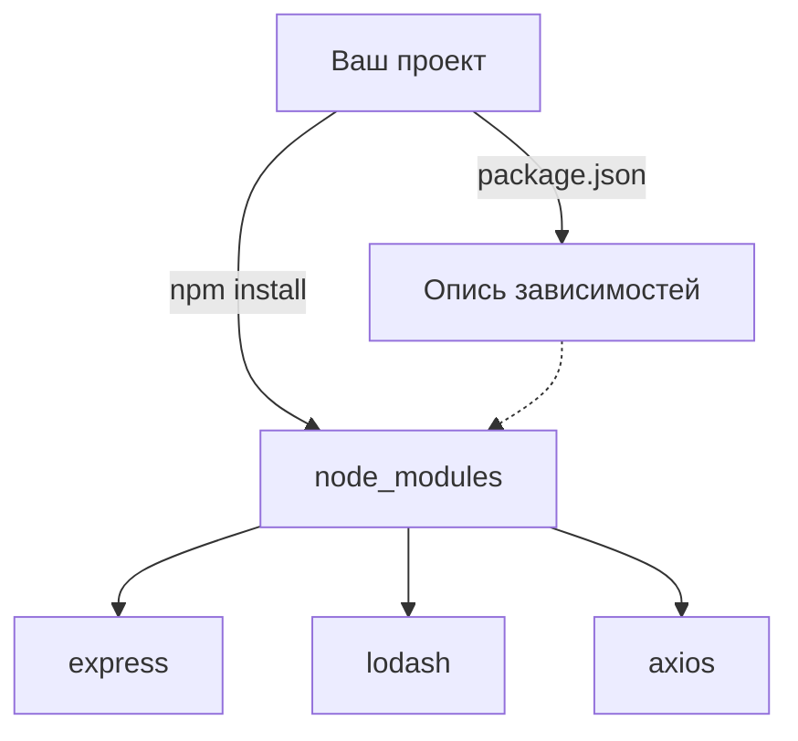

# **5.3. Работа с npm**

**npm** (Node Package Manager) — это сердце экосистемы Node.js. Он позволяет устанавливать тысячи готовых библиотек (пакетов), управлять **зависимостями** проекта и запускать **скрипты** автоматизации. Понимание npm — это обязательный навык любого современного разработчика.

---

- [🏠 Главная](../../readme.md)
- [📚 Все уровни](../index.md)
- [📖 Справочники](../../guides/index.md)
- [🔧 Введение](../../Intro/index.md)
- [⬅️ Предыдущий документ](./5.2-node-modules.md)
- [➡️ Следующий документ](./5.4-projects-5.md)

---

## **Содержание**

1. [**Что такое npm?**](#1-что-такое-npm)
2. [**Инициализация проекта**](#2-инициализация-проекта)
3. [**Установка пакетов**](#3-установка-пакетов)
4. [**Управление зависимостями**](#4-управление-зависимостями)
5. [**npm scripts**](#5-npm-scripts)
6. [**Практические примеры**](#6-практические-примеры)
7. [**Управление версиями пакета**](#7-управление-версиями-пакета)
8. [**Публикация пакетов**](#8-публикация-пакетов)
9. [**Полезные пакеты**](#9-полезные-пакеты)
10. [**Основные команды**](#10-основные-команды)
11. [**Альтернативы npm**](#11-альтернативы-npm)
12. [**Итог**](#итог)
13. [**Практика**](#практика)

---

## |1| **Что такое npm?**



На диаграмме видно, как работает npm: команда `npm install` читает конфигурацию из `package.json` и закачивает все указанные пакеты в папку `node_modules`.

**npm** позволяет:

- Устанавливать сторонние библиотеки
- Управлять зависимостями проекта
- Публиковать собственные пакеты
- Запускать скрипты проекта

npm устанавливается автоматически вместе с Node.js.

---

## |2| **Инициализация проекта**

Первое действие в любом Node.js-проекте — открыть терминал **в папке проекта** и выполнить `npm init`. Эта команда создаёт файл `package.json` — центр управления проектом. Без него npm не будет знать, какие пакеты установлены, какие скрипты запускать и кто автор проекта.

> [!NOTE]
> Все команды ниже надо вводить в терминале, находясь в корневой папке вашего проекта.

### Создание package.json

```bash
# Интерактивное создание
npm init

# Быстрое создание с настройками по умолчанию
npm init -y
# или
npm init --yes
```

### Структура package.json

```json
{
  "name": "my-project",
  "version": "1.0.0",
  "description": "Описание проекта",
  "main": "index.js",
  "scripts": {
    "start": "node index.js",
    "test": "echo \"Error: no test specified\" && exit 1"
  },
  "keywords": ["javascript", "node"],
  "author": "Ваше имя <email@example.com>",
  "license": "MIT",
  "dependencies": {},
  "devDependencies": {}
}
```

---

## |3| **Установка пакетов**

**Установка** — это процесс закачивания пакета из реестра npmjs.com в папку `node_modules` вашего проекта. npm автоматически запишет установленный пакет в `package.json`.

### Локальная установка

**Локальная** установка добавляет пакет только для текущего проекта. Это самый частый способ работы. Обратите внимание на флаг `-D` (или `--save-dev`) — он записывает пакет в раздел `devDependencies`, т.е. только для разработки:

Чем отличаются `dependencies` и `devDependencies`?

- **`dependencies`** — пакеты, необходимые для **работы приложения**. Например, `express` — без него ваш сервер не запустится.
- **`devDependencies`** — пакеты для **разработки**: тесты, линтеры, `nodemon`. На продакшн-сервер они не попадут (если запустить `npm install --production`).


```bash
# Установка пакета в проект
npm install express

# Сокращенная форма
npm i express

# Установка конкретной версии
npm install express@4.18.0

# Установка как dev-зависимость
npm install --save-dev nodemon
npm i -D nodemon

# Установка как обычная зависимость (по умолчанию)
npm install --save lodash
npm i -S lodash
```

### Глобальная установка

**Глобальная** установка (флаг `-g`) делает пакет доступным как команда в любом месте системы. Используйте её для инструментов CLI (например, `create-react-app`, `typescript`), но не для библиотек проекта:

```bash
# Установка пакета глобально
npm install -g create-react-app

# Просмотр глобально установленных пакетов
npm list -g --depth=0
```

### Установка из разных источников

По умолчанию npm ищет пакеты на `npmjs.com`. Но это не единственный источник: можно установить любой пакет прямо из GitHub, URL или даже из локальной папки — это удобно для разработки собственных пакетов:

```bash
# Из GitHub
npm install user/repo

# Из конкретной ветки
npm install user/repo#branch

# Из URL
npm install https://github.com/user/repo.git

# Из локального пути
npm install ../my-local-package
```

---

## |4| **Управление зависимостями**

В Node.js-проектах есть два вида зависимостей: те, без которых продукт не заработает (**dependencies**), и те, что нужны только при разработке (**devDependencies**). Это разделение очень важно: в финальный билд попадают только production-зависимости.

### Типы зависимостей

Каждый тип зависимостей играет свою роль:

**dependencies** - производственные зависимости:

```json
{
  "dependencies": {
    "express": "^4.18.0",
    "lodash": "^4.17.21"
  }
}
```

**devDependencies** - зависимости для разработки:

```json
{
  "devDependencies": {
    "nodemon": "^2.0.20",
    "jest": "^29.0.0"
  }
}
```

**peerDependencies** - зависимости, которые должны быть установлены пользователем:

```json
{
  "peerDependencies": {
    "react": ">=16.0.0"
  }
}
```

### Семантическое версионирование

Перед номером версии в `package.json` часто стоит специальный знак. Он говорит npm, какие обновления разрешены. Формат версии: `MAJOR.MINOR.PATCH`:

- `4.18.0` — **MAJOR** (4): ломающие изменения, **MINOR** (18): новые функции, **PATCH** (0): исправления ошибок.
- `^4.18.0` — знак **каратка** (керет): разрешены minor и patch обновления (4.x.x), но не major.
- `~1.4.0` — знак **тильда**: разрешены только patch обновления (1.4.x).

```json
{
  "dependencies": {
    "express": "4.18.0", // Точная версия
    "lodash": "^4.17.21", // Совместимые минорные обновления
    "axios": "~1.4.0", // Совместимые патч-обновления
    "react": ">=16.0.0", // Версия не меньше указанной
    "vue": "<3.0.0", // Версия меньше указанной
    "jquery": "*" // Любая версия (не рекомендуется)
  }
}
```

### Обновление пакетов

Со временем пакеты устаревают: выходят новые версии, исправляются уязвимости. Команда `npm outdated` покажет таблицу с устаревшими пакетами, а `npm update` обновит их в рамках заданных версионных ограничений (semver):

```bash
# Проверка устаревших пакетов
npm outdated

# Обновление всех пакетов
npm update

# Обновление конкретного пакета
npm update express

# Обновление до последней версии (игнорируя семвер)
npm install express@latest
```

### package-lock.json

Когда вы устанавливаете пакеты, npm создаёт файл `package-lock.json`. Если `package.json` — это список желаний («хочу Express версии 4.x»), то `package-lock.json` — это точный снимок всего дерева зависимостей в момент установки. Он гарантирует, что у всей команды и на сервере будут **идентичные версии** всех пакетов.

Файл `package-lock.json` фиксирует точные версии всех зависимостей:

```json
{
  "name": "my-project",
  "version": "1.0.0",
  "lockfileVersion": 2,
  "requires": true,
  "packages": {
    "": {
      "name": "my-project",
      "version": "1.0.0",
      "dependencies": {
        "express": "^4.18.0"
      }
    },
    "node_modules/express": {
      "version": "4.18.2",
      "resolved": "https://registry.npmjs.org/express/-/express-4.18.2.tgz",
      "integrity": "sha512-...",
      "dependencies": {
        "accepts": "~1.3.8"
      }
    }
  }
}
```

**Важно:** всегда включайте `package-lock.json` в систему контроля версий!

---

## |5| **npm scripts**

npm позволяет автоматизировать любые повторяющиеся действия в проекте, описав их в `package.json`. Это заменяет длинные команды в терминале на простые привычные алиасы.

### Определение скриптов

```json
{
  "scripts": {
    "start": "node index.js",
    "dev": "nodemon index.js",
    "test": "jest",
    "build": "webpack --mode production",
    "lint": "eslint src/",
    "clean": "rm -rf dist/",
    "deploy": "npm run build && npm run upload"
  }
}
```

### Запуск скриптов

```bash
# Стандартные скрипты (можно без run)
npm start
npm test

# Пользовательские скрипты (нужен run)
npm run dev
npm run build
npm run lint

# Передача аргументов
npm run test -- --watch
npm start -- --port=8080
```

### Хуки (lifecycle scripts)

**Хуки** — это специальные скрипты, которые npm выполняет **автоматически** до (префикс `pre`) или после (префикс `post`) другого скрипта. Это очень удобно для CI/CD-пипелайнов: перед запуском автоматически собрать проект, а после — отправить уведомление:

```json
{
  "scripts": {
    "prestart": "npm run build",
    "start": "node dist/index.js",
    "poststart": "echo 'Сервер запущен'",

    "pretest": "npm run lint",
    "test": "jest",
    "posttest": "npm run coverage",

    "prepublishOnly": "npm run build"
  }
}
```

// А вот как это выглядит на практике:
// - `pretest` запустится автоматически перед `npm test`: сначала проверит код линтером
// - `poststart` запустится после `npm start`: выведет уведомление о запуске сервера
// Хуки работают только если их имя точно совпадает с паттерном `pre<script>` или `post<script>`

```bash
# Запуск скрипта с хуком
npm test
# Сначала выполнится pretest, затем test

npm start
# Сначала выполнится prestart, затем start, затем poststart
```

---

## |6| **Практические примеры**

### Проект с Express.js

Это полный цикл создания проекта с веб-сервером. `express` попадёт в `dependencies` (нужен для работы), `nodemon` — в `devDependencies` (нужен только во время разработки): автоматически перезапускает сервер при сохранении файлов.

```bash
# Создание проекта
mkdir my-web-app
cd my-web-app
npm init -y

# Установка зависимостей
npm install express
npm install -D nodemon

# Обновление package.json
```

**package.json:**

```json
{
  "name": "my-web-app",
  "version": "1.0.0",
  "main": "app.js",
  "scripts": {
    "start": "node app.js",
    "dev": "nodemon app.js",
    "test": "echo \"Error: no test specified\" && exit 1"
  },
  "dependencies": {
    "express": "^4.18.0"
  },
  "devDependencies": {
    "nodemon": "^2.0.20"
  }
}
```

**app.js:**

```javascript
const express = require("express");
const app = express();
const PORT = process.env.PORT || 3000;

app.get("/", (req, res) => {
  res.send("Привет из Express!");
});

app.listen(PORT, () => {
  console.log(`Сервер запущен на порту ${PORT}`);
});
```

### Проект с утилитами

Здесь показано, как несколько популярных пакетов работают вместе: `lodash` для работы с данными, `moment` для дат и `axios` для HTTP-запросов. Это реальный паттерн: маленькие специализированные модули, каждый делает свою работу.

```bash
# Установка полезных пакетов
npm install lodash moment axios
npm install -D jest eslint prettier
```

**utils.js:**

```javascript
const _ = require("lodash");
const moment = require("moment");
const axios = require("axios");

// Работа с lodash
function processData(data) {
  return _.uniqBy(data, "id")
    .filter((item) => item.active)
    .map((item) => _.pick(item, ["id", "name", "email"]));
}

// Работа с датами
function formatDate(date) {
  return moment(date).format("DD.MM.YYYY HH:mm");
}

// HTTP запросы
async function fetchUserData(userId) {
  try {
    const response = await axios.get(
      `https://jsonplaceholder.typicode.com/users/${userId}`
    );
    return response.data;
  } catch (error) {
    console.error("Ошибка получения данных:", error.message);
    return null;
  }
}

module.exports = {
  processData,
  formatDate,
  fetchUserData,
};
```

### Тестирование с Jest

Testing — обязательная часть любого серьёзного проекта. `jest` устанавливается как `devDependency` (нужен только на этапе разработки). Файл теста должен называться `[name].test.js`. Jest найдёт его автоматически:

**package.json:**

```json
{
  "scripts": {
    "test": "jest",
    "test:watch": "jest --watch",
    "test:coverage": "jest --coverage"
  },
  "jest": {
    "testEnvironment": "node",
    "coverageDirectory": "coverage"
  }
}
```

**utils.test.js:**

```javascript
const { processData, formatDate } = require("./utils");

describe("Utils", () => {
  test("processData должна фильтровать и обрабатывать данные", () => {
    const input = [
      { id: 1, name: "Иван", email: "ivan@test.com", active: true },
      { id: 2, name: "Мария", email: "maria@test.com", active: false },
      { id: 1, name: "Иван", email: "ivan@test.com", active: true },
    ];

    const result = processData(input);

    expect(result).toHaveLength(1);
    expect(result[0]).toEqual({
      id: 1,
      name: "Иван",
      email: "ivan@test.com",
    });
  });

  test("formatDate должна форматировать дату", () => {
    const date = new Date("2023-09-18T15:30:00");
    const result = formatDate(date);

    expect(result).toBe("18.09.2023 15:30");
  });
});
```

---

## |7| **Управление версиями пакета**

Когда вы добавляете новые функции или исправляете ошибки, версию пакета нужно обновлять. npm следует **семантическому версионированию**: ошибка = patch, новая функция = minor, ломающее изменение = major.

### **Команды версионирования**

```bash
# Увеличение patch версии (1.0.0 -> 1.0.1)
npm version patch

# Увеличение minor версии (1.0.1 -> 1.1.0)
npm version minor

# Увеличение major версии (1.1.0 -> 2.0.0)
npm version major

# Установка конкретной версии
npm version 1.2.3

# Предварительная версия
npm version prerelease
npm version prepatch
npm version preminor
npm version premajor
```

---

## |8| **Публикация пакетов**

Любой разработчик может опубликовать свой пакет на `npmjs.com` и сделать его доступным для миллионов людей через `npm install`. Перед публикацией важно:
- Убедиться, что имя пакета уникально (проверьте на npmjs.com).
- Добавить `.npmignore`, чтобы не случайно опубликовать тесты или `node_modules`.
- Написать понятный `README.md` — это первое, что увидит другой пользователь.

### **Подготовка к публикации**

**.npmignore:**

```
node_modules/
.git/
tests/
*.test.js
.env
coverage/
docs/
```

**package.json:**

```json
{
  "name": "my-awesome-package",
  "version": "1.0.0",
  "description": "Описание пакета",
  "main": "index.js",
  "files": ["lib/", "index.js", "README.md"],
  "keywords": ["utility", "helper", "javascript"],
  "repository": {
    "type": "git",
    "url": "https://github.com/username/my-awesome-package.git"
  },
  "bugs": {
    "url": "https://github.com/username/my-awesome-package/issues"
  },
  "homepage": "https://github.com/username/my-awesome-package#readme"
}
```

### **Публикация**

```bash
# Регистрация на npmjs.com
npm adduser

# Вход в аккаунт
npm login

# Проверка содержимого пакета
npm pack

# Публикация
npm publish

# Публикация с тегом
npm publish --tag beta
```

---

## |9| **Полезные пакеты**

Ниже приведены пакеты, которые вы будете использовать чаще всего. Не нужно устанавливать всё подряд, выбирайте то, что решает вашу задачу!

### **Утилиты**

| Пакет                | Назначение                                  |
| -------------------- | ------------------------------------------- |
| `moment`, `date-fns` | Работа с датами и временем                  |
| `lodash`, `ramda`    | Помощные функции для работы с данными       |
| `axios`              | HTTP-клиент, запросы к API                  |
| `dotenv`             | Чтение переменных окружения из файла `.env` |
| `chalk`              | Цветные сообщения в консоли                 |
| `joi`, `yup`         | Валидация данных                            |

```bash
# Работа с датами
npm install moment date-fns

# Утилиты для работы с данными
npm install lodash ramda

# HTTP клиент
npm install axios

# Работа с окружением
npm install dotenv

# Цвета в консоли
npm install chalk colors

# Валидация данных
npm install joi yup
```

### **Инструменты разработки**

| Пакет                   | Назначение                                   |
| ----------------------- | -------------------------------------------- |
| `nodemon`               | Автоперезапуск сервера при сохранении файлов |
| `jest`, `mocha`, `chai` | Фреймворки для автоматического тестирования  |
| `eslint`                | Проверка кода на ошибки и стиль              |
| `prettier`              | Автоматическое форматирование кода           |
| `webpack`, `parcel`     | Сборка и оптимизация проекта                 |

```bash
# Перезапуск при изменениях
npm install -D nodemon

# Тестирование
npm install -D jest mocha chai

# Линтинг
npm install -D eslint

# Форматирование кода
npm install -D prettier

# Сборка проекта
npm install -D webpack parcel
```

---

## |10| **Основные команды**

Ниже — справочные команды npm, которые вы будете использовать чаще всего. Запомните: если забыли какая-то команда называется, всегда можно ввести `npm help <команда>`.

### **Основные команды**

Ниже — самые полезные команды для ежедневной работы. `npm audit` особенно важен: он анализирует ваши зависимости на известные уязвимости безопасности.

```bash
# Информация о пакете
npm info express
npm view express

# Поиск пакетов
npm search "web framework"

# Список установленных пакетов
npm list
npm ls

# Проверка безопасности
npm audit
npm audit fix

# Очистка кэша
npm cache clean --force

# Удаление пакета
npm uninstall express
npm remove express
npm rm express
```

### **Конфигурация npm**

npm хранит свои настройки в файле `.npmrc`. Через `npm config set` можно задать имя автора по умолчанию (чтобы не вводить каждый раз при `npm init`), сменить реестр (например на корпоративный Nexus) и многое другое:

```bash
# Просмотр конфигурации
npm config list

# Установка конфигурации
npm config set registry https://registry.npmjs.org/
npm config set init.author.name "Ваше имя"
npm config set init.author.email "email@example.com"

# Удаление конфигурации
npm config delete registry
```

---

## |11| **Альтернативы npm**

**Yarn** и **pnpm** — это другие менеджеры пакетов. Они совместимы с npm-пакетами, но предлагают больше скорость и надёжность в определённых сценариях.

### **Yarn**

```bash
# Установка
npm install -g yarn

# Использование
yarn init
yarn add express
yarn add --dev nodemon
yarn install
yarn start
```

### **pnpm**

```bash
# Установка
npm install -g pnpm

# Использование
pnpm init
pnpm add express
pnpm add -D nodemon
pnpm install
pnpm start
```

---

## **Итог**

**npm** — это ваш главный инструмент как разработчика Node.js. Теперь вы знаете:

- `npm init` создаёт `package.json` — паспорт проекта.
- `npm install` закачивает все зависимости в `node_modules`.
- **dependencies** — для прордакшна, **devDependencies** — для разработки.
- `npm run` запускает любой скрипт, описанный в `package.json`.
- `package-lock.json` фиксирует точные версии всех пакетов.

> [!TIP]
> Всегда добавляйте `node_modules/` в файл `.gitignore` — эта папка может весить десятки мегабайт, но легко восстанавливается через `npm install`.

---

## **Практика**

### 1. **Инициализация проекта**
Создайте папку `my-first-npm-project`, откройте в ней терминал и выполните `npm init -y`. Откройте `package.json` и измените: имя, версию, добавьте описание.

### 2. **Установка зависимостей**
Установите пакет `chalk` (для цветных сообщений) в `dependencies` и `nodemon` в `devDependencies`. Откройте `package.json` — убедитесь, что они попали в правильные разделы.

### 3. **Свой npm-скрипт**
Пропишите скрипт `greet`, который запускает `node greet.js` (файл выводит в консоль две строки приветствия). Запустите его через `npm run greet`.

### 4. **Хук на практике**
Добавьте скрипт `prestart`, выводящий сообщение `Проект запускается...`. Убедитесь, что он выполняется автоматически при `npm start`.

### 5. **Анализ зависимостей**
Установите `dotenv` и `axios`. Запустите `npm outdated` — посмотрите на таблицу версий. Затем `npm audit` — прочитайте отчёт безопасности.

### 6. **Скрипт deploy**
Создайте npm-скрипт `deploy`, который запускает последовательно: проверку кода (`lint`), тесты (`test`) и сборку (`build`). Используйте `&&`.

### 7. **Семантическое версионирование**
Установите `express` в проект. Посмотрите в `package.json` на знак перед версией. Ответьте: что означает `^` в вашем случае? До какой версии npm разрешит обновляться?

### 8. **Мини-библиотека**
Напишите небольшой модуль `dateUtils.js`, который экспортирует чистые функции для работы с датами (без внешних зависимостей), затем опубликуйте его на npmjs.com и установите через `npm install`.

---

- [🏠 Главная](../../readme.md)
- [📚 Все уровни](../index.md)
- [⬅️ Назад к модулям](./5.2-node-modules.md)
- [➡️ Далее к проектам](./5.4-projects-5.md)
