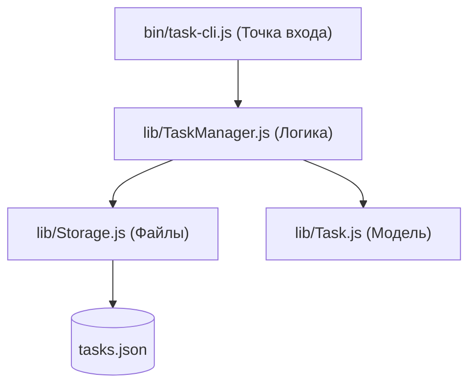

# **5.4. Проекты: Закрепление Node.js и npm**

Этот урок является кульминацией раздела **Node.js и npm**. Здесь мы переходим от теории к созданию реальных инструментов. Практика — это единственный способ по-настоящему "почувствовать" код, понять, как отдельные модули сплетаются в единый работающий организм.

Мы создадим три различных проекта, каждый из которых задействует разные стороны платформы: от командных утилит до веб-серверов. Это поможет вам закрепить навыки работы с **пакетами**, **файловой системой** и **асинхронностью**.

---

- [🏠 Главная](../../readme.md)
- [📚 Все уровни](../index.md)
- [📖 Справочники](../../guides/index.md)
- [🔧 Введение](../../Intro/index.md)
- [⬅️ Предыдущий документ](./5.3-npm.md)
- [➡️ Следующий документ](./6.1-console.md)

---

## **Содержание**

1. [**|01| CLI утилита для управления задачами**](#01-cli-утилита-для-управления-задачами)
2. [**|02| Веб-сервер с Express**](#02-веб-сервер-с-express)
3. [**|03| Генератор отчетов**](#03-генератор-отчетов)
4. [**Практические задания**](#практические-задания)

---

## |01| **CLI утилита для управления задачами**

Первый проект — классическая консольная утилита (Command Line Interface). Это идеальный способ научиться работать с аргументами командной строки, вводом пользователя и сохранением данных в файлы.

> [!NOTE]
> **Теория прежде кода:**
> Мы используем **Commander** для обработки команд, **Inquirer** для интерактивных вопросов и **Chalk** для того, чтобы наш терминал заиграл красками. Данные будут храниться в формате JSON, что научит нас работать с модулем `fs` и сериализацией объектов.

### 1. **Инициализация проекта**

```bash
mkdir task-cli
cd task-cli
npm init -y
npm install commander chalk inquirer
npm install -D jest
```

### 2. **Структура проекта**

```
task-cli/
├── bin/
│   └── task-cli.js
├── lib/
│   ├── Task.js
│   ├── TaskManager.js
│   └── Storage.js
├── tests/
│   └── TaskManager.test.js
├── package.json
└── README.md
```
#### **Архитектура приложения**

Для понимания того, как компоненты взаимодействуют друг с другом, взгляните на эту диаграмму:



### 3. **Реализация**

#### **3.1. package.json**

В этом файле мы определяем имя нашего пакета, его версию и, что самое важное, точку входа для командной строки в секции `bin`.

```json
{
  "name": "task-cli",
  "version": "1.0.0",
  "description": "CLI утилита для управления задачами",
  "main": "lib/TaskManager.js",
  "bin": {
    "task": "./bin/task-cli.js"
  },
  "scripts": {
    "start": "node bin/task-cli.js",
    "test": "jest",
    "test:watch": "jest --watch"
  },
  "dependencies": {
    "commander": "^9.0.0",
    "chalk": "^4.1.2",
    "inquirer": "^8.2.5"
  },
  "devDependencies": {
    "jest": "^29.0.0"
  },
  "keywords": ["cli", "tasks", "todo"],
  "author": "Ваше имя",
  "license": "MIT"
}
```

#### **3.2. bin/task-cli.js**

Это **точка входа** нашего приложения. Именно этот файл запускается, когда вы вводите команду `task` в терминале. Он отвечает за парсинг аргументов и взаимодействие с пользователем через консоль.

```javascript
#!/usr/bin/env node

const { Command } = require("commander");
const chalk = require("chalk");
const inquirer = require("inquirer");
const TaskManager = require("../lib/TaskManager");

const program = new Command();
const taskManager = new TaskManager();

// Утилиты для вывода
function printTask(task) {
  const status = task.completed ? chalk.green("✓") : chalk.red("○");
  const priority = {
    high: chalk.red("HIGH"),
    medium: chalk.yellow("MED"),
    low: chalk.green("LOW"),
  }[task.priority];

  console.log(`${status} [${task.id}] ${chalk.bold(task.title)} (${priority})`);
  if (task.description) {
    console.log(`    ${chalk.gray(task.description)}`);
  }
}

function printTasks(tasks, title = "Задачи") {
  if (tasks.length === 0) {
    console.log(chalk.gray("Задач не найдено"));
    return;
  }

  console.log(chalk.bold.blue(`\n${title}:`));
  console.log(chalk.gray("─".repeat(50)));
  tasks.forEach(printTask);
}

// Команды
program
  .name("task")
  .description("CLI утилита для управления задачами")
  .version("1.0.0");

// Добавление задачи
program
  .command("add")
  .description("Добавить новую задачу")
  .option("-t, --title <title>", "Заголовок задачи")
  .option("-d, --description <description>", "Описание задачи")
  .option("-p, --priority <priority>", "Приоритет (low/medium/high)", "medium")
  .action(async (options) => {
    let { title, description, priority } = options;

    if (!title) {
      const answers = await inquirer.prompt([
        {
          type: "input",
          name: "title",
          message: "Заголовок задачи:",
          validate: (input) =>
            input.trim() ? true : "Заголовок не может быть пустым",
        },
        {
          type: "input",
          name: "description",
          message: "Описание (необязательно):",
        },
        {
          type: "list",
          name: "priority",
          message: "Приоритет:",
          choices: ["low", "medium", "high"],
          default: "medium",
        },
      ]);

      title = answers.title;
      description = answers.description;
      priority = answers.priority;
    }

    const task = taskManager.addTask(title, description, priority);
    console.log(chalk.green("✓ Задача добавлена:"));
    printTask(task);
  });

// Список задач
program
  .command("list")
  .description("Показать список задач")
  .option("-a, --all", "Показать все задачи")
  .option("-c, --completed", "Показать только выполненные")
  .option("-p, --pending", "Показать только невыполненные")
  .option("--priority <priority>", "Фильтр по приоритету")
  .action((options) => {
    let tasks;
    let title = "Задачи";

    if (options.completed) {
      tasks = taskManager.getCompletedTasks();
      title = "Выполненные задачи";
    } else if (options.pending) {
      tasks = taskManager.getPendingTasks();
      title = "Невыполненные задачи";
    } else if (options.priority) {
      tasks = taskManager.getTasksByPriority(options.priority);
      title = `Задачи с приоритетом ${options.priority}`;
    } else {
      tasks = options.all
        ? taskManager.getAllTasks()
        : taskManager.getPendingTasks();
      title = options.all ? "Все задачи" : "Невыполненные задачи";
    }

    printTasks(tasks, title);
  });

// Выполнение задачи
program
  .command("complete <id>")
  .description("Отметить задачу как выполненную")
  .action((id) => {
    const taskId = parseInt(id);
    const task = taskManager.completeTask(taskId);

    if (task) {
      console.log(chalk.green("✓ Задача выполнена:"));
      printTask(task);
    } else {
      console.log(chalk.red("Задача не найдена"));
    }
  });

// Отмена выполнения
program
  .command("uncomplete <id>")
  .description("Отменить выполнение задачи")
  .action((id) => {
    const taskId = parseInt(id);
    const task = taskManager.uncompleteTask(taskId);

    if (task) {
      console.log(chalk.yellow("○ Выполнение отменено:"));
      printTask(task);
    } else {
      console.log(chalk.red("Задача не найдена"));
    }
  });

// Удаление задачи
program
  .command("remove <id>")
  .description("Удалить задачу")
  .action(async (id) => {
    const taskId = parseInt(id);
    const task = taskManager.findTask(taskId);

    if (!task) {
      console.log(chalk.red("Задача не найдена"));
      return;
    }

    const { confirm } = await inquirer.prompt([
      {
        type: "confirm",
        name: "confirm",
        message: `Удалить задачу "${task.title}"?`,
        default: false,
      },
    ]);

    if (confirm) {
      taskManager.removeTask(taskId);
      console.log(chalk.red("✗ Задача удалена"));
    }
  });

// Поиск задач
program
  .command("search <query>")
  .description("Поиск задач")
  .action((query) => {
    const tasks = taskManager.searchTasks(query);
    printTasks(tasks, `Результаты поиска для "${query}"`);
  });

// Статистика
program
  .command("stats")
  .description("Показать статистику")
  .action(() => {
    const stats = taskManager.getStatistics();

    console.log(chalk.bold.blue("\nСтатистика задач:"));
    console.log(chalk.gray("─".repeat(30)));
    console.log(`Всего задач: ${chalk.white.bold(stats.total)}`);
    console.log(`Выполнено: ${chalk.green.bold(stats.completed)}`);
    console.log(`В работе: ${chalk.yellow.bold(stats.pending)}`);

    console.log("\nПо приоритетам:");
    console.log(`  Высокий: ${chalk.red.bold(stats.byPriority.high)}`);
    console.log(`  Средний: ${chalk.yellow.bold(stats.byPriority.medium)}`);
    console.log(`  Низкий: ${chalk.green.bold(stats.byPriority.low)}`);

    if (stats.total > 0) {
      const completionRate = ((stats.completed / stats.total) * 100).toFixed(1);
      console.log(`\nПрогресс: ${chalk.cyan.bold(completionRate + "%")}`);
    }
  });

// Интерактивный режим
program
  .command("interactive")
  .alias("i")
  .description("Интерактивный режим")
  .action(async () => {
    console.log(
      chalk.bold.blue("🚀 Интерактивный режим управления задачами\n")
    );

    while (true) {
      const { action } = await inquirer.prompt([
        {
          type: "list",
          name: "action",
          message: "Выберите действие:",
          choices: [
            "Показать задачи",
            "Добавить задачу",
            "Выполнить задачу",
            "Удалить задачу",
            "Поиск",
            "Статистика",
            "Выход",
          ],
        },
      ]);

      switch (action) {
        case "Показать задачи":
          printTasks(taskManager.getPendingTasks());
          break;

        case "Добавить задачу":
          await program.parseAsync(["", "", "add"], { from: "user" });
          break;

        case "Выполнить задачу":
          const pendingTasks = taskManager.getPendingTasks();
          if (pendingTasks.length === 0) {
            console.log(chalk.gray("Нет невыполненных задач"));
            break;
          }

          const { taskToComplete } = await inquirer.prompt([
            {
              type: "list",
              name: "taskToComplete",
              message: "Выберите задачу для выполнения:",
              choices: pendingTasks.map((task) => ({
                name: `[${task.id}] ${task.title}`,
                value: task.id,
              })),
            },
          ]);

          taskManager.completeTask(taskToComplete);
          console.log(chalk.green("✓ Задача выполнена"));
          break;

        case "Статистика":
          await program.parseAsync(["", "", "stats"], { from: "user" });
          break;

        case "Выход":
          console.log(chalk.blue("До свидания! 👋"));
          process.exit(0);
      }

      console.log(); // Пустая строка для разделения
    }
  });

program.parse();
```

#### **3.3. lib/TaskManager.js**

Этот класс содержит основную **бизнес-логику**. Он не знает ничего о консоли или файлах напрямую, он лишь управляет коллекцией задач и взаимодействует с хранилищем.

```javascript
const Task = require("./Task");
const Storage = require("./Storage");

class TaskManager {
  constructor() {
    this.storage = new Storage();
    this.tasks = this.loadTasks();
    this.nextId = this.getNextId();
  }

  loadTasks() {
    const data = this.storage.load();
    return data.map((taskData) => Task.fromJSON(taskData));
  }

  saveTasks() {
    const data = this.tasks.map((task) => task.toJSON());
    return this.storage.save(data);
  }

  getNextId() {
    return this.tasks.length > 0
      ? Math.max(...this.tasks.map((t) => t.id)) + 1
      : 1;
  }

  addTask(title, description = "", priority = "medium") {
    const task = new Task(this.nextId++, title, description, priority);
    this.tasks.push(task);
    this.saveTasks();
    return task;
  }

  removeTask(id) {
    const index = this.tasks.findIndex((task) => task.id === id);
    if (index !== -1) {
      const removedTask = this.tasks.splice(index, 1)[0];
      this.saveTasks();
      return removedTask;
    }
    return null;
  }

  completeTask(id) {
    const task = this.findTask(id);
    if (task) {
      task.complete();
      this.saveTasks();
    }
    return task;
  }

  uncompleteTask(id) {
    const task = this.findTask(id);
    if (task) {
      task.uncomplete();
      this.saveTasks();
    }
    return task;
  }

  updateTask(id, updates) {
    const task = this.findTask(id);
    if (task) {
      task.update(updates);
      this.saveTasks();
    }
    return task;
  }

  findTask(id) {
    return this.tasks.find((task) => task.id === id);
  }

  getAllTasks() {
    return [...this.tasks];
  }

  getCompletedTasks() {
    return this.tasks.filter((task) => task.completed);
  }

  getPendingTasks() {
    return this.tasks.filter((task) => !task.completed);
  }

  getTasksByPriority(priority) {
    return this.tasks.filter((task) => task.priority === priority);
  }

  searchTasks(query) {
    const lowerQuery = query.toLowerCase();
    return this.tasks.filter(
      (task) =>
        task.title.toLowerCase().includes(lowerQuery) ||
        task.description.toLowerCase().includes(lowerQuery)
    );
  }

  getStatistics() {
    const total = this.tasks.length;
    const completed = this.getCompletedTasks().length;
    const pending = this.getPendingTasks().length;

    const byPriority = {
      high: this.getTasksByPriority("high").length,
      medium: this.getTasksByPriority("medium").length,
      low: this.getTasksByPriority("low").length,
    };

    return { total, completed, pending, byPriority };
  }
}

module.exports = TaskManager;
```

#### **3.4. lib/Storage.js**

Отвечает исключительно за **сохранение и загрузку** данных. Здесь мы используем модуль `fs` для записи JSON-файла в домашнюю директорию пользователя.

```javascript
const fs = require("fs");
const path = require("path");
const os = require("os");

class Storage {
  constructor() {
    this.dataDir = path.join(os.homedir(), ".task-cli");
    this.dataFile = path.join(this.dataDir, "tasks.json");
    this.ensureDataDir();
  }

  ensureDataDir() {
    if (!fs.existsSync(this.dataDir)) {
      fs.mkdirSync(this.dataDir, { recursive: true });
    }
  }

  load() {
    try {
      if (fs.existsSync(this.dataFile)) {
        const data = fs.readFileSync(this.dataFile, "utf8");
        return JSON.parse(data);
      }
    } catch (error) {
      console.error("Ошибка загрузки данных:", error.message);
    }
    return [];
  }

  save(tasks) {
    try {
      const data = JSON.stringify(tasks, null, 2);
      fs.writeFileSync(this.dataFile, data, "utf8");
      return true;
    } catch (error) {
      console.error("Ошибка сохранения данных:", error.message);
      return false;
    }
  }
}

module.exports = Storage;
```

#### **3.5. lib/Task.js**

Наша базовая **модель данных**. Это простая сущность, которая представляет одну задачу и содержит методы для её изменения.

```javascript
class Task {
  constructor(id, title, description = "", priority = "medium") {
    this.id = id;
    this.title = title;
    this.description = description;
    this.priority = priority;
    this.completed = false;
    this.createdAt = new Date();
    this.updatedAt = new Date();
  }

  complete() {
    this.completed = true;
    this.updatedAt = new Date();
  }

  uncomplete() {
    this.completed = false;
    this.updatedAt = new Date();
  }

  update(updates) {
    Object.assign(this, updates);
    this.updatedAt = new Date();
  }

  toJSON() {
    return {
      id: this.id,
      title: this.title,
      description: this.description,
      priority: this.priority,
      completed: this.completed,
      createdAt: this.createdAt,
      updatedAt: this.updatedAt,
    };
  }

  static fromJSON(data) {
    const task = new Task(data.id, data.title, data.description, data.priority);
    task.completed = data.completed;
    task.createdAt = new Date(data.createdAt);
    task.updatedAt = new Date(data.updatedAt);
    return task;
  }
}

module.exports = TaskManager;
```

#### **3.6. tests/TaskManager.test.js**

Тесты для проверки функциональности TaskManager.

```javascript
const TaskManager = require("../lib/TaskManager");
const Task = require("../lib/Task");

describe("TaskManager", () => {
  let taskManager;

  beforeEach(() => {
    taskManager = new TaskManager();
    // Очищаем задачи для тестов
    taskManager.tasks = [];
    taskManager.nextId = 1;
  });

  test("должен добавлять новую задачу", () => {
    const task = taskManager.addTask("Тестовая задача", "Описание", "high");

    expect(task).toBeInstanceOf(Task);
    expect(task.title).toBe("Тестовая задача");
    expect(task.description).toBe("Описание");
    expect(task.priority).toBe("high");
    expect(task.id).toBe(1);
    expect(taskManager.getAllTasks()).toHaveLength(1);
  });

  test("должен удалять задачу", () => {
    const task = taskManager.addTask("Задача для удаления");
    const removed = taskManager.removeTask(task.id);

    expect(removed).toEqual(task);
    expect(taskManager.getAllTasks()).toHaveLength(0);
  });

  test("должен отмечать задачу как выполненную", () => {
    const task = taskManager.addTask("Задача для выполнения");
    const completed = taskManager.completeTask(task.id);

    expect(completed.completed).toBe(true);
    expect(taskManager.getCompletedTasks()).toHaveLength(1);
  });

  test("должен находить задачи по запросу", () => {
    taskManager.addTask("JavaScript изучение", "Изучить основы");
    taskManager.addTask("Python проект", "Создать веб-приложение");
    taskManager.addTask("Изучение React", "Пройти курс");

    const results = taskManager.searchTasks("изучение");
    expect(results).toHaveLength(2);
  });

  test("должен возвращать правильную статистику", () => {
    taskManager.addTask("Задача 1", "", "high");
    taskManager.addTask("Задача 2", "", "medium");
    const task3 = taskManager.addTask("Задача 3", "", "low");
    taskManager.completeTask(task3.id);

    const stats = taskManager.getStatistics();
    expect(stats.total).toBe(3);
    expect(stats.completed).toBe(1);
    expect(stats.pending).toBe(2);
    expect(stats.byPriority.high).toBe(1);
    expect(stats.byPriority.medium).toBe(1);
    expect(stats.byPriority.low).toBe(1);
  });
});
```

### 4. **Использование**

Чтобы запустить наше приложение, у нас есть два пути:
1.  **Локальный запуск**: Используйте команду `node bin/task-cli.js [команда]`.
2.  **Глобальная привязка**: Выполните команду `npm link` в корне проекта. Это создаст символическую ссылку, и вы сможете вызывать утилиту просто по слову `task` из любой папки вашего компьютера.

```bash
# Установка утилиты глобально
npm link

# Теперь можно использовать команду 'task' напрямую:

# Добавить задачу
task add -t "Изучить Node.js" -d "Пройти курс по Node.js" -p high

# Показать список
task list

# Отметить выполнение
task complete 1

# Посмотреть статистику
task stats

# Запустить интерактивное меню
task interactive
```

---

## |02| **Веб-сервер с Express**

Теперь мы выходим за пределы терминала. Создание веб-сервера — это основа современной разработки. Мы научимся обрабатывать HTTP-запросы и структурировать API.

### 1. **Базовый пример: Hello World**

Прежде чем строить сложную систему, давайте создадим самый простой сервер, чтобы понять принцип его работы.

```javascript
const express = require("express");
const app = express();

app.get("/", (req, res) => {
  res.send("Привет, Харизма! Сервер работает.");
});

app.listen(3000, () => {
  console.log("Сервер запущен на http://localhost:3000");
});
```

### 2. **Инициализация полноценного проекта**

Для серьезного проекта нам понадобится больше инструментов.

```bash
mkdir users-api
cd users-api
npm init -y
npm install express cors helmet morgan uuid bcryptjs jsonwebtoken
npm install -D nodemon jest supertest
```

### 3. **Настройка проекта**

#### **3.1. package.json**

Обратите внимание на секцию `scripts`. Мы добавили `dev` команду, которая использует **nodemon**. Это инструмент, который автоматически перезагружает сервер при каждом сохранении файла, что делает разработку невероятно приятной.

```json
{
  "name": "users-api",
  "version": "1.0.0",
  "main": "server.js",
  "scripts": {
    "start": "node server.js",
    "dev": "nodemon server.js",
    "test": "jest"
  },
  "dependencies": {
    "express": "^4.18.2",
    "cors": "^2.8.5",
    "helmet": "^7.0.0",
    "morgan": "^1.10.0",
    "uuid": "^9.0.0",
    "bcryptjs": "^2.4.3",
    "jsonwebtoken": "^9.0.0"
  },
  "devDependencies": {
    "nodemon": "^3.0.1",
    "jest": "^29.0.0",
    "supertest": "^6.3.3"
  }
}
```

#### **3.2. server.js**

Это наше "сердце". Здесь мы подключаем middleware (промежуточное ПО) для защиты сервера и обработки JSON-данных.

```javascript
const express = require("express");
const cors = require("cors");
const helmet = require("helmet");
const morgan = require("morgan");

const app = express();
const PORT = process.env.PORT || 3000;

// Middleware (промежуточное ПО)
app.use(helmet()); // Защита HTTP-заголовков
app.use(cors());   // Разрешение кросс-доменных запросов
app.use(morgan("combined")); // Логирование запросов в консоль
app.use(express.json());     // Парсинг тела запроса в формате JSON

// Роутинг (Маршрутизация)
app.get("/", (req, res) => {
  res.json({ message: "API приветствует вас!" });
});

// Пример подключения других маршрутов
// app.use("/api/users", require("./routes/users"));

// Обработка ошибок
app.use((err, req, res, next) => {
  console.error(err.stack);
  res.status(500).json({ error: "Что-то пошло не так на стороне сервера!" });
});

app.listen(PORT, () => {
  console.log(`Сервер запущен на порту ${PORT}`);
});

module.exports = app;
```

> [!TIP]
> **Практическое задание:** 
> Попробуйте самостоятельно создать файл `routes/users.js` и реализовать там несколько эндпоинтов:
> - `GET /` — возвращает список всех пользователей.
> - `POST /` — добавляет нового пользователя в массив.

---

## |03| **Генератор отчетов**

Этот проект закрепит навыки работы с потоками данных (Streams). Мы создадим инструмент для обработки файлов, которые слишком велики для простой загрузки в память.

> [!NOTE]
> **Теория прежде кода:**
> Работа с форматом CSV требует внимательности. Мы используем пакет `csv-parser` для эффективного чтения данных "на лету", что критически важно для производительности Node.js приложений.

### 1. **Настройка зависимостей**

```bash
npm install csv-parser csv-writer commander
```

### 2. **Принцип работы**

Создайте модуль, который читает CSV файлы, обрабатывает данные и генерирует отчеты в разных форматах.

## **Итог**

Завершение этих проектов даст вам уверенность в работе с **Node.js**. Вы научились не только писать код, но и организовывать структуру проекта, управлять зависимостями и даже писать тесты. Это фундамент, на котором строятся сложные корпоративные системы.

---

## **Практика**

Для тех, кто хочет испытать себя ещё сильнее, попробуйте реализовать следующие идеи:

### 1. **Файловый архиватор**
Создайте CLI утилиту, которая будет упаковывать файлы из указанной папки в ZIP-архив с использованием встроенного модуля `zlib`.

### 2. **Парсер логов**
Разработайте инструмент, который читает файл `access.log` и выводит статистику: количество запросов по каждому IP-адресу или самые популярные URL.

### 3. **API клиент**
Создайте консольное приложение, которое делает запрос к открытому API (например, JSONPlaceholder) и выводит данные в красивой таблице в терминале.

---

- [🏠 Главная](../../readme.md)
- [📚 Все уровни](../index.md)
- [📖 Справочники](../../guides/index.md)
- [🔧 Введение](../../Intro/index.md)
- [⬅️ Предыдущий документ](./5.3-npm.md)
- [➡️ Следующий документ](./6.1-console.md)
