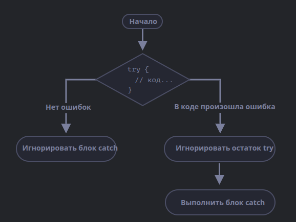

# **Обработка исключений**

> [🏠 Главная](../../readme.md)
> || [📚 Все уровни](../index.md)
> || [📖 Справочники](../../guides/index.md)
> || [🔧 Введение](../../Intro/index.md)
> [⬅️ Предыдущий документ](./1.9-json.md)
> [➡️ Следующий документ](./3.1-buffers.md)

---

## **Содержание**
1. [**Основные концепции**](#1-основные-концепции)
2. [**Синтаксис**](#2-синтаксис)
3. [**Объект ошибки**](#3-объект-ошибки)
4. [**Блок «catch» без переменной**](#4-блок-catch-без-переменной)
5. [**Использование «try…catch»**](#5-использование-trycatch)
6. [**Генерация собственных ошибок**](#6-генерация-собственных-ошибок)
7. [**Проброс исключения**](#7-проброс-исключения)
8. [**try…catch…finally**](#8-trycatchfinally)
9. [**Глобальный catch**](#9-глобальный-catch)
10. [**Преимущества и недостатки**](#10-преимущества-и-недостатки)
11. [**Практика**](#практика)

---

Обработка исключений — это механизм, позволяющий программам продолжать работу даже при возникновении ошибок, не прерывая выполнения. Он используется для захвата, управления и обработки ошибок, которые возникают во время выполнения программы.

---

## |1| **Основные концепции**

1. **Исключения (Exceptions):**
   Исключения возникают, когда программа сталкивается с критической ошибкой (например, деление на ноль или доступ к несуществующему элементу массива).

2. **Конструкция `try-catch-finally`:**
    - `try`: Блок кода, где могут возникнуть ошибки.
    - `catch`: Обрабатывает исключения, которые произошли в блоке `try`.
    - `finally`: Блок, который выполняется всегда, независимо от того, произошла ошибка или нет.

3. **Создание пользовательских исключений:**
   Программисты могут вызывать свои исключения с помощью `throw`.

---

## |2| **Синтаксис**

Конструкция `try..catch` состоит из двух основных блоков: `try`, затем `catch`:

```javascript
try {
    // Код, который может вызвать исключение
} catch (error) {
    // Обработка исключения
} finally {
    // Код, который выполнится в любом случае
}
```

Работает она так:

1. Сначала выполняется код внутри блока `try {...}`.
2. Если в нём нет ошибок, то блок `catch(err)` игнорируется: выполнение доходит до конца `try` и потом далее, полностью пропуская `catch`.
3. Если же в нём возникает ошибка, то выполнение `try` прерывается, и поток управления переходит в начало `catch(err)`. Переменная `err` (можно использовать любое имя) содержит объект ошибки с подробной информацией о произошедшем.
4. Блок `finally` выполняется в любом случае, получена ошибка или нет.



Таким образом, при ошибке в блоке `try {…}` скрипт не «падает», и мы получаем возможность обработать ошибку внутри `catch`.

> [!CAUTION]
> **`try..catch` работает только для ошибок, возникающих во время выполнения кода**
> Чтобы `try..catch` работал, код должен быть выполнимым. Другими словами, это должен быть корректный JavaScript-код.
> Он не сработает, если код синтаксически неверен, например, содержит несовпадающее количество фигурных скобок.

> [!CAUTION]
> **`try..catch` работает синхронно**
> Исключение, которое произойдёт в коде, запланированном «на будущее», например в `setTimeout`, `try..catch` не поймает.

---

## |3| **Объект ошибки**

Когда возникает ошибка, JavaScript генерирует объект, содержащий её детали. Затем этот объект передаётся как аргумент в блок `catch`:

```js
try {
    // ...
} catch (err) {
    // <-- объект ошибки, можно использовать другое название вместо err
    // ...
}
```

Для всех встроенных ошибок этот объект имеет два основных свойства:
-   `name`: Имя ошибки. Например, для неопределённой переменной это "ReferenceError".
-   `message`: Текстовое сообщение о деталях ошибки.

И нестандартное свойство:
-   `stack`: Текущий стек вызова: строка, содержащая информацию о последовательности вложенных вызовов, которые привели к ошибке. Используется в целях отладки.

---

## |4| **Блок «catch» без переменной**

Если нам не нужны детали ошибки, в `catch` можно её пропустить:

```js
try {
    // ...
} catch {
    // <-- без (err)
    // ...
}
```

---

## |5| **Использование «try…catch»**

Вот пример с чтением JSON:

```js
let json = '{ некорректный JSON }';

try {
    let user = JSON.parse(json); // <-- тут возникает ошибка...
    alert(user.name); // не сработает
} catch (e) {
    // ...выполнение прыгает сюда
    alert('Извините, в данных ошибка, мы попробуем получить их ещё раз.');
    alert(e.name);
    alert(e.message);
}
```

---

## |6| **Генерация собственных ошибок**

Для того, чтобы унифицировать обработку ошибок, мы воспользуемся оператором `throw`.

### **Оператор «throw»**

Оператор `throw` генерирует ошибку.

Синтаксис:

```js
throw <объект ошибки>
```

В JavaScript есть встроенные конструкторы `Error`, `SyntaxError`, `ReferenceError`, `TypeError`. Сгенерируем её:

```js
let json = '{ "age": 30 }'; // данные неполны

try {
    let user = JSON.parse(json); // <-- выполнится без ошибок
    if (!user.name) {
        throw new SyntaxError('Данные неполны: нет имени');
    }
    alert(user.name);
} catch (e) {
    alert('JSON Error: ' + e.message); // JSON Error: Данные неполны: нет имени
}
```

---

## |7| **Проброс исключения**

Есть простое правило:
> **Блок `catch` должен обрабатывать только те ошибки, которые ему известны, и «пробрасывать» все остальные.**

Техника «проброс исключения» выглядит так:
1. Блок `catch` получает все ошибки.
2. В блоке `catch(err) {...}` мы анализируем объект ошибки `err`.
3. Если мы не знаем как её обработать, тогда делаем `throw err`.

```js
let json = '{ "age": 30 }'; // данные неполны
try {
    let user = JSON.parse(json);

    if (!user.name) {
        throw new SyntaxError('Данные неполны: нет имени');
    }

    blabla(); // неожиданная ошибка

    alert(user.name);
} catch (e) {
    if (e.name == 'SyntaxError') {
        alert('JSON Error: ' + e.message);
    } else {
        throw e; // проброс
    }
}
```

---

## |8| **try…catch…finally**

Конструкция `try..catch` может содержать ещё одну секцию: `finally`.

```js
try {
   // пробуем выполнить код...
} catch(e) {
   // обрабатываем ошибки ...
} finally {
   // выполняем всегда ...
}
```

Секция `finally` часто используют, когда мы начали что-то делать и хотим завершить это вне зависимости от того, будет ошибка или нет.

```js
let num = +prompt('Введите положительное целое число?', 35);

let diff, result;

function fib(n) {
    if (n < 0 || Math.trunc(n) != n) {
        throw new Error('Должно быть целое неотрицательное число');
    }
    return n <= 1 ? n : fib(n - 1) + fib(n - 2);
}

let start = Date.now();

try {
    result = fib(num);
} catch (e) {
    result = 0;
} finally {
    diff = Date.now() - start;
}

alert(result || 'возникла ошибка');
alert(`Выполнение заняло ${diff}ms`);
```

### **Специфические особенности `finally`**

#### **1. `finally` и `return`**
Блок `finally` заслуживает особого внимания, так как он срабатывает при **любом** выходе из `try..catch`, включая оператор `return`.

```javascript
function func() {
    try {
        return 1;
    } catch (e) {
        /* ... */
    } finally {
        console.log('finally всё равно сработал!');
    }
}

console.log(func()); 
// Результат:
// 'finally всё равно сработал!'
// 1
```

#### **2. Паттерн `try..finally`**
Иногда нам не нужно *обрабатывать* ошибку прямо здесь (мы хотим, чтобы она пробросилась выше), но нам критично гарантировать выполнение очистки или завершения процесса.

```javascript
function processData() {
    const timer = startMeasure();
    try {
        // ... сложная логика, которая может упасть
    } finally {
        stopMeasure(timer); // Завершим замер, даже если всё взорвется
    }
}
```
В этом случае ошибка просто «выпадет» из функции, но `finally` успеет отработать до того, как управление уйдет во внешний код.

---

## |9| **Глобальный catch**

Существует ли способ отреагировать на фатальные ошибки, если нет `try...catch`?

В браузере мы можем присвоить функцию специальному свойству `window.onerror`. В Node.js – `process.on("uncaughtException")`.

```html
<script>
    window.onerror = function (message, url, line, col, error) {
        alert(`${message}\n В ${line}:${col} на ${url}`);
    };

    function readData() {
        badFunc(); // Ой, что-то пошло не так!
    }

    readData();
</script>
```

---

---

## |10| **Глубокий анализ: `finally` или просто код в конце?**

Часто возникает вопрос: есть ли преимущество у `finally` перед обычным написанием кода после блока `try..catch`?

Рассмотрим два примера:

**Вариант А (`finally`):**
```javascript
try {
  work();
} catch (e) {
  handle(e);
} finally {
  cleanup();
}
```

**Вариант Б (обычный код):**
```javascript
try {
  work();
} catch (e) {
  handle(e);
}
cleanup();
```

На первый взгляд они идентичны. Но разница проявляется в двух критических случаях:

1.  **Если внутри `try` или `catch` есть `return`**: В варианте **Б** `cleanup()` никогда не выполнится. В варианте **А** — выполнится обязательно.
2.  **Если внутри `catch` возникла новая ошибка** (или ошибка была проброшена через `throw`): В варианте **Б** скрипт прекратит выполнение до того, как дойдет до `cleanup()`. Вариант **А** гарантирует очистку.

> [!TIP]
> Используйте `finally` всегда, когда действие **обязано** произойти для сохранения целостности системы (закрытие файлов, сетевых соединений, очистка памяти).

## **Итог**

Конструкция `try..catch` позволяет обрабатывать ошибки во время исполнения кода. Объекты ошибок содержат свойства `message` и `name`. Проброс исключения – важный приём для правильной архитектуры.

---

## **Практика**

1. **Деление на ноль**
   Напишите функцию `divide(a, b)`. Если `b` равно нулю, выбрасывайте исключение (`throw new Error(...)`). В противном случае возвращайте результат.

2. **Проверка возраста**
   Напишите функцию `checkAge(age)`. Если возраст меньше `18`, функция должна выбрасывать исключение. Используйте `try...catch`.

3. **Чтение JSON**
   Напишите функцию `parseJSON(jsonString)`, которая возвращает объект или выбрасывает ошибку при некорректном формате. Вызовите её в блоке `try...catch`.

4. Напишите функцию, которая проверяет, является ли переданная строка числом. Если нет — выбрасывайте исключение.

5. Реализуйте игру "Угадай число". При вводе нечисловых значений выбрасывайте исключение.
