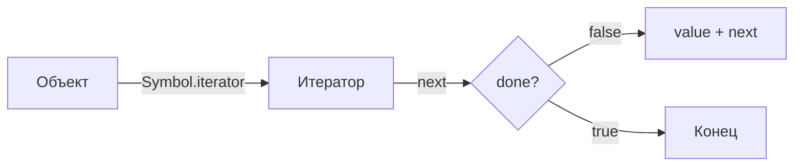

# **Итераторы и Генераторы**

В современном JavaScript работа с последовательностями данных часто выходит за рамки простых массивов. **Итераторы** и **Генераторы** — это мощные инструменты, которые позволяют описывать алгоритмы перебора данных любой сложности: от бесконечных последовательностей до асинхронных потоков.

---

- [🏠 Главная](../../readme.md)
- [📚 Все уровни](../index.md)
- [📖 Справочники](../../guides/index.md)
- [🔧 Введение](../../Intro/index.md)
- [⬅️ Продвинутое ООП](./1.2-advanced-oop-classes.md)
- [➡️ Регулярные выражения](./3.1-advanced-regexp.md)

---

## **Содержание**

1. [**Итерируемые объекты и протокол итерации**](#|1|-**Итерируемые-объекты-и-протокол-итерации**)
2. [**Создание собственного итератора**](#|2|-**Создание-собственного-итератора**)
3. [**Генераторы: функции, умеющие ждать**](#|3|-**Генераторы-функции-умеющие-ждать**)
4. [**Делегирование генераторов и `yield*`**](#|4|-**Делегирование-генераторов-и-yield**)
5. [**Асинхронные итераторы и генераторы**](#|5|-**Асинхронные-итераторы-и-генераторы**)
6. [**Итог**](#**Итог**)
7. [**Практика**](#**Практика**)

---

## |1| **Итерируемые объекты и протокол итерации**

**Итерируемые объекты** (**iterables**) — это объекты, содержимое которых можно перебрать. Большинство встроенных коллекций в JavaScript (Массивы, Строки, `Map`, `Set`) являются итерируемыми по умолчанию.

Для того чтобы объект считался итерируемым, он должен реализовывать **протокол итерации**: иметь метод с уникальным символьным ключом `Symbol.iterator`.

### **Как работает итератор?**

1.  Берется метод `Symbol.iterator` от объекта.
2.  Этот метод возвращает специальный объект — **итератор**.
3.  Итератор имеет метод `next()`, который при каждом вызове возвращает объект состояния: `{ value: ANY, done: BOOLEAN }`.
4.  Когда `done: true`, перебор закончен.



```javascript
const numbers = [1, 2];
const iterator = numbers[Symbol.iterator]();

console.log(iterator.next()); // { value: 1, done: false }
console.log(iterator.next()); // { value: 2, done: false }
console.log(iterator.next()); // { value: undefined, done: true }
```

---

## |2| **Создание собственного итератора**

Мы можем превратить любой объект в итерируемый. Это полезно, когда объект представляет собой логическую последовательность (например, диапазон чисел).

### **Пример: Диапазон (Range)**

Представим объект `range`, который должен возвращать числа от `from` до `to`.

```javascript
const range = {
    from: 1,
    to: 5,

    [Symbol.iterator]() {
        // Метод возвращает объект-итератор
        return {
            current: this.from,
            last: this.to,

            next() {
                if (this.current <= this.last) {
                    return { done: false, value: this.current++ };
                } else {
                    return { done: true };
                }
            }
        };
    }
};

for (const num of range) {
    console.log(num); // 1, 2, 3, 4, 5
}
```

> [!NOTE]
> Цикл `for...of` — это "синтаксический сахар", который под капотом вызывает `Symbol.iterator` и метод `next()`.

---

## |3| **Генераторы: функции, умеющие ждать**

Создавать итераторы вручную — трудоемко. Для облегчения этой задачи существуют **Генераторы** (`Generator Functions`).

**Генератор** — это функция, которая может приостанавливать свое выполнение, возвращать промежуточное значение, а затем продолжать выполнение с того же места.

### **Синтаксис и `yield`**

Генератор объявляется со звездочкой `function*` и использует ключевое слово `yield` для возврата значения.

```javascript
function* numberGenerator() {
    yield 1;
    yield 2;
    return 3; // Конечный результат
}

const gen = numberGenerator(); // Создается объект-генератор (итератор)

console.log(gen.next()); // { value: 1, done: false }
console.log(gen.next()); // { value: 2, done: false }
console.log(gen.next()); // { value: 3, done: true }
```

### **Двусторонняя связь: `next(value)`**

Генераторы уникальны тем, что они не только выдают значения наружу, но и могут принимать их обратно внутрь.

```javascript
function* gen() {
  // Передаем вопрос наружу, ждем ответа
  const result = yield "2 + 2 = ?";
  console.log(result); // 4
}

const g = gen();
const question = g.next().value; // "2 + 2 = ?"
g.next(4); // Передаем 4 обратно в генератор
```

### **Управление жизненным циклом**

1.  **`gen.return(value)`**: Немедленно завершает генератор, возвращая `{ value, done: true }`.
2.  **`gen.throw(err)`**: Пробрасывает ошибку внутрь генератора в месте последнего `yield`. Это позволяет обрабатывать ошибки внутри самого генератора через `try..catch`.

```javascript
function* demo() {
  try {
    yield "Нажми на меня";
  } catch (e) {
    console.log("Поймал внутри:", e);
  }
}

const d = demo();
d.next();
d.throw(new Error("Бум!")); // Поймал внутри: Error: Бум!
```

Генераторы идеально подходят для создания итерируемых объектов. Перепишем наш `range`:

```javascript
const range = {
    from: 1,
    to: 3,
    *[Symbol.iterator]() { // Генератор как метод
        for (let i = this.from; i <= this.to; i++) {
            yield i;
        }
    }
};

console.log([...range]); // [1, 2, 3]
```

---

## |4| **Делегирование генераторов и `yield*`**

Оператор `yield*` позволяет одному генератору "вкладывать" в себя другой генератор или любой итерируемый объект. Это называется **делегированием**.

```javascript
function* generateSequence(start, end) {
    for (let i = start; i <= end; i++) yield i;
}

function* generatePasswordCodes() {
    // 0..9 (ASCII 48..57)
    yield* generateSequence(48, 57);
    // A..Z (ASCII 65..90)
    yield* generateSequence(65, 90);
    // a..z (ASCII 97..122)
    yield* generateSequence(97, 122);
}

let password = '';
for(let code of generatePasswordCodes()) {
    password += String.fromCharCode(code);
}
// password: "0123456789ABCDEFGHIJKLMNOPQRSTUVWXYZabcdefghijklmnopqrstuvwxyz"
```

---

## |5| **Асинхронные итераторы и генераторы**

Когда данные поступают асинхронно (например, куски файла или страницы из API), используются **Асинхронные итераторы**.

1.  Используется `Symbol.asyncIterator`.
2.  Метод `next()` возвращает **Promise**, который резолвится в `{ value, done }`.
3.  Для перебора используется цикл `for await...of`.

### **Пример асинхронного генератора**

```javascript
async function* fetchUsers(users) {
    for (const name of users) {
        // Имитация сетевого запроса
        await new Promise(resolve => setTimeout(resolve, 500));
        yield `Пользователь: ${name}`;
    }
}

(async () => {
    const generator = fetchUsers(['Alice', 'Bob', 'Charlie']);
    for await (const user of generator) {
        console.log(user); // Выводит с паузой в 500мс
    }
})();
```

---

## |6| **Глубокое понимание: Генераторы как база для `async/await`**

До появления `async/await` разработчики использовали генераторы вместе с промисами для написания линейного асинхронного кода (библиотека `co`).

```javascript
// Концептуальная схема работы async/await под капотом
function execute(generator) {
    const g = generator();
    
    function step(nextVal) {
        const result = g.next(nextVal);
        if (!result.done) {
            result.value.then(val => step(val)); // Ждем промис и рекурсивно продолжаем
        }
    }
    step();
}

execute(function* () {
    const user = yield fetchUser(); // Почти как await!
    const posts = yield fetchPosts(user.id);
    console.log(posts);
});
```

---

## **Итог**

-   **Итератор** — объект с методом `next()`, управляющий перебором.
-   **Итерируемый объект** — реализует `[Symbol.iterator]`.
-   **Генератор** (`function*`) — удобный способ создания итераторов через `yield`.
-   **`yield*`** — делегирует выполнение другому итерируемому объекту.
-   **Асинхронная итерация** — позволяет перебирать данные, приходящие по частям во времени, через `for await...of`.

---

## **Практика**

### 1. **Бесконечный генератор Фибоначчи**
Напишите функцию-генератор `fibonacci()`, которая бесконечно генерирует числа Фибоначчи. Проверьте её работу, выведя первые 10 чисел.

### 2. **Пользовательский итератор "Слова в строке"**
Создайте объект `sentence`, который принимает строку. Реализуйте в нем `Symbol.iterator` так, чтобы цикл `for...of` перебирал слова в этой строке (разделитель — пробел).

### 3. **Асинхронный пагинатор**
Напишите асинхронный генератор `getPages(limit)`, который доходит до `limit` страниц. Каждая "загрузка" страницы должна занимать 200мс (через `setTimeout`).
